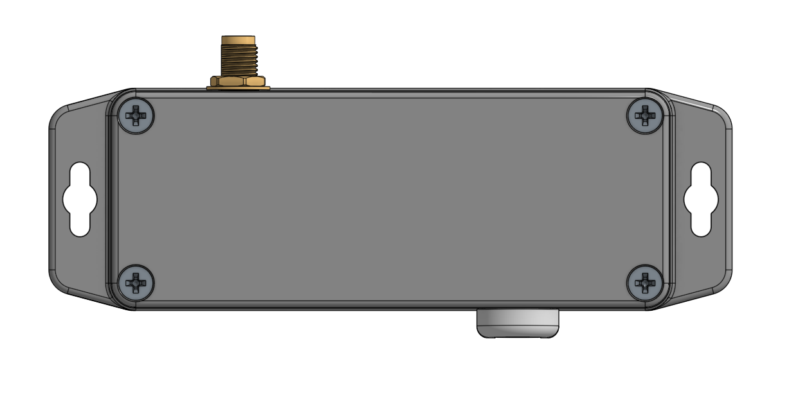
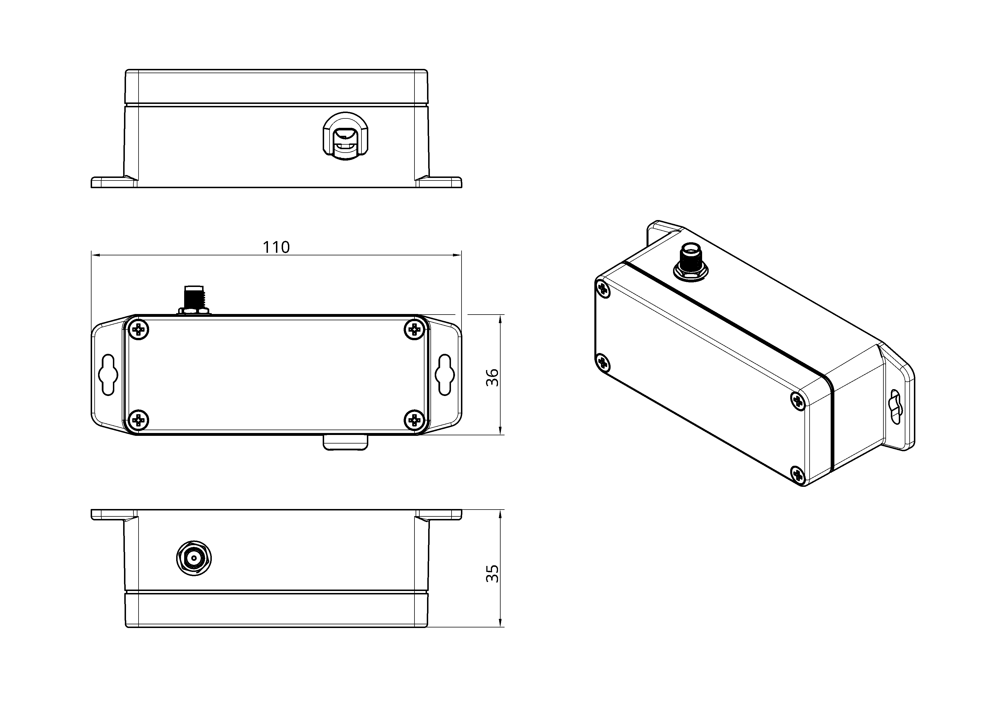
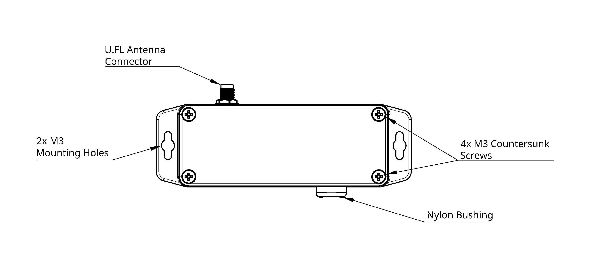
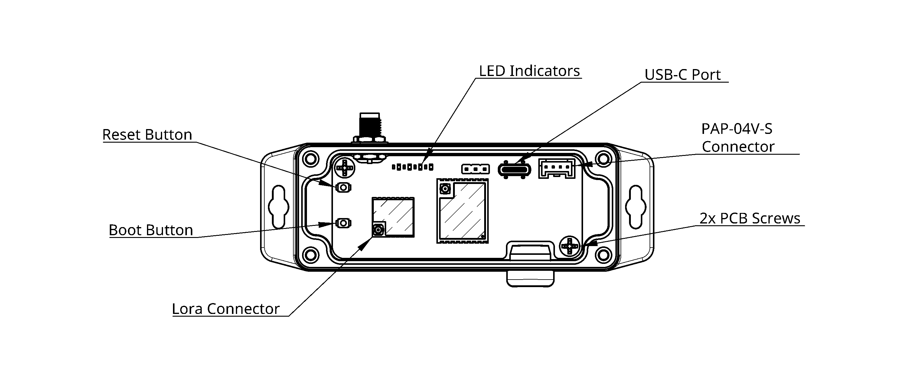
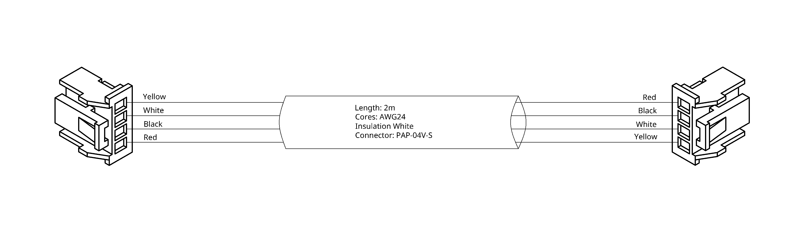
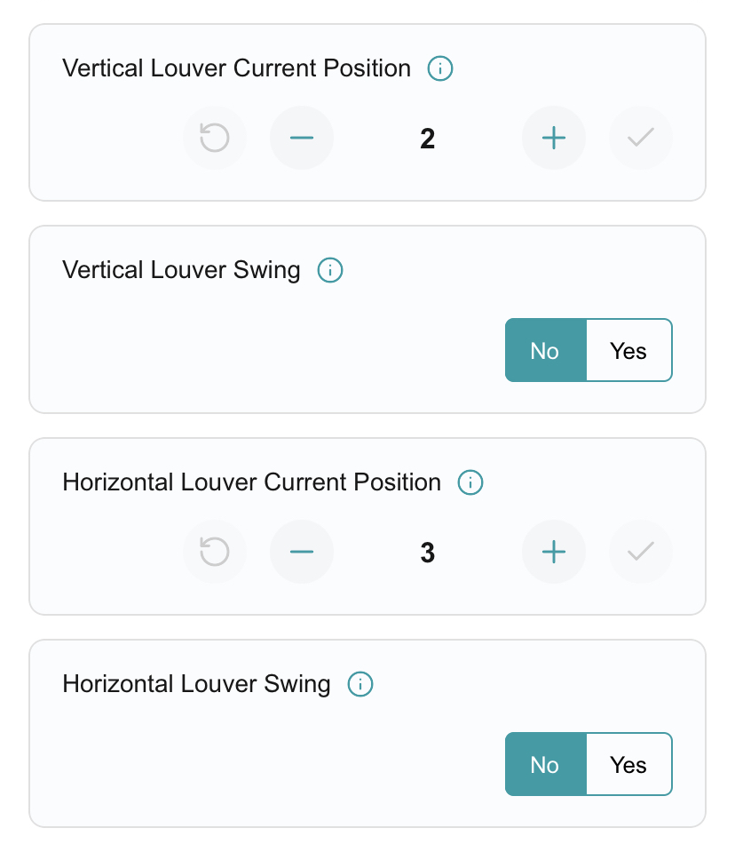

# UART LoRaLink User Manual

# 1. About Product

## 1.1. Product Overview
The UART LoRaLink is Nube-iO’s wireless (LoRa®) LoRaLink controller. Designed to
interface directly with compatible RAC/PAC and VRF Air Conditioning units in a small package, reducing the installation time and bypassing the AT command interface.

LoRa® wireless IoT technology offers a long
transmission range, low power consumption, and is less susceptible to object interference than other wireless technologies. This ensures seamless control integration for a range of applications.

***Insert Silk Screen Render***

## 1.2. Architecture
**LoRaLink Device:** Acts as the master device, interfacing with compatible RAC/PAC and VRF Air Conditioning units via the UART protocal. It manages data transmission to and from the central Nube iO gateway.  
**Nube iO Gateway:** Serves as the central node, managing communication from multiple LoRaLink devices and distributing data as needed.  
**Control:** The LoRaLink device directly manages data exchange with compatible Air Conditioning units using their specific UART protocol.

## 1.3. Product Features
**Operation Control:** Enable the unit on and off. 
**Mode Control:** Switch between cool, heat, dry, auto, and fan modes. 
**Temperature Setpoint Control:** Adjust heating/cooling temperature setpoint.
- Cooling setpoint 18 to 30 degrees Celsius
- Heating setpoint 16-18 to 30 degrees Celsius (low limit model dependent)

**Fan Speed Control:** Control fan speed (model dependent). 
**Louvre Direction Control:** Adjust vertical and horizontal louvre position and louvre swing operation (model dependent). 
**Economy Control:** Enable and disable the unit's economy mode.  
**Return Air Temperature Monitoring:** Monitor the return air temperature. 
**Error Status Reporting:** Retrieve the error status and error code.

 

# 2. Hardware Overview

## 2.1. Packing List
- Installation & User Manual. 
- UART LoRaLink Device 
- LoRa Antenna. 
- PAP-04V-S power/communication cable. 
- Mounting screws/velcro tape.

*Insert Packing list images*

 

## 2.2. Product Dimensions
|                	        |                                           |
|-----------------------	|-----------------------------------------	|
| Height:               	| 36 mm / 1.42 inches                   	  |
| Width:                	| 110 mm / 4.33 inches                      |
| Depth:                	| 35 mm / 1.38 inches                     	|
| Enclosure             	| Light Grey Polycarbonate, IP68 Rated 	    |

## 2.3. Product Component Breakdown

### 2.3.1 External
- U.FL Antenna Connector: Connects the antenna for wireless communication.
- Mounting Holes: Allows for secure mounting via appropriate fixings.
- Countersunk Screws: Allows for easy opening of the device.
- Nylon Bushing: Facilitates the entry of cables into the device.

### 2.3.2 Internal
- Reset Button: Pressing this button will reset the UART LoRaLink, restart the firmware and publish a lora message.
- Boot Button: Used to enter the device into Boot mode for firmware updates
- LED Indicators: Used to indicate device operation status's.
  - Red PWR light - When active indicates the device is powered.
  - Green TX light - When periodically flashing indicates communication.
  - Blue RX light - When periodically flashing indicates communicationn.
  - Orange L1 light - Will be inactive in normal operation. If reset is pressed L1 will illuminate momentarily during the reboot cycle.
- Lora Connector: Connects the U.FL Antenna Connector to the internal PCB.
- USB-C Port: Provides a connection point to update the device firmware.
- CN Connector: Connection point for the PAP-04V-S Connector linking the LoRaLink to the Air Conditioner UART port (CN6, CN65 or CN75).
- PCB Screws: Used to secure the PCB in the enclosure.

 

# 2. Installation & Configuration

## 2.1. Mounting
The UART LoRaLink can be mounted in several ways depending on the type of air conditioning system. In all cases, the antenna must remain vertical (unless specifically noted). Use either the provided Velcro tape or screws, depending on the surface and accessibility.

**General Notes**

- Keep the antenna vertical and unobstructed for best signal performance.
- Use existing penetrations where possible to avoid damaging the air conditioning unit.
- Velcro tape is preferred where drilling may risk damage to internal components.
- Ensure the cable path is tidy, protected, and free from heat sources or moving parts.

*Insert Diagram of Best Mounting*

### 2.1.1 Split Systems
The UART LoRaLink can be mounted:

- On the unit — either at the bottom, top, or side of the outdoor case.
- On the wall next to the unit — horizontally or vertically.
- Inside trunking — above or beside cable penetrations.

Choose the closest practical location to the electrical PCB.
Ensure the antenna is vertical and that cables are routed cleanly via existing penetrations or wall cavities.

### 2.1.2 Ducted Systems
The UART LoRaLink can be mounted:

- Top of the indoor unit
- A nearby joist
- Side of the indoor unit

Velcro or screws can be used, depending on the surface. Maintain a clear vertical antenna position.

### 2.1.3 Under-Ceiling Systems
The UART LoRaLink can be mounted::

- Bottom right-hand side of the unit
- Top right-hand side of the unit
- Wall beside the unit

Use existing cable entry points. Attach with Velcro or screws as appropriate.

### 2.1.4 Cassette Systems
The UART LoRaLink can be mounted:

- On the ceiling surface
- On the side of the cassette unit
- In the roof cavity above the cassette

Choose the closest practical location to the electrical PCB.
Ensure the antenna is vertical and that cables are routed cleanly via existing penetrations or roof cavities.

### 2.1.5 Floor Systems
The UART LoRaLink can be mounted:

- On the side of the floor unit
- On the wall next to the unit

Choose the closest practical location to the electrical PCB.
Ensure the antenna is vertical and that cables are routed cleanly via existing penetrations or roof cavities.

 

## 2.2. UART Connection

**Insert Note for Crossover**

| Indoor Unit  |                |
|-----------	|----------------|
| Pin 1     	| 12VDC          |  
| Pin 2     	| DC Ground      |
| Pin 3     	| Sending Tx     |
| Pin 4      	| Receiving Rx   |

| UART LoRaLink    |                |
|-----------	|----------------|
| Pin 1     	| 12VDC          |  
| Pin 2     	| DC Ground      |
| Pin 3     	| Receiving Rx   |
| Pin 4      	| Sending Tx     |

 

## 2.3. Installation
To install the UART LoRaLink follor the below steps:

#### Step 1
Remove the cover of the UART device by loosening the 4 external screws. (Refer to section 2.3.1)

#### Step 2
Attach the supplied LoRa antenna to the U.FL Antenna Connector. (Refer to section 2.3.1)

> **Note:** It is advised to install the antenna vertically and keep it clear of obstructions for maximum transmission capability between the UART LoRaLink and the Rubix Compute(s) on site.

#### Step 3
Locate the air conditioner unit that the UART LoRaLink device is to be installed on.

> **Note:** Each UART device is flashed, labelled and prepared for a specific unit/room. If connected to the wrong unit/room, it will monitor and control the incorrect unit, causing dashboard functionality issues.

#### Step 4
Remove the electrical panel cover from the air conditioner indoor unit.

- For **wall-mounted**, **floor-mounted**, and **under-ceiling** systems: remove the plastic case of the air conditioner.
- For **cassette systems**: remove the air intake cover.
- For **ducted systems**: remove the electrical door/panel.

#### Step 5
Locate the **CN6**, **CN65**, or **CN75** plug base on the indoor unit's printed control board.  

> **Note:** The available plug depends on the unit model. Check the air conditioner’s user guide for details.

#### Step 6
Plug the UART LoRaLink cable into the available CN6, CN65 or CN75 plug.

#### Step 7
There are four LED indicators on the PCB inside the UART LoRaLink enclosure. (Refer to section 2.3.1.) 

When initially powered:

- **PWR** and **TX** will illuminate and hold.  
  

After approximately 15 seconds:

- **L1**, **TX**, and **RX** will begin alternating flashing — this indicates the UART LoRaLink is receiving and transmitting data.

Then:

- **L1** will stop flashing  
- **PWR** remains solid  
- **TX** and **RX** continue alternating flashes as the LoRaLink communicates.

#### Step 8
Once the device is connected and transmitting data, it can be controlled from the onsite dashboard or mobile app.

<!-- #### Step 9
Test control via the dashboard. Change operating settings and ensure the air conditioner responds correctly.

> **Note:**  
> - If a **wired remote controller** is present, ensure all setting changes are reflected on the wall controller.  
> - If a **wireless remote** is used, toggle power and change modes to ensure the unit responds correctly. -->

#### Step 9
Once connected to the correct indoor unit, ensure the UART LoRaLink is mounted securely and ensure the antenna is positioned correctly to maximise signal transmission.  
Refer to **Section 2: Mounting Options** for more detail.

#### Step 10
After confirming the enclosure is correctly installed, reinstall the front cover. The device is now ready to be controlled from the onsite dashboard.

#### Step 11
Reinstall the electrical panel on the indoor unit. Then reinstall the air conditioner’s plastic cover (if applicable).

  

## 2.4. Configuration
The UART LoRaLink can be configured in two ways.

**Option 1** is to configure and manage the LoraLinks via the NubeiO Mobile App. This method is the simplest and most efficient as the installer can add and manage devices from anywhere in the facility using only there mobile phone. 

**Option 2** is to configure and manage the LoraLinks via NubeiO's engineering software, Rubix CE. Further details outlining Lora configuration in Rubix CE can be found using the following link: **[LoraRaw](/rubix-ce-docs/docs/rubix-ce/drivers/lora/lora-raw/lora)**

### 2.4.1 Via Technician App

#### 2.4.1.1 Downloading the App
*When officially released add the real Apple and Google play links*

|Downloads | |
|-|-|
| Google Play |  |
| App Store |  |

#### 2.4.1.2 Gateway Management
There are two methods to add a Rubix Compute Gateway via the mobile app. 
1. Manually Entering the gateway configuration details 
2. Scanning the local network for compatible Rubix Computes

**Manually Adding a Gateway**
1. **Step-1** Launch the mobile app and ensure Rubix Computes Screen is opened.
2. **Step-2** Press the `Add Rubix Compute` button located on the bottom right of the screen.
3. **Step-3** Press the `Enter Details Manually` button to select this method and navigate to the configuration.
4. **Step-4** Enter the appropriate information. The mandatory fields include:
    - Gateway Name
    - IP Address
    - Port
    - Username
    - Password
5. **Step-5** Press the `Connect` button located on the bottom of the screen to confirm the configuration and be automatically navigated to the Devices screen.

**Note:** If you are unsure of the username and password please contact your service provider or NubeiO technical suport via `support@nube-io.com`

**Scanning Network to Add a Gateway**
1. **Step-1** Launch the mobile app and ensure Rubix Computes Screen is opened.
2. **Step-2** Press the `Add Rubix Compute` button located on the bottom right of the screen.
3. **Step-3** press the `Enter Details Manually` button to select this method and initiate the network scan. A progress bar will automatically be displayed showing the scan progress.
4. **Step-4** Any compatible Rubix Compute Gateways will show in the `Found Gateway's`section below the progress bar. Select the desired Rubix Compute to enter the configuration menu and fill out the mandatory fields:
    - Gateway Name
    - Username
    - Password
5. **Step-5** Press the `Connect` button located on the bottom of the screen to confirm the configuration and be automatically navigated to the Devices screen.

**Note:** If you are unsure of the username and password please contact your service provider or NubeiO technical suport via `support@nube-io.com`

**Editing a Gateway**
1. **Step-1** Launch the mobile app and ensure Rubix Computes Screen is opened.
2. **Step-2** Press on the `information` button  for the gateway you wish to edit and enter the gateway information view
3. **Step-3** Press the `pencil` button  to enter the editable settings for the rubix compute gateway.
4. **Step-4** Update/edit gateway information and re-enter the password.
5. **Step-5** Press `Update` button to save and apply the changes. The App will then navigate to the devices screen for the updated gateway.

**Deleting a Gateway**
1. **Step-1** Launch the mobile app and ensure Rubix Computes Screen is opened.
2. **Step-2** Press on the `information` button  for the gateway you wish to edit and enter the gateway information view
3. **Step-3** Press the `Delete Gateway` button at the bottom of the gateway information screen.
4. **Step-4** A confirmation warning will appear with the following options    
    - `Cancel`: Select this option if you wish to cancel the deletion.    
    - `Delete`: Select this option to confirm the deletion.  
5. **Step-5** If deletion is confirmed as per Step-4 the Rubix Compute gateway will be removed and user will be navigated back to the Rubix Computes gateways screen.

**Accessing Gateway Information**
1. **Step-1** Launch the mobile app and ensure Rubix Computes Screen is opened.
2. **Step-2** Press on the `information` button  for the Rubix Compute Gateway you wish to enter the Device information view.

 

#### 2.4.1.3 Device Management

There are two methods to add a LoRaLink Device via the mobile app. 
1. Manually Entering the LoRaLink device details 
2. Scanning the device QR Code

**Manually Adding a LoRaLink**
1. **Step-1** Launch the mobile app and ensure Rubix Computes Screen is opened.
2. **Step-2** Select the Rubix Compute Gateway from the list of gateway that you intend to add a LoRaLink to by clicking on the Gateway card. You will be navigated to the Devices screen.
3. **Step-3** Press the `Add Device` button located on the bottom right of the screen.
4. **Step-4** Press the `Enter Device Details` button to select this method and navigate to the configuration.
5. **Step-5** Enter the appropriate information. The mandatory fields include:
    - Device Name
    - Address UUID (8 digit ID located on the product labelling on the LoRalink device)
    - History Enable/Diable (Enabled as default)
6. **Step-6** Press the `Continue` button located on the bottom of the screen to confirm the configuration and the device will be created and points provisioned.
7. **Step-7** Once the LoRaLink device returns a response during the provisioning the controls dashboard will be automatically generated and opened for the newly added device.

**Scanning the QR Code**
1. **Step-1** Launch the mobile app and ensure Rubix Computes Screen is opened.
2. **Step-2** Select the Rubix Compute Gateway from the list of gateway that you intend to add a LoRaLink to by clicking on the Gateway card. You will be navigated to the Devices screen.
3. **Step-3** Press the `Add Device` button located on the bottom right of the screen.
4. **Step-4** Press the `Scan Device QR` button to select this method and navigate to the configuration.
5. **Step-5**
6. **Step-6** 

***TBC***

**Editing a Device**
1. **Step-1** Launch the mobile app and navigate from the Rubix Computes screen to the Devices Screen for the appropriate gateway.
2. **Step-2** Press on the `information` button  for the LoRaLink you wish to edit and enter the Device information view
3. **Step-3** Press the `pencil` button  to enter the editable settings for the LoRaLink device.
4. **Step-4** Update/edit device information.
5. **Step-5** Press `Update` button to save and apply the changes. The App will then navigate to the control dashboard for the updated device.

**Deleting a Device**
1. **Step-1** Launch the mobile app and navigate from the Rubix Computes screen to the Devices Screen for the appropriate gateway.
2. **Step-2** Press on the `information` button  for the LoRaLink you wish to edit and enter the Device information view
3. **Step-3** Press the `Delete Device` button at the bottom of the device information screen.
4. **Step-4** A confirmation warning will appear with the following options  
    - `Cancel`: Select this option if you wish to cancel the deletion.  
    - `Delete`: Select this option to confirm the deletion.  
5. **Step-5** If deletion is confirmed as per Step-4 the LoRaLink device will be removed and user will be navigated back to the Devices screen.

**Accessing Device Information**
1. **Step-1** Launch the mobile app and navigate from the Rubix Computes screen to the Devices Screen for the appropriate gateway.
2. **Step-2** Press on the `information` button  for the LoRaLink you wish to enter the Device information view.

 

# 4. Operation Guide

The LoRalink allows users to control and monitor compatible RAC/PAC and VRF Air Conditioning units in a small package, reducing the installation time and bypassing the AT command interface. 

The LoRalink interface dynamically configures the control panel based on the connected unit model, reflecting only the operating modes and control points supported by that model.

The following are key control and monitoring points available to the user:

**Operation Control:** Enable the unit on and off. 
**Mode Control:** Switch between cool, heat, dry, auto, and fan modes. 
**Temperature Setpoint Control:** Adjust heating/cooling temperature setpoint.
- Cooling setpoint 18 to 30 degrees Celsius
- Heating setpoint 16-18 to 30 degrees Celsius (low limit model dependent)

**Fan Speed Control:** Control fan speed (model dependent). 
**Louvre Direction Control:** Adjust vertical and horizontal louvre position and louvre swing operation (model dependent). 
**Return Air Temperature Monitoring:** Monitor the return air temperature. 
**Error Status Reporting:** Retrieve the error status and error code.

 

## 4.1. Device Details

For additional device details press on the `information` button . 

The Device Details screen displays additional information for device monitoring, including wireless signal quality, unit type, and available control and louver parameters.

**Recieved signal strength indicator (RSSI):** Indicates the strength of the wireless signal between the device and the gateway. Stronger signals improve communication reliability.
- GOOD = 0 to -90
- MODERATE = -90 TO -110
- POOR = Less than -110

**Sound to Noise Ratio:** Indicates the quality of the wireless signal relative to background noise. Higher values represent clearer and more reliable communication.
- GOOD = Greater than 0
- MODERATE = 0 to -10
- POOR = Less than -10

**Unit Type:** Identifies the type of air conditioning system connected.
-   Examples: Single, Ducted

**Available control variables:** Displays which control functions are supported by the connected unit model.
- Example: Has Mode Cool = Yes

**Louver variables:** Displays the supported louver control options for the unit.
- Example: Has Vertical Louver Swing = Yes
- Vertical Louver Step Count = 4 Steps 

 

 

## 4.2. Operation Control
Users can control the unit’s operation using the `Stop/Start` toggle switch.  
For additional point information press on the `information` button .

 

## 4.3. Mode Control
Users can control the unit’s operating mode by pressing on the desired mode within the selector switch. Available modes are model-dependent and may vary by unit. To check available modes on the selected unit please follow the steps outlined in section *4.1. Device Details.*  
Available operating modes include:
- **Auto:** The unit automatically selects heating or cooling based on the current room temperature and the setpoint.
- **Cool:** Actively cools the space to reach and maintain the selected temperature.
- **Dry:** Reduces humidity in the space with minimal cooling, helping improve comfort in humid conditions.
- **Fan:** Circulates air within the space without heating or cooling.
- **Heat:** Actively heats the space to reach and maintain the selected temperature.

For further details on each operating mode, refer to the unit’s user manual.

 

## 4.4. Temperature Setpoint Control
Users can adjust the temperature setpoint to control the temperature maintained by the unit. The setpoint can be increased or decreased in 0.5°C increments within the following ranges.
- Cooling/Auto/Dry: Setpoint range is 18 to 30 degrees Celsius
- Heating: Setpoint 16-18 to 30 degrees Celsius (Low limit model dependent. Refer to the unit’s user manual)
- Fan: Setpoint control is diasbled in fan mode as the unit is circulating air within the space without heating or cooling.

**Temperature Setpoint** can be changed using the following steps.
1. **Step-1** Increase or decrease the setpoint value using the plus  and minus  buttons to the desired setpoint.
2. **Step-2** Once at the desired setpoint press the tick  button to save and apply the new setpoint.

**Canecling Changes:** To cancel a setpoint change press the reset  button prior to **Step-2**. This will revert the setpoint to the previous value.

 

## 4.5. Fan Speed Control
Users can control the unit’s fan speed by pressing on the desired speed within the selector switch. Available fan speeds are model-dependent and may vary by unit. To check available fan speeds on the selected unit please follow the steps outlined in section *4.1. Device Details.*  
Available fan speeds include:
- **Auto:** The unit automatically adjusts the fan speed based on the current room temperature and the set temperature for optimal comfort and efficiency.
- **Quiet:** Operates the fan at a very low speed to minimize noise, ideal for sleeping or quiet environments.
- **Low:** Runs the fan at a low speed for gentle air circulation while maintaining comfort.
- **Medium:** Provides a balanced fan speed for effective cooling or heating while maintaining moderate noise levels.
- **High:** Runs the fan at maximum speed to quickly reach the desired temperature or improve air circulation.

For further details on each fan speed mode, refer to the unit’s user manual.

 

## 4.6. Economy Mode Control
Users can enable or disable the unit’s economy mode using the `No/Yes` toggle switch.  

 

## 4.7. Vertical Louver Control
Users can adjust the vertical louvers to a position of their choosing or enable the louver swing function built into the unit. The louver steps can be increased or decreased in 1 step increments with the amount of steps available varying based on the unit the LoRalink is connected to. To check the step count available refer to section *4.1. Device Details.*

**Vertical louver positions** can be changed using the following steps.
1. **Step-1** Increase or decrease the step position value the plus  and minus  buttons to the desired setpoint.
2. **Step-2** Once at the desired step position press the tick  button to save and apply the new position.

**Canecling Changes:** To cancel a position change press the reset  button prior to **Step-2**. This will revert the step position to the previous value.

**Vertical Louver Swing:** Users can enable or disable the unit’s vertical louver swing mode using the `No/Yes` toggle switch. When the vertical louver swing is enabled the manually set step position will be ignored. If a step postion is set by a user this change will overide the swing function and the vertical louver swing mode will automatically toggle to `No`.

 

## 4.8. Horizontal Louver Control
Users can adjust the horizontal louvers to a position of their choosing or enable the louver swing function built into the unit. The louver steps can be increased or decreased in 1 step increments with the amount of steps available varying based on the unit the LoRalink is connected to. To check the step count available refer to section *4.1. Device Details.*

**Horizontal louver positions** can be changed using the following steps.
1. **Step-1** Increase or decrease the step position value the plus  and minus  buttons to the desired setpoint.
2. **Step-2** Once at the desired step position press the tick  button to save and apply the new position.

**Canecling Changes:** To cancel a position change press the reset  button prior to **Step-2**. This will revert the step position to the previous value.

**Horizontal Louver Swing:** Users can enable or disable the unit’s horizontal louver swing mode using the `No/Yes` toggle switch. When the horizontal louver swing is enabled the manually set step position will be ignored. If a step postion is set by a user this change will overide the swing function and the horizontal louver swing mode will automatically toggle to `No`.

 

# 5. UART LoRaLink Point Register

| Point ID | Point Name                        | New Variable (Data Type) | Attribute  |
|----------|-----------------------------------|-------------------------|------------|
| N/A   | snr                               | float                   | Read Only  |
| N/A   | rssi                              | float                   | Read Only  |
| 1        | Communication Status              | uint8                  | Read Only  |
| 2        | Unit Type                          | uint8                  | Read Only  |
| 3        | Has Economy                        | bool                   | Read Only  |
| 10       | Has Mode Cool                      | bool                   | Read Only  |
| 11       | Has Mode Dry                       | bool                   | Read Only  |
| 12       | Has Mode Fan                       | bool                   | Read Only  |
| 13       | Has Mode Heat                      | bool                   | Read Only  |
| 14       | Has Mode Auto                      | bool                   | Read Only  |
| 15       | Has Fan Auto                       | bool                   | Read Only  |
| 16       | Has Fan High                       | bool                   | Read Only  |
| 17       | Has Fan Medium                     | bool                   | Read Only  |
| 18       | Has Fan Low                        | bool                   | Read Only  |
| 19       | Has Fan Quiet                      | bool                   | Read Only  |
| 20       | Vertical Louver Step Count         | uint8                  | Read Only  |
| 21       | Has Vertical Louver Swing          | bool                   | Read Only  |
| 22       | Vertical Louver 1 Step Count       | uint8                  | Read Only  |
| 23       | Has Vertical Louver 1 Swing        | bool                   | Read Only  |
| 24       | Vertical Louver 2 Step Count       | uint8                  | Read Only  |
| 25       | Has Vertical Louver 2 Swing        | bool                   | Read Only  |
| 26       | Vertical Louver 3 Step Count       | uint8                  | Read Only  |
| 27       | Has Vertical Louver 3 Swing        | bool                   | Read Only  |
| 28       | Vertical Louver 4 Step Count       | uint8                  | Read Only  |
| 29       | Has Vertical Louver 4 Swing        | bool                   | Read Only  |
| 30       | Horizontal Louver Step Count       | uint8                  | Read Only  |
| 31       | Has Horizontal Louver Swing        | bool                   | Read Only  |
| 32       | Horizontal Louver 1 Step Count     | uint8                  | Read Only  |
| 33       | Has Horizontal Louver 1 Swing      | bool                   | Read Only  |
| 34       | Horizontal Louver 2 Step Count     | uint8                  | Read Only  |
| 35       | Has Horizontal Louver 2 Swing      | bool                   | Read Only  |
| 36       | Horizontal Louver 3 Step Count     | uint8                  | Read Only  |
| 37       | Has Horizontal Louver 3 Swing      | bool                   | Read Only  |
| 38       | Horizontal Louver 4 Step Count     | uint8                  | Read Only  |
| 39       | Has Horizontal Louver 4 Swing      | bool                   | Read Only  |
| 40       | Set Operation Status               | bool                   | Write      |
| 41       | Set Operation Mode                 | uint8                  | Write      |
| 42       | Set Temperature                    | temp                   | Write      |
| 43       | Set Fan                            | uint8                  | Write      |
| 44       | Vertical Louver Current Position   | uint8                  | Write      |
| 45       | Vertical Louver Swing              | bool                   | Write      |
| 46       | Vertical Louver 1 Current Position | uint8                  | Write      |
| 47       | Verticle Louver 1 Swing            | bool                   | Write      |
| 48       | Vertical Louver 2 Current Position | uint8                  | Write      |
| 49       | Verticle Louver 2 Swing            | bool                   | Write      |
| 50       | Vertical Louver 3 Current Position | uint8                  | Write      |
| 51       | Verticle Louver 3 Swing            | bool                   | Write      |
| 52       | Vertical Louver 4 Current Position | uint8                  | Write      |
| 53       | Verticle Louver 4 Swing            | bool                   | Write      |
| 54       | Horizontal Louver Current Position | uint8                  | Write      |
| 55       | Horizontal Louver Swing            | bool                   | Write      |
| 56       | Room Temperature                   | temp                   | Read Only  |
| 57       | Error State                        | uint16                 | Read Only  |
| 58       | Error Code                         | uint16                 | Read Only  |
| 59       | Set Economy                        | bool                   | Write      |

 

# 6. Document Revision

| Revision | Date       | Change Description                  |
|----------|------------|------------------------------------|
| 1.0      | 28-11-2025 | Initial Draft release of the document.   |
| 1.1      | 16-01-2026 | Operation Workflow added    |
| 1.2      | DD-MM-YYYY |     |

