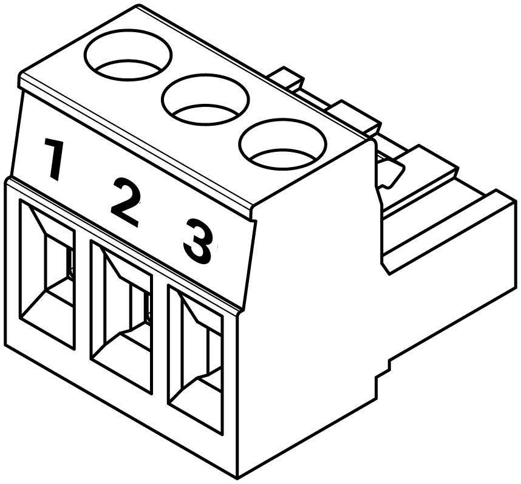

# Electrical Meter Installation and Commissioning Guide

# 1. Powering and Installing the Gateway
This section will outline the process required to power and install the gateway.

## 1.1 Re-attaching the Aerials
Before powering on the gateway, ensure the LoRa and 4G aerials are securely screwed into their correctly labeled ports on top of the gateway. The LoRa aerial is identifiable by two lines around its base (see Images 1 and 2).

 

 

The aerials are stored inside the enclosure during shipping to prevent damage. To access them, unscrew the four corner screws on the enclosure lid (these are only finger-tight when shipped). (See images 3 and 4)

 

 

During this step confirm the circuit breaker is in the 'ON' position before re-installing the enclosure lid. The up position is when the circuit breaker is ON. (See Image 5)

 

## 1.2 Installing the Gateway
If securing the gateway to a wall, use four fixings - one in each corner of the enclosure. The choice of fixings will depend on the wall material.

If wall-mounting is not required, ensure the gateway is stored in a safe and secure location, free from any stress on the power cable.

## 1.3 Powering the Gateway
The gateways come with a pre-wired 3-pin plug. Simply connect this to a power outlet and switch it on. Allow up to 5 minutes for the 4G router and Rubix Compute to power up completely.

 

# 2. Modbus Connection 
The Nube-iO Energy Monitoring System is compatible with Modbus RTU (Serial RS485) and Modbus TCP electrical meters.

## 2.1 Modbus RS485 Meters
To establish communication with Modbus RS485 meters to a Rubix Compute, the Rubix Compute RS485 connectors are terminated and installed as shown below.

|           	|      |
|-----------	|----------------	|
| Pin 1 (**+**) 	| **A** or **+** of RS485 Network         	|
| Pin 2 (-) 	| **B** or - of of RS485 Network  	|
| Pin 3 (**G**) 	| **C** or **Ground**      	|

Follow the manufacturer instructions for wiring and configuring the RS485 connection on the meter end. 

When wiring an RS485 network a **single shielded twisted pair (STP)** cable should be used and each meter **MUST** be connected in a **Daisy Chain**. Meters that are connected between 2 other meters will have 2 wires (one from the previous meter and one from the next meter) in the same terminal. 

For optimal performance when connecting an RS485 network, the last device on the network should have an End Of Line (EOL) resistor installed.

:::caution
Polarity of the **A/+** and **B/-** wires must be kept consistent for all meters on the network.
:::

See example network topology below.

 

## 2.2 Modbus TCP Meters
To establish communication with Modbus TCP meters to a Rubix Compute, the meter must be connected to the same network as the Rubix Compute. Follow the manufacturer instructions for wiring and configuring the Ethernet connection on the meter end. The meter must be configured with a static IP address.

Contact Nube iO support (service@nube.io.com) for the configured IP addresses of the Rubix Compute to confirm the meter is on the same subnet as the Rubix Compute. The default configuration for the 2 x Ethernet ports on the Rubix Compute is shown below.

| Port Name | Linux Port Name | Type  | IP            | Subnet        | Gateway      |
|-----------|-----------------|-------|---------------|---------------|--------------|
| ETH-1     | eth0            | Fixed | 192.168.15.10 | 255.255.255.0 | 192.168.15.1 |
| ETH-2     | eth1            | DHCP  | Dynamic       | Dynamic       | Dynamic      |

See example network topology below.

 

# 3. Commissioning
The Electrical Meter Commissioning process involves first configuring and commissioning the meter, then confirming communication with the Rubix Compute, and verifying correct readings.

## 3.1 Electrical Meter 

## 3.1.1 Meter Configuration
Follow the manufacturer instructions for configuring the electrical meter. This will involve configuring the following parameters:
- Modbus address 
- TCP IP address (for Modbus TCP meters)
- Baud rate (for Modbus RTU meters)
- Parity (for Modbus RTU meters)
- Data bits (for Modbus RTU meters)
- Stop bits (for Modbus RTU meters)

## 3.1.2 Meter Commissioning
The Electrical meter must be commissioned to ensure it is correctly reading and reporting the required parameters. This involves configuring the following:
- Voltage references
- Current transformer connection type (eg 2 CT, 3 CT, Single-Balanced CT, etc)
- Current transformer ratios (CT Ratios)

Note some smart meter models have the capability to auto-detect CT ratios and CT connection type, refer to the manufacturer instructions for details.

Once the meter is configured, confirm the meter is correctly reading the required parameters such as voltage, current, power, energy, etc. Refer to the manufacturer instructions for how to access these readings on the meter.
- Voltage - Should be checked to be +/- 10% of nominal voltage (eg 230V)
- Frequency - Should be checked to be +/- 10% of nominal frequency (eg 50Hz)
- Current - Should be checked with a clamp meter or similar device to confirm it is reading the current correctly.
- Power - Should be checked to be approximately equal to Voltage x Current (allowing for power factor). **MUST** be positive when load is connected.
- Energy - Should be checked to be increasing when load is connected and decreasing when load is removed.

## 3.2 Nube iO Remote Meter Reading System (RMRS)
Once the meter is configured and commissioned, confirm the meter is communicating with the Rubix Compute and reporting the correct readings in the Nube iO RMRS. If the meter is not reporting, refer to the System Troubleshooting Guide for steps to identify and rectify communication issues.

