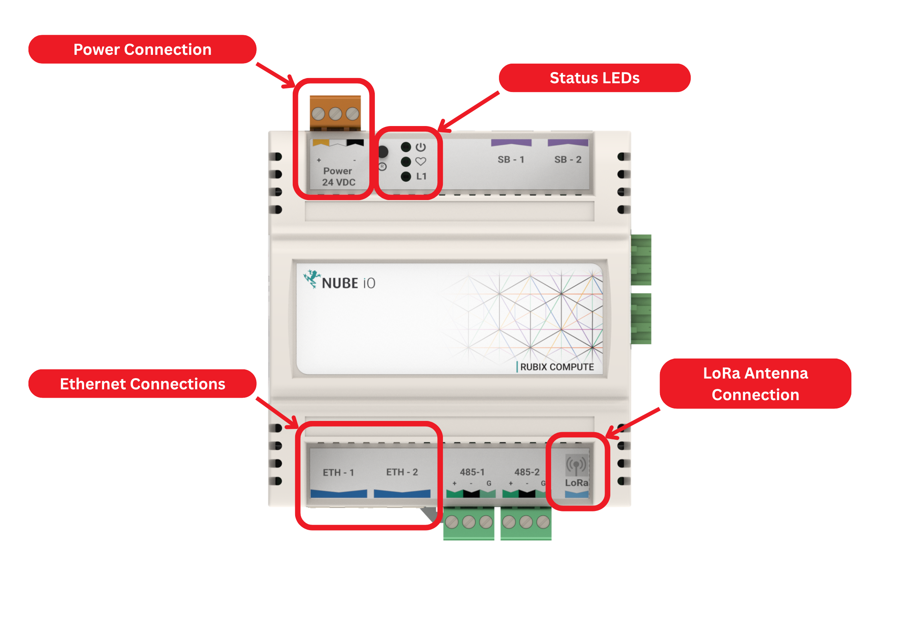
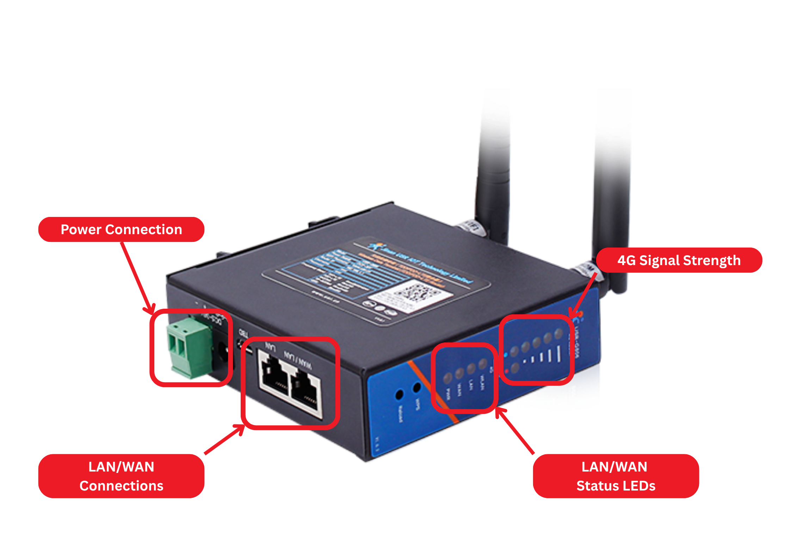
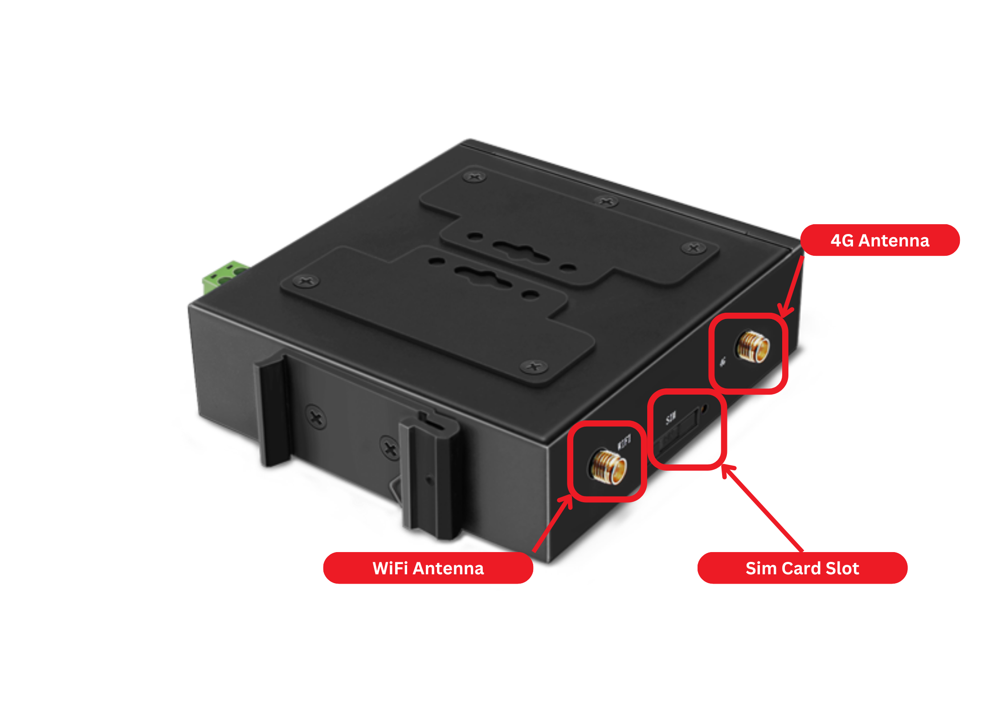
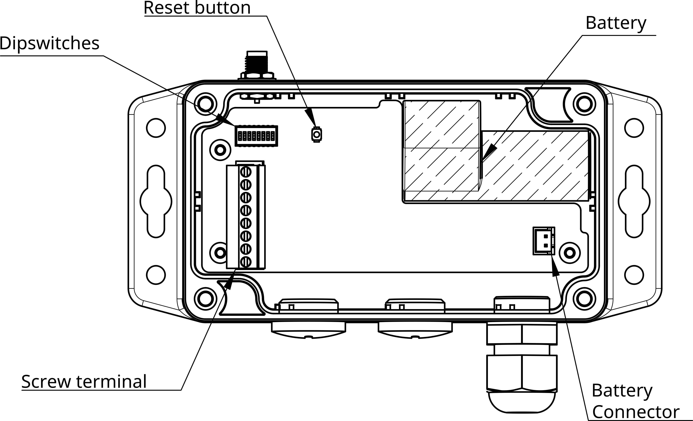

# EMS System Troubleshooting Guide v2

## Overview
Use this guide for quick on-site checks to identify power, network, sensor, and hardware issues before escalation. Checks are separated by role so the right person performs the right action safely.

Power supply unit (PSU) in this guide means the device providing low-voltage power to the gateway (typically a 24V power supply).

## Safety and Role Boundary
- Facilities Manager: visual inspection, status checks, simple resets, cable reseat, battery replacement, and evidence collection.
- Licensed Tradesperson (Electrician/Plumber): live electrical testing, rewiring, supply rectification, terminations, and meter/sensor plumbing-electrical rectification.
- If there is water ingress to the gateway, burn marks, or exposed conductors, isolate equipment and escalate immediately.

## Gateway (Rubix Compute)

Use this image as a quick visual reference for the Rubix Compute check points:

- **Power Connection:** 24V DC power connection for the Rubix Compute.
- **Status LEDs:** Visual status indicators for power, activity, and communication state. 
- **Ethernet Connections:** LAN ports used for wired network connections.
- **LoRa Antenna Connection:** RF antenna connection used for LoRa field-device communications such as Microedges and Droplets.

| No. | Check | Role | Symtom | Likely Cause | Action |
| --- | --- | --- | --- | --- | --- |
| 1 | Gateway Hardware Condition Check | Facilities Manager | Visible water ingress, burn marks, or loose wiring | Physical damage or installation fault | Isolate equipment and escalate to licensed tradesperson. |
| 2 | Gateway LED Check | Facilities Manager | No LEDs on gateway | Power not present | Check local breaker label/status, confirm 24V power supply is ON, and confirm connectors are seated. |
| 3 | Gateway Data Status Check | Facilities Manager | Gateway LEDs ON, no data | Network/router issue | Confirm Ethernet link lights, reboot router, and verify WAN service status. |
| 4 | Ethernet Link-Light Check | Facilities Manager | Ethernet light OFF | No network link | Reconnect or replace Ethernet patch cable. |
| 5 | 24V Supply Voltage Check | Licensed Tradesperson (Electrician) | Gateway still no power after basic checks | Failed 24V power supply (PSU), missing 24V feed, or wiring fault | Test supply voltage, polarity, and continuity; rectify feed/termination; replace failed 24V power supply. |
| 6 | Termination Integrity Check | Licensed Tradesperson (Electrician) | Loose or failed terminations | Installation fault | Re-terminate wiring to standard, torque-check terminals, and verify enclosure integrity. |
| 7 | Electrical Damage Check | Licensed Tradesperson (Electrician) | Burn marks or heat damage | Electrical fault/current event | Isolate circuit, replace damaged components, and verify protective device coordination. |

## Router

Use this image as a quick visual reference for the Rubix Compute check points:

- **Power Connection:** 24V DC power connection for the router.
- **LAN/WAN Connection:** Ethernet ports used for internet connectivity and connecting to the Rubix Compute.
- **4G Signal Strength:** Visual status indicator for cellular signal strength.
- **LAN/WAN Indicator:** Visual status indicator for LAN/WAN network connectivity.
- **4G Antenna:** RF antenna connection used for cellular communications.
- **WiFi Antenna:** RF antenna connection used for WiFi communications.

| No. | Check | Role | Symtom | Likely Cause | Action |
| --- | --- | --- | --- | --- | --- |
| 1 | Router Power Check | Facilities Manager | Router has no power | Adapter unplugged/failed | Check adapter is plugged in, verify outlet is active, and swap with known-good adapter if available. |
| 2 | Router WAN/Internet Check | Facilities Manager | Router no internet | WAN/ISP issue | Reboot router once, confirm WAN indicator, and check known ISP outage. |
| 3 | Router Ventilation Check | Facilities Manager | Router overheating | Ventilation issue | Improve airflow, remove obstruction, and monitor stability. |
| 4 | Router Supply Voltage Check | Licensed Tradesperson (Electrician) | Router still no power after basic checks | Failed adapter/power feed or wiring fault | Test supply voltage and polarity, rectify feed/termination, and replace failed supply hardware. |

## Micro-Edge (LoRa Sensor)

Use this image as a quick visual reference for the Micro-Edge check points:
- **LoRa Antenna:** RF antenna connection used for LoRa communications with the gateway.
- **Cable Entry Gland:** Sealed entry point for sensor cables, providing ingress protection.
- **Reset Button:** Physical button used for resetting the sensor to restart device operation.
- **Battery:** Internal 3.6V 4000mAh battery providing power to the Micro-Edge.
- **Battery Connector:** Connection point for the battery.
- **Screw Terminals:** Connection points for sensor wiring, such as pulse inputs from a water meter.

 

| No. | Check | Role | Symtom | Likely Cause | Action |
| --- | --- | --- | --- | --- | --- |
| 1 | Battery Health Check | Facilities Manager | Micro-Edge not reporting or low battery alarm | Battery depleted or poor battery contact | Replace battery and recheck reporting. |
| 2 | Micro-Edge Reporting Check | Facilities Manager | Micro-Edge no data | Battery or LoRa path issue | Replace battery, verify gateway is online, and check for new obstructions. |
| 3 | LoRa Signal/Antenna Check | Facilities Manager | Intermittent data | Weak signal | Reposition sensor/antenna within approved location. |
| 4 | Meter Orientation/Install Check | Licensed Tradesperson (Plumber/Electrician) | Incorrect water/flow readings | Sensor install/config issue | Verify meter orientation, installation condition, wiring pulse/config, then recommission. |
| 5 | Field Device Wiring Check | Licensed Tradesperson (Plumber/Electrician) | Persistent no data from field device | Field wiring/device failure | Test loop/pulse/wiring path, rectify fault, and replace failed field device. |
| 6 | Ingress Protection Check | Licensed Tradesperson (Plumber/Electrician) | Water ingress at enclosure/device | Seal or gland failure | Replace compromised parts, reseal glands/enclosure, and verify ingress protection. |

## Contact Nube iO Support When
- Facilities Manager checks are complete and issue persists.
- Licensed tradesperson rectification is complete but telemetry is still missing/incorrect.
- Gateway and network are healthy but field devices still do not report.
- Repeated faults occur after rectification.

**Email:** service@nube-io.com  
**Phone:**  +(61) 279 068 414

## Field Notes Template
Use this section when contacting Nube iO support:

- Site name:
- Date/time:
- Contact person:
- Gateway serial/Build ID:
- Affected device(s):
- Symptoms observed:
- Facilities Manager checks completed:
- Licensed trade checks completed:
- Actions taken:
- Photos attached: