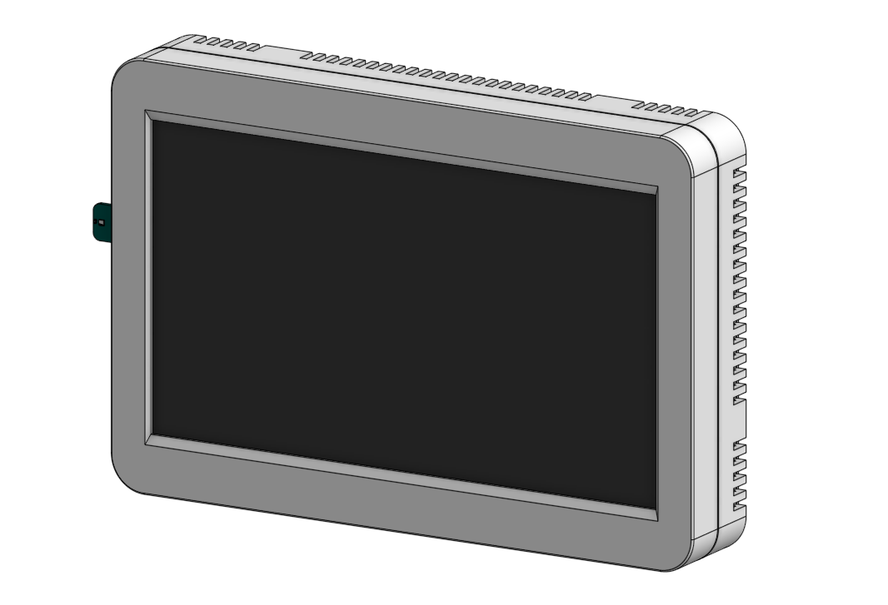

# TouchPoint LCD User Manual

# 1. Overview/About Product

## 1.1. Product Overview
This wall-mounted touchscreen provides a local control interface and environmental sensing node for UART-compatible split ducted air conditioning systems in residential and light commercial environments. Designed for IoT-enabled HVAC and Building Management Systems, it acts as both a user control point and a source of environmental feedback.

Optimised for smart home and retrofit installations, it enables smooth interaction between users and connected HVAC systems. The intuitive interface allows quick adjustments to setpoints, fan modes, zoning preferences, and schedules, helping deliver a more comfortable and efficient indoor environment.

Connects easily to centralised BMS platforms via RS485, with support for Modbus RTU and custom integration profiles. Integrated temperature and humidity sensors provide environmental feedback that enables intelligent automation and energy-efficient HVAC control.

## 1.2. Architecture
**Touch Point LCD:** This wall-mounted touchscreen provides a local control interface for the user to manage and monitor the air conditioning system.  
**ZoneConnex Controller:** Acts as the master device, interfacing with compatible RAC/PAC and VRF Air Conditioning units via the UART protocal. It manages data transmission to and from the field devices and manages the control of the air conditioning system.  
**Nube iO Mobile App:** This mobile application provides a remote control interface for the user to manage and monitor the air conditioning system.  
**Droplet:** This wireless LoRa device monitors temperature and humitidy in each zone transmitting data to the ZoneConnex allowing for individual zone control.

 

## 1.3. Product Features

## 1.3.1 Hardware Features
**Wireless Connectivity:** The Touch Point LCD supports Wi-Fi 802.11 b/g/n connectivity. 
**RS-485:** The Touch Point lCD incorrporates 1x RS485 communication port.  
**DC Power:** The Touch Point LCD incorrporates a 18VDC power input port.
**USB-C:** Service / Programming Port used to manage the Touch Point LCD firmware.

## 1.3.2 Control Features
**Operation Control:** Enable the unit on and off. 
**Mode Control:** Switch between cool, heat, dry, auto, and fan modes. 
**Temperature Setpoint Control:** Adjust heating/cooling temperature setpoint.
- Cooling setpoint 18 to 30 degrees Celsius
- Heating setpoint 16-18 to 30 degrees Celsius (low limit model dependent)

**Fan Speed Control:** Control fan speeds (model dependent). 
**Return Air Temperature Monitoring:** Monitor the return air temperature. 
**Zone Temperature/Humidity Monitoring:**
**Zone Control:** Via the MIA mobile app users can interface with the ZoneConnex to control up to 10 zone dampers. Each damper can be controller within a range of 0-100% airflow in 5% increments.  
**Schedule Management:** Via the MIA mobile app, users can configure and manage schedules to automatically run their air conditioning unit at set times and days — helping maintain comfort, reduce manual adjustments, and improve energy efficiency.  
**Run Mode Management:** Via the MIA mobile app, users can set timed On/Off actions based on the unit’s current state. If the system is already running, a Run Off timer can be enabled to automatically turn the unit off after the selected duration. If the system is currently off, a Run On timer can be set to automatically start the unit after the chosen time period.  
**Scene Management:** Via the MIA mobile app, users can create custom “scenes” that bundle specific run conditions—such as mode, setpoint, and fan speed. These scenes can then be applied to schedules, or link them to run modes for consistent comfort with a single action.  
**Error Status Reporting:** Via the MIA mobile app users can monitor the error status and error codes generated by the Air Conditioner unit whilst also monitoring system generated alerts such as communications errors.

 

# 2. Hardware Overview

## 2.1. Packing List
- Installation & User Manual 
- Touch Point LCD Device 
- 15m 4 core 24AWG Power/communication cable
- Pan Head Self Tapping Screws (4x M3x25mm)

## 2.2. Product Dimensions
|                	        |                                           |
|-----------------------	|-----------------------------------------	|
| Height:               	| 112.55 mm / 4.43 inches                	  |
| Width:                	| 180.97 mm / 7.13 inches                      |
| Depth:                	| 17.5 mm / 0.69 inches                   	|
| LCD Housing             	| White ABS Plastic	    |
| LCD Panel             	|  Glass, Liquid Crystal, Polarizer, LED    |

<!--  -->

## 2.3. Product Component Breakdown

### 2.3.1 Front View
*Insert Image*
<!-- - 24VAC/DC Power Input: Termination block for connecting the ZoneConnex 24VAC/DC power input.
- U.FL Antenna: Connects the antenna for LoRa & LoRaWan communication.
- Wifi Antenna: Connects the antenna for Wifi communication.
- Din Rail Clip: Allows for secure din rail mounting and maintenance.
- Mounting Clips: Allows for secure mounting via use of appropriate fixings.
- UART Port: Termination block for connecting the ZoneConnex to UART communication.
- RS485-ISO: Termination block for connecting third party field-bus communication devices to the ZoneConnex.
- LCD RS485: Termination block for connecting Touch Point LCD or local NubeiO Modbus devices to the ZoneConnex.
- LCD 18VDC Power: Termination block for powering the Touch Point LCD from the ZoneConnex. -->

<!--  -->

### 2.3.2 Top View
*Insert Image*
<!-- - 24VAC/DC Power Input: Termination block for connecting the ZoneConnex 24VAC/DC power input.
- Wifi Antenna: Connects the antenna for Wifi communication
- Zone Control Ports 1-5: RJ12 outputs to supply 24V AC to control the zone dampers.
- USB-C: Service / Programming Port used to manage the ZoneConnex firmware.
- 6-Pin STM32 Port: STM32 Programming Port ***used for?***
- ACBM Reset Button: ***used for?*** ***Factory reset?***
- ACBM User Button: ***used for?*** ***Reboot?***
- Zone Control Reset Button: ***used for?*** ***Factory reset?***
- Zone Control Button: ***used for?*** ***Reboot?*** -->

<!--  -->

### 2.3.3 Bottom View
*Insert Image*
<!-- - Zone Control Ports 6-10: RJ12 outputs to supply 24V AC to control the zone dampers.
- U.FL Antenna: Connects the antenna for LoRa & LoRaWan communication.
- RJ45 Ethernet Port 1: 100 Mbps RJ45 Ethernet Port for LAN Connection.
- RJ45 Ethernet Port 2: 100 Mbps RJ45 Ethernet Port for LAN Connection.
- UART Port: Termination block for connecting the ZoneConnex to UART communication.
- RS485-ISO: Termination block for connecting third party field-bus communication devices to the ZoneConnex.
- LCD RS485: Termination block for connecting Touch Point LCD or local Modbus devices to the ZoneConnex.
- LCD 18VDC Power: Termination block for powering the Touch Point LCD from the ZoneConnex. -->

<!--  -->

 

# 3. Installation & Configuration

## 3.1. Mounting
The Touch Point can be mounted via fixings utilising the mounting holes incorporated in the LCD housing. The Touch Point LCD should always be mounted in a location such that it will not experience extreme high or low temperatures, liquids or high humidity.

### 3.1.1 Fixings & Mounting Clips
Use the following steps to mount the Touch Point LCD utilising the 4x mounting clips and fixings:

1. **Step-1** Using a flat-blade screwdriver, carefully release the two retaining clips on the bottom side of the housing.
2. **Step-2** Position the Touch Point LCD housing against the mounting surface and mark the fixing hole locations using the mounting holes as a guide.
3. **Step-3** Remove the Touch Point LCD housing and drill the required fixing holes at the marked locations. Install wall plugs if mounting to masonry or plasterboard.
4. **Step-4** Align the Touch Point LCD housing with the fixing points and secure it to the surface using appropriate screws or fixings. Do not overtighten.
5. **Step-5** Gently pull the LCD Screen housing forward to confirm it is securely mounted.
6. **Step-6** Feed the prewired cable through the desired cable entry point and re-insert the LCD screen ensuring the two retaining clips on the bottom side of the house are re-seated into the slots.

 

Use the following steps to remove the Touch Point LCD utilising the 4x mounting clips and fixings:

1. **Step-1** Isolate power to the Touch Point LCD and ensure all connected equipment is safely powered down. 
2. **Step-2** Using a flat-blade screwdriver, carefully release the two retaining clips on the bottom side of the housing.
3. **Step-3** Gently pull the LCD screen forward and away from the housing to disengage it.
4. **Step-4** Disconnect the prewired cable from the rear of the LCD screen, or pull through the excess cable if available.
5. **Step-5** If removing the housing, loosen and remove the fixing screws securing the housing to the mounting surface then carefully lift the Touch Point LCD housing away from the mounting surface.

 

*Insert Image*
<!--  -->

 

## 3.2. Power Supply Connections
*Insert Power Connections information and descriptions*

 

## 3.3. Communication Connections
*Insert Communications Connections information and descriptions*

 

# 5. Operation Guide
*Insert Operational information and descriptions*

 

# 6. Point Register (If Applicable*)
*Insert Point Register for device including a point table*

<!-- Example:

| **0-10VDC**    	|                   	|
|----------------	|-------------------	|
| Register Type  	| Holding Registers 	|
| Data Type      	| UINT16            	|
| Function Codes 	| 3,6,16            	|
| Description    	| Set value         	|
| Value Scale    	| x0.01              	|

| Point 	| Register 	|
|-------	|----------	|
| U01   	| 1        	|
| U02   	| 2        	|
| U03   	| 3        	|
| U04   	| 4        	|
| U05   	| 5        	|
| U06   	| 6        	|
| U07   	| 7        	|
| U08   	| 8        	| -->

 

# 7. Document Revision

| Revision | Date       | Change Description                  |
|----------|------------|------------------------------------|
| 1.0      | 28-11-2025 | Initial release of the document.   |
| 1.1      | DD-MM-YYYY | Description of the next change.    |
| 1.2      | DD-MM-YYYY | Description of the next change.    |

