# Zone Connex User Manual

# 1. Overview/About Product

## 1.1. Product Overview
ZoneConnex is Nube iO’s pre-programmed HVAC zone controller, designed to provide a local interface for monitoring and managing split ducted air conditioning systems in residential and light commercial environments.

It delivers precise zone control and system visibility through the Nube iO MIA mobile app or via the Nube iO Touch Point LCD screen, allowing users to easily adjust temperature settings, mode selections, and airflow preferences across multiple zones.

Optimised for smart home integration and HVAC retrofit installations, ZoneConnex streamlines interactions between users and connected systems — helping improve comfort, efficiency, and overall control flexibility.

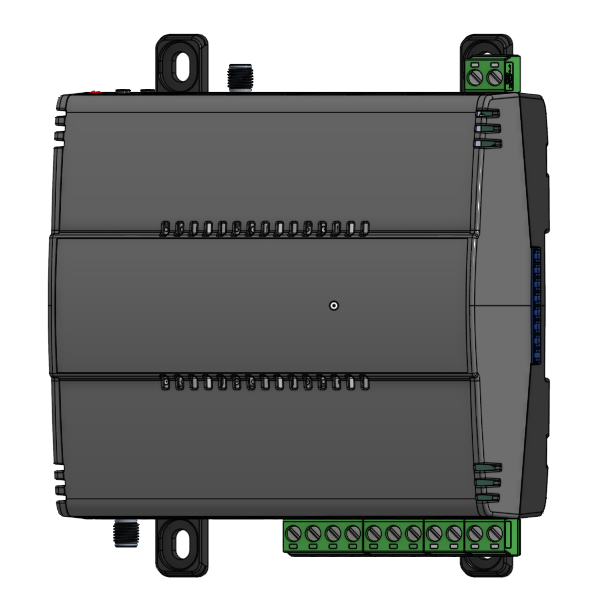

## 1.2. Architecture
**ZoneConnex Controller:** Acts as the master device, interfacing with compatible RAC/PAC and VRF Air Conditioning units via the UART protocal. It manages data transmission to and from the field devices and manages the control of the air conditioning system.  
**Touch Point LCD:** This wall-mounted touchscreen provides a local control interface for the user to manage and monitor the air conditioning system.  
**MIA Mobile App:** This mobile application provides a remote control interface for the user to manage and monitor the air conditioning system.  
**Droplet:** This wireless LoRa device monitors temperature and humitidy in each zone transmitting data to the ZoneConnex allowing for individual zone control.

## 1.3. Product Features

## 1.3.1 Hardware Features
**Wireless Connectivity:** The ZoneConnex supports Wi-Fi 2.4 GHz and Bluetooth 4.2 connectivity. 
**Ethernet:** 2x 100 Mbps RJ45 Ethernet Ports for LAN Connection. 
**RS-485:** The ZoneConnex incorrporates 2x RS485 Communication Ports
- 1 × Isolated RS-485 (for third party field-bus communication)
- 1 × RS-485 (for Touch Point LCD or local NubeiO Modbus device).

**Zone Control Ports:** The ZoneConnex incorrporates 10x RJ12 outputs supplying 24V AC to zone dampers. 
**Touch Point LCD Integration:** The ZoneConnex provides a power source and connection point for the Nube iO Touch Point LCD. 
**LoRa® & LoRaWan:** The ZoneConnex supports LoRa and LoRaWan communication. 

## 1.3.2 Control Features
**Operation Control:** Enable the unit on and off. 
**Mode Control:** Switch between cool, heat, dry, auto, and fan modes. 
**Temperature Setpoint Control:** Adjust heating/cooling temperature setpoint.
- Cooling setpoint 18 to 30 degrees Celsius
- Heating setpoint 16-18 to 30 degrees Celsius (low limit model dependent)

**Fan Speed Control:** Control fan speed (model dependent). 
**Zone Control and Managment:** Control and manage 10 zones individually. 
**Return Air Temperature Monitoring:** Monitor the return air temperature. 
**Zone Air Temperature Monitoring:** Monitor each zone air temperature indivudually via paired Droplet sensors. 
**Error Status Reporting:** Retrieve the error status and error code.

 

# 2. Hardware Overview

## 2.1. Packing List
- Installation & User Manual 
- ZoneConnex Device 
- Wifi Antenna
- LoRa Antenna
- PAP-04V-S UART communication cable
- 4 core 24AWG Power/communication cable
- Pan Head Self Tapping Screws (4x M3x25mm)

## 2.2. Product Dimensions
|                	        |                                           |
|-----------------------	|-----------------------------------------	|
| Height:               	| 105.31 mm (134.1 incl. clips) / 4.15 inches (5.27 incl. clips)                  	  |
| Width:                	| 111.84 mm / 4.40 inches                      |
| Depth:                	| 70.25 mm (72.95 incl. clips) / 2.76 inches (2.87 incl. clips)                    	|
| Enclosure             	| PC/ABS blend (Flame Retardant Grade, UL94 V-0) Matte Black, IP2X Rated 	    |

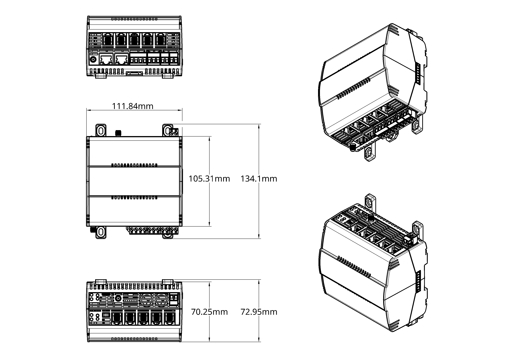

## 2.3. Product Component Breakdown

### 2.3.1 Front View
- 24VAC/DC Power Input: Termination block for connecting the ZoneConnex 24VAC/DC power input.
- U.FL Antenna: Connects the antenna for LoRa & LoRaWan communication.
- Wifi Antenna: Connects the antenna for Wifi communication.
- Din Rail Clip: Allows for secure din rail mounting and maintenance.
- Mounting Clips: Allows for secure mounting via use of appropriate fixings.
- UART Port: Termination block for connecting the ZoneConnex to UART communication.
- RS485-ISO: Termination block for connecting third party field-bus communication devices to the ZoneConnex.
- LCD RS485: Termination block for connecting Touch Point LCD or local NubeiO Modbus devices to the ZoneConnex.
- LCD 18VDC Power: Termination block for powering the Touch Point LCD from the ZoneConnex.

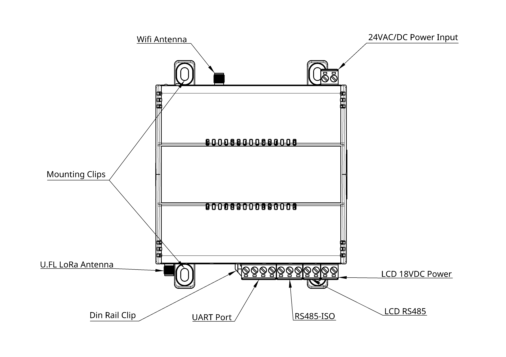

### 2.3.2 Top View
- 24VAC/DC Power Input: Termination block for connecting the ZoneConnex 24VAC/DC power input.
- Wifi Antenna: Connects the antenna for Wifi communication
- Zone Control Ports 1-5: RJ12 outputs to supply 24V AC to control the zone dampers.
- USB-C: Service / Programming Port used to manage the ZoneConnex firmware.
- 6-Pin STM32 Port: STM32 Programming Port ***used for?***
- ACBM Reset Button: ***used for?*** ***Factory reset?***
- ACBM User Button: ***used for?*** ***Reboot?***
- Zone Control Reset Button: ***used for?*** ***Factory reset?***
- Zone Control Button: ***used for?*** ***Reboot?***

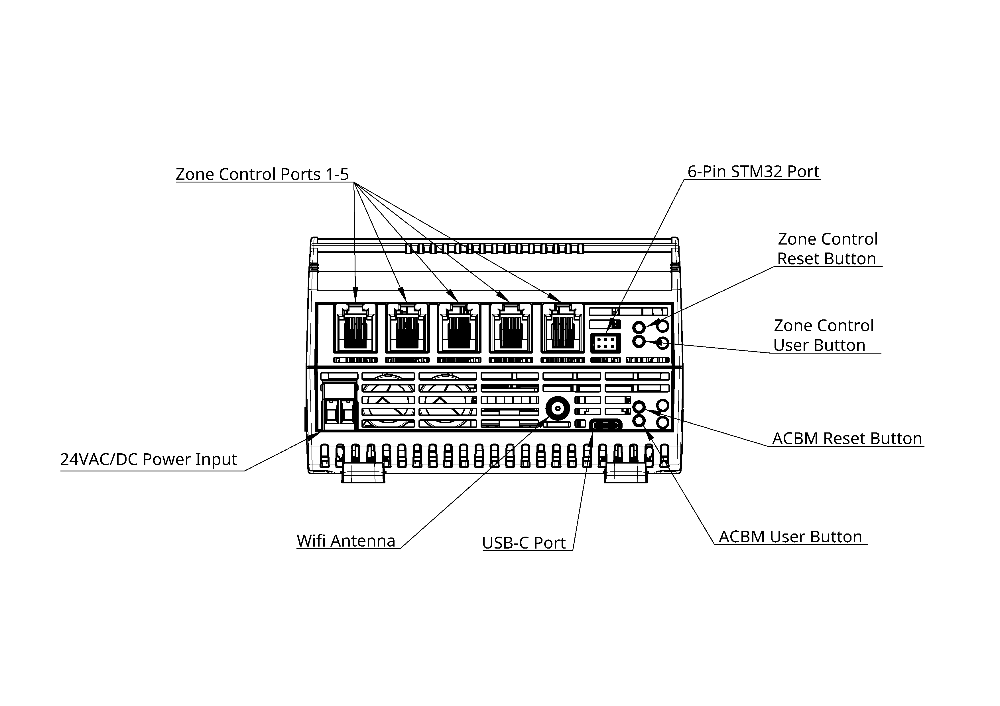

### 2.3.3 Bottom View
- Zone Control Ports 6-10: RJ12 outputs to supply 24V AC to control the zone dampers.
- U.FL Antenna: Connects the antenna for LoRa & LoRaWan communication.
- RJ45 Ethernet Port 1: 100 Mbps RJ45 Ethernet Port for LAN Connection.
- RJ45 Ethernet Port 2: 100 Mbps RJ45 Ethernet Port for LAN Connection.
- UART Port: Termination block for connecting the ZoneConnex to UART communication.
- RS485-ISO: Termination block for connecting third party field-bus communication devices to the ZoneConnex.
- LCD RS485: Termination block for connecting Touch Point LCD or local Modbus devices to the ZoneConnex.
- LCD 18VDC Power: Termination block for powering the Touch Point LCD from the ZoneConnex.

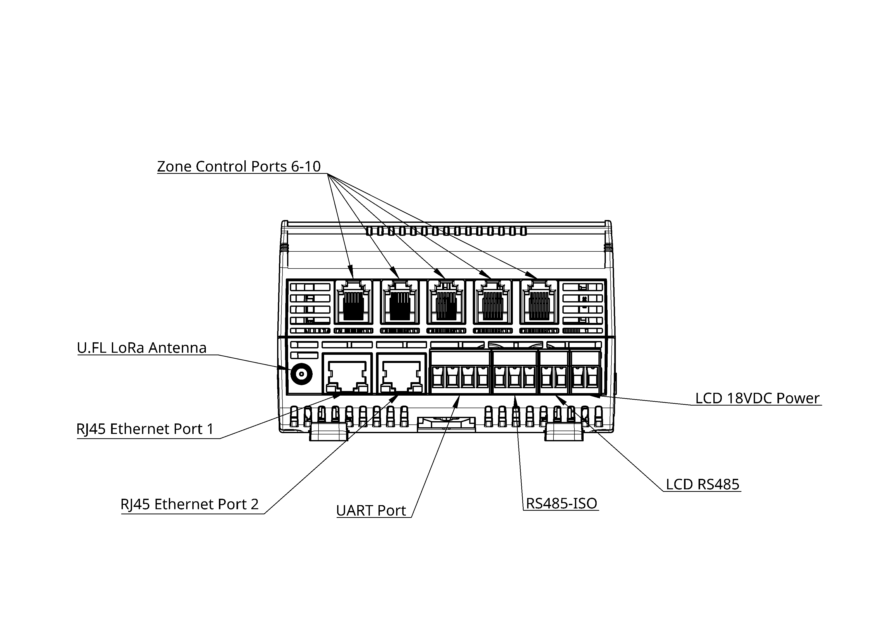

 

# 3. Installation & Configuration

## 3.1. Mounting
The ZoneConnex can be mounted in on din rail or via fixings utilising the mounting clips depending on the type of air conditioning system. In all cases, the antenna must remain vertical (unless specifically noted).

### 3.1.1 Din Rail Mounting
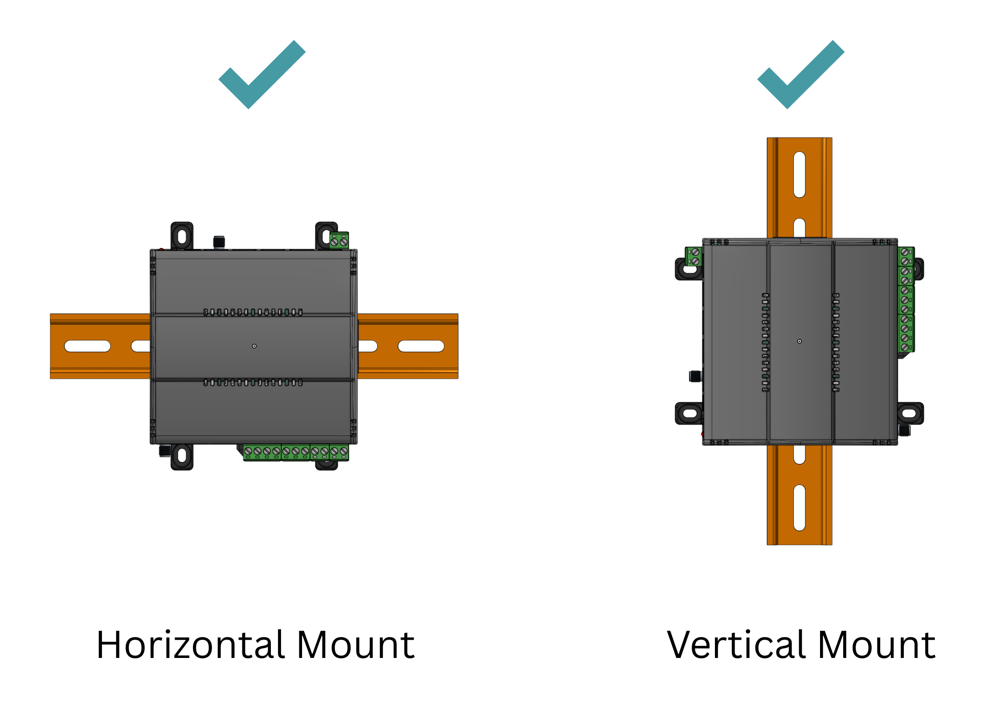

### 3.1.2 Fixings & Mounting Clips
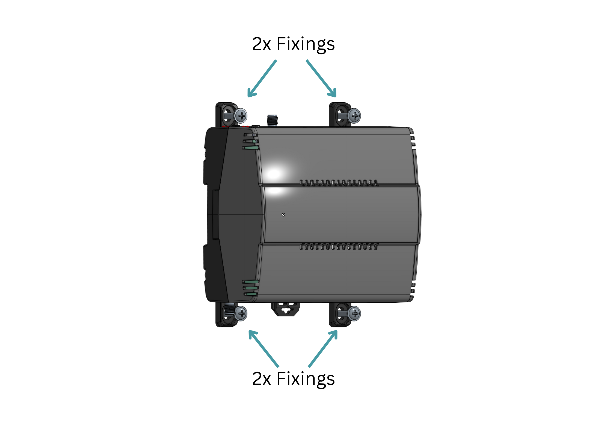

 

## 3.2. Power Supply Connections

### 3.2.1 ZoneConnex Power Supply
The ZoneConnex can be powered by a 24V AC or DC power supply on the 24VAC/DC power terminals as shown below. 

|            | 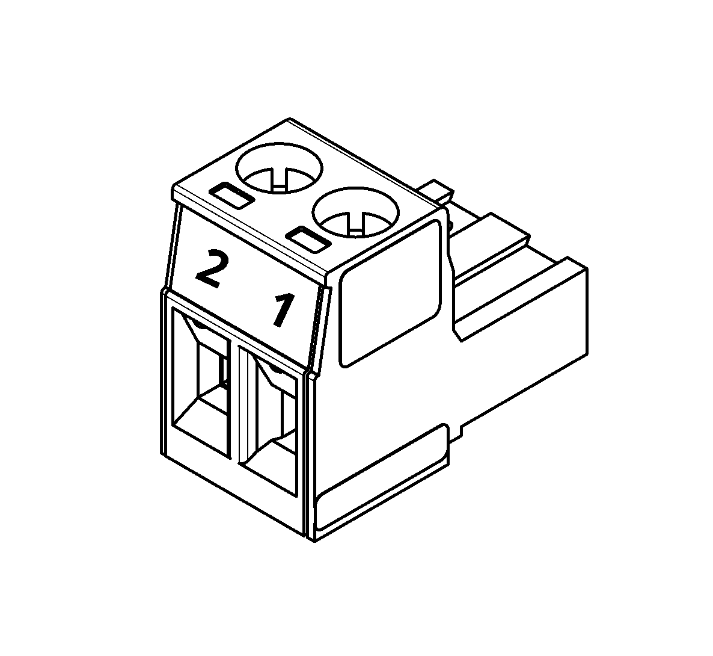 |
|----------- |----------------------------------------|
| Pin 1 **(L / +)** | 24V AC **Live (L)** or 24V DC **+** |
| Pin 2 **(N / -)** | 24V AC **Neutral (N)** or 24V DC **−** |

**Note:** 24V AC must be used if zone damper control is required in order to power the actuators.

### 3.2.2 Touch Point LCD Power Supply
The ZoneConnex is equiped power the NubeiO Touch Point LCD. The ZoneConnex supplys 18V DC via connection to the LCD 18VDC Power terminals as shown below. 

|            | 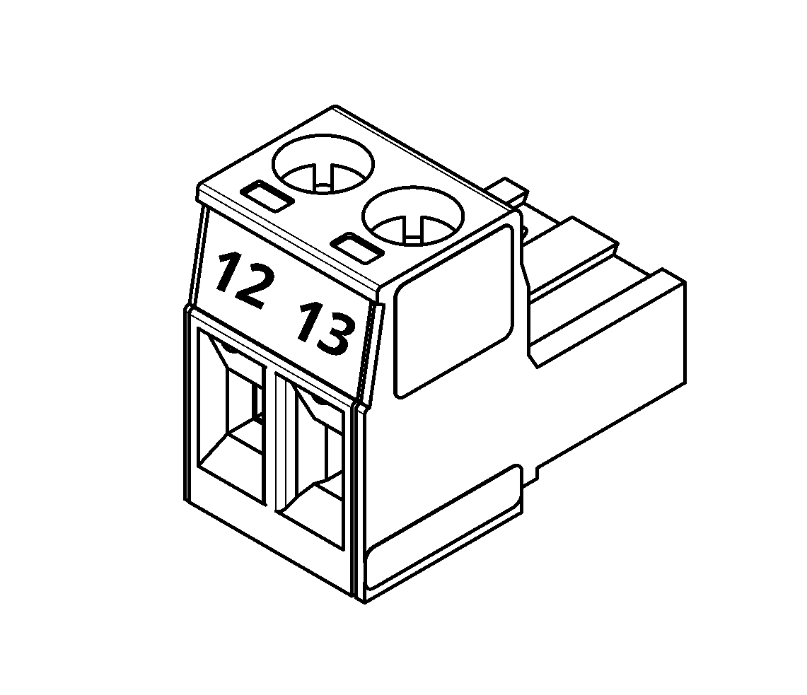 |
|----------- |----------------------------------------|
| Pin 12 **(+)** | 24V DC **+** |
| Pin 13 **(-)** | 24V DC **−** |

 

## 3.3. Communication Connections

### 3.3.2 UART Connection
The ZoneConnex is equiped to interface with compatible RAC/PAC and VRF Air Conditioning units via the UART protocal. 

The UART connection is terminated and installed as shown below.

|           	| 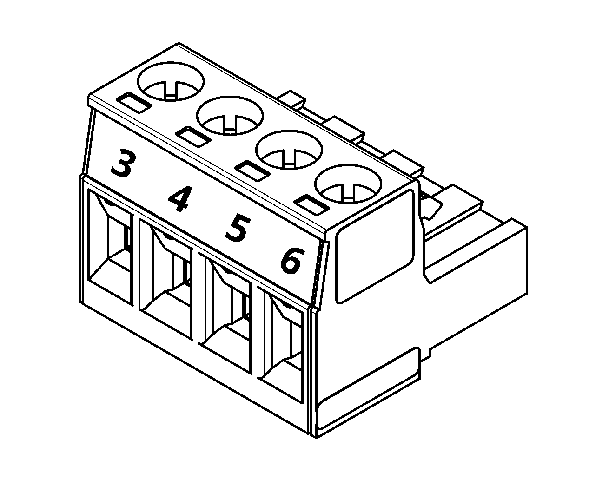     |
|-----------	|----------------	                    |
| Pin 3 (**G**) | **Ground** of UART Network       |
| Pin 4 (**RX**) | **RX** of UART Network       |
| Pin 5 (**TX**) | **TX** of UART Network     	            |
| Pin 6 (**Spare**) | NOT USED   	            |

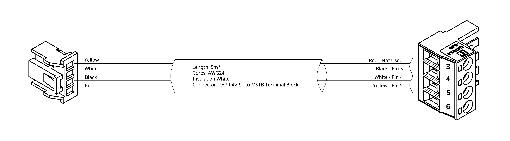

### 3.3.2 RS485 Connections

There are two ports available to establish Modbus RS485 communication to devices via the ZoneConnex, LCD RS485 and RS485-ISO. 
- LCD RS485: Termination block for connecting Touch Point LCD or local NubeiO Modbus devices to the ZoneConnex.
- RS485-ISO: Termination block for connecting third party field-bus communication devices to the ZoneConnex.

The RS485 connectors are terminated and installed as shown below.

#### 3.3.2.1 RS485-ISO

|           	| 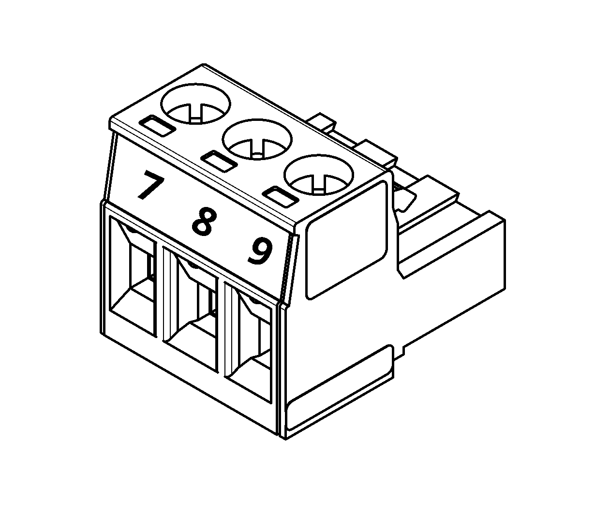     |
|-----------	|----------------	                    |
| Pin 7 (**+**) | **A** or **+** of RS485 Network       |
| Pin 8 (**-**) 	| **B** or **-** of of RS485 Network        |
| Pin 9 (**G**) | **C** or **Ground**      	            |

#### 3.3.3.2 LCD RS485

|           	| 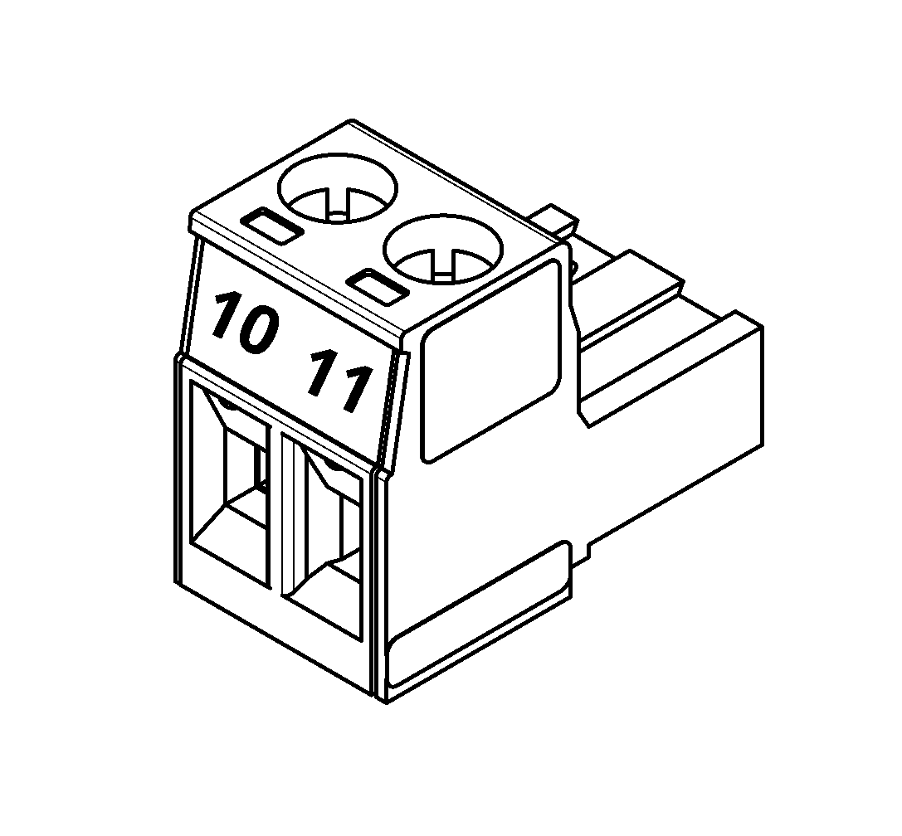     |
|-----------	|----------------	                    |
| Pin 12 (**+**) | **A** or **+** of RS485 Network       |
| Pin 13 (**-**) 	| **B** or **-** of of RS485 Network        |

 

# 5. Operation Guide
*Insert Operational information and descriptions*

 

# 6. Point Register (If Applicable*)
*Insert Point Register for device including a point table*

<!-- Example:

| **0-10VDC**    	|                   	|
|----------------	|-------------------	|
| Register Type  	| Holding Registers 	|
| Data Type      	| UINT16            	|
| Function Codes 	| 3,6,16            	|
| Description    	| Set value         	|
| Value Scale    	| x0.01              	|

| Point 	| Register 	|
|-------	|----------	|
| U01   	| 1        	|
| U02   	| 2        	|
| U03   	| 3        	|
| U04   	| 4        	|
| U05   	| 5        	|
| U06   	| 6        	|
| U07   	| 7        	|
| U08   	| 8        	| -->

 

# 7. Document Revision

| Revision | Date       | Change Description                  |
|----------|------------|------------------------------------|
| 1.0      | 28-11-2025 | Initial release of the document.   |
| 1.1      | DD-MM-YYYY | Description of the next change.    |
| 1.2      | DD-MM-YYYY | Description of the next change.    |

