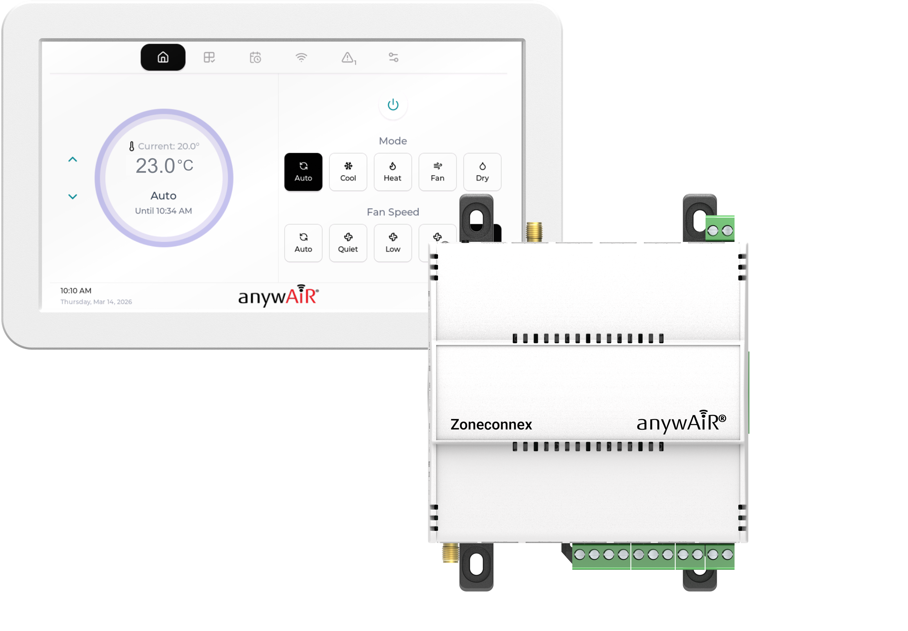
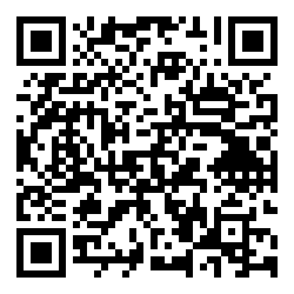
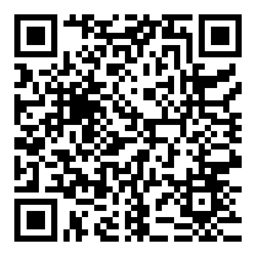
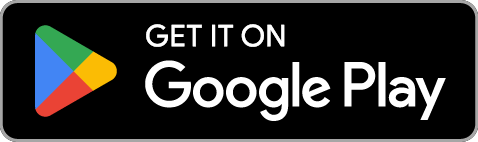
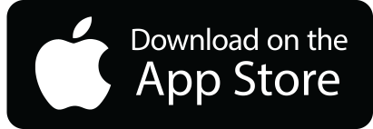

<h1 class="cover-title">Quick Start Guide Zoneconnex</h1>

INSTALLATION GUIDE

Model: UTY-ZCAW1

<h1 class="doc-title">Zoneconnex Quick Start Guide</h1>

Installation Guide

Please read the following information before installation and use.

For authorised service personnel only.

<strong>Note:</strong> This Zoneconnex system is only <strong>compatible with General Air Con's that have UART ports</strong>. Please check compatibility before installing.

# 1. Packaging Contents

Check that you have received all items below.

- Zoneconnex Controller
- TouchPoint LCD
- LoRa® Antenna
- 24VAC Power Supply
- 15m 4-core 24 AWG LCD power/communication cable
- 2m PAP-04V-S UART communication cable
- Pan head self tapping screws (8x M3 x 25mm)

# 2. Hardware Overview

Refer to following diagrams for component locations:

**Zoneconnex Front View:**

{.medium}

**Zoneconnex Top View:**

{.medium}

**Zoneconnex Bottom View:**

{.medium}

# 3. Fitting Installation

## 3.1 Mounting the Zoneconnex Controller

**A. DIN Rail Mounting**

Ensure the DIN rail is securely installed. **Hook the top of the Zoneconnex** onto the top of the DIN rail.

Pivot the bottom toward the rail until the **lower clip snaps into place**. Gently pull forward to confirm the Controller is securely mounted.

{.medium}

**B. Direct Mounting**

Attach mounting clips to the back of the Controller (if not pre-fitted). Position the Controller against the mounting location and **mark the fixing points**.

**Drill the holes and insert wall plugs if required.** **Secure the Controller** using appropriate **screws or fixings**. Gently pull forward to confirm it is firmly mounted.

{.medium}

## 3.2 Mounting the TouchPoint LCD

Release the **two bottom clips** to remove the LCD from its housing. Hold the housing against the wall and **mark the fixing points**. **Drill holes and insert wall plugs if needed.** **Secure the housing** to the wall with **screws**. Feed the **pre-wired cable** through the desired entry point. Re-insert the LCD by: engaging the **top clips first**, **then pressing the bottom clips** into place.

{.medium}

<figure><figcaption>Top retaining clips</figcaption></figure>
<figure><figcaption>Bottom retaining clips</figcaption></figure>

**Releasing the retaining clips**

<figure><figcaption><strong>Correct method:</strong> Insert a flat blade screwdriver onto the angled edge of the retaining clip (furthest from the LCD screen) and gently lever the clip away from the housing.</figcaption></figure>
<figure><figcaption><strong>Incorrect method:</strong> Do not insert the screwdriver into the slot closest to the LCD screen, as the clip cannot be safely or effectively levered away from the housing in this position.</figcaption></figure>

# 4. Power & Wiring

## 4.1 Zoneconnex Power Supply

<strong>Please note:</strong> The Air Conditioning unit should be isolated and off prior to any power &amp; wiring.

Connect the **prewired AC power supply** to the **24VAC** terminals (1 & 2) on the Zoneconnex — see diagram below:

{.small}

## 4.2 UART Connection

Route the **UART cable** into the Air Conditioning unit control panel and connect it to the **CN65** or **CN75** port via the UART interface — refer to diagram below:

{.medium}

{.small}

## 4.3 TouchPoint LCD RS485 & Power Supply

Connect the power/communication cable between the TouchPoint LCD and Zoneconnex.

The TouchPoint LCD:

- Communicates via a **Modbus RS485**.
- Receives **18VDC power from the Zoneconnex**.

{.small}

**Zoneconnex Pin Reference:**

|   |   |
|---|---|
| Pin 10 **(+)** | **A** or **+** of RS485 Network |
| Pin 11 **(-)** | **B** or **-** of RS485 Network |
| Pin 12 **(+)** | 18V DC **+** |
| Pin 13 **(-)** | 18V DC **−** |

## 4.4 TouchPoint LCD Connections

The TouchPoint LCD utilises **Push-To-Release** terminals. Gently press down on the terminal pin to release the clamp, insert or remove the cable, then release the pin to lock the cable in place.

The TouchPoint LCD pin connections are as shown in the following image:

{.medium}

# 5. Configuration

## 5.1 anywAiR® Zone Mobile App

Scan the QR code below to download the anywAiR® Zone Mobile App for iOS or Android.

| Android | iOS |
|---|---|
|  |  |
|  |  |

## 5.2 Wi-Fi Configuration

Follow the steps below to connect your Zoneconnex system to Wi-Fi:

1. On the TouchPoint LCD, press **Wi-Fi**.
2. Press **Scan Wi-Fi** to search for networks.
3. Select your network and press **Connect**.
4. Enter the network password using the on-screen keyboard.
5. Press **Connect**.

Once connected, the screen will display network information including: QR code, signal strength, connection speed, security type, and channel.

<figure><figcaption>Scan Wi-Fi</figcaption></figure>
<figure><figcaption>Connection details</figcaption></figure>

# 6. Installer Mode

To access installer mode, follow the prompts below in accordance with the Installer Mode anywAiR® Zone Mobile App workflow:

1. On the TouchPoint LCD home screen, tap the **Settings** icon.
2. On the settings/about screen, tap the **System** card **8 times**.

{.medium}

3. Enter the **installer password (default 898989)** and confirm.
4. Open the **anywAiR® Zone Mobile App**. Select **Continue as Installer**. Scan the **left QR** for connecting to Zoneconnex Access Point Wi-Fi.

{.medium}

5. Once connected to the Zoneconnex Access Point Wi-Fi, scan the **right QR** to access installer mode for the Zoneconnex.

{.medium}

To exit Installer Mode, press **Exit Installer Mode** in the app.

# 7. Zone Configuration

By default, zones are configured in a 1:1 pairing with dampers. This means Zone 1 is assigned to Damper 1, Zone 2 to Damper 2, and so on up to 10 zones.

This default setup allows for quick commissioning with minimal configuration. If required, zone-to-damper assignments can be customised during the zone configuration — refer to the configuration steps below:

1. Use the following steps to complete the **zone configuration** from the **Installer menu** on the **anywAiR® Zone app**.
2. Enter the total Number of Zones and required Constant Zones, then press **Next**.
3. Select the required Relief Zones, then press **Configure Zones**.
4. Configure the first zone:
    - Set Zone Name
    - Enable Primary Zone (if required)
    - Enable Relief Zone (if required)
    - Toggle Zone Power to test control
    - Set Minimum and Maximum Airflow (%)
5. Add/remove Dampers\* and Droplets\* (\*sold separately; the Zoneconnex is rated to support RJ12 24VAC dampers up to 150mA).
6. Press **Next** to save the zone settings.
7. Repeat zone configuration for all remaining zones (press **Back** if needed to return to the previous zone).
8. On the final zone, press **Complete** to finish and open the Zones screen for monitoring and control.

# 8. User Manuals

For **full setup instructions and product documentation**, scan the following QR code:

[{.small}](https://nubeio.github.io/rubix-ce-docs/docs/overview)

# Important Information

**Compatibility**

The **anywAiR® Zone Mobile App** is compatible with selected General ducted air conditioning systems when used with the optional anywAiR® Zoneconnex Controller.

**Installation & Safety**

- Installation and servicing must be carried out by authorised and qualified personnel only.
- Always isolate power before wiring or servicing the Controller or LCD panel.
- Use only supplied or approved power supplies, antennas and cables.
- Do not modify, open or alter the product, as this may void safety and compliance approvals.

**Data & Usage Disclaimer**

GENERAL Australia & New Zealand accepts no liability for incorrect data. Please ensure you have confirmed installation requirements.

**Security**

- The product does not use universal default passwords.
- If a password is required, it must be set by the user and should not be easy to guess.

If you identify a potential security vulnerability, please report it via: [www.fujitsugeneral.com.au/contact-us](https://www.fujitsugeneral.com.au/contact-us)

Reporting is free of charge, and no personal information is required for initial submission.

**Cyber security support ends on 01/01/2029.**

**Compliance**

This product carries the RCM mark and complies with the following standards:

- AS/NZS 62368.1
- AS/NZS CISPR 32
- AS/NZS 4268

<h3 class="copyright-heading">Copyright &amp; Trademarks</h3>

Copyright© 2026 GENERAL Australia &amp; New Zealand. All rights reserved. Actual products' colours may be different from the colours shown.

App Store is a service mark of Apple Inc. © 2019. Google Play and the Google Play logo are trademarks of Google LLC. All other trademarks and tradenames are the property of their respective owners.

General Australia Pty Ltd

www.generalairstage.com.au | www.generalairstage.co.nz

contact@fujitsugeneral.com.au | 1300 882 201

