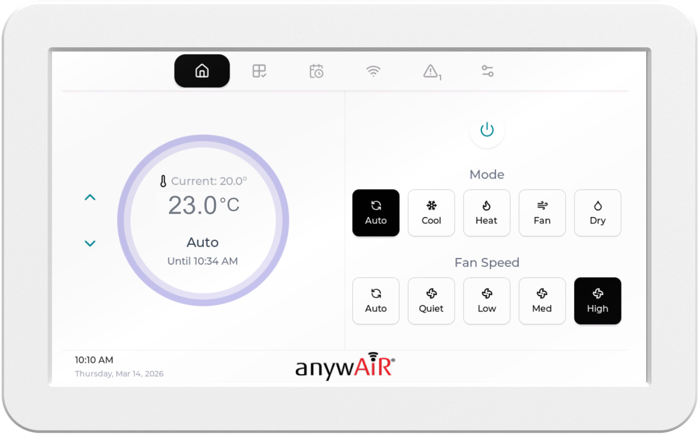
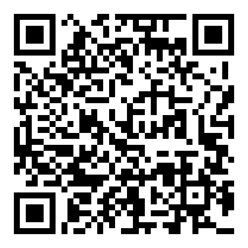

<h1 class="cover-title">Quick Start Guide Zoneconnex</h1>

USER GUIDE

Model: UTY-ZCAW1

<h1 class="doc-title">Zoneconnex Quick Start Guide</h1>

User Guide

**Welcome**

Welcome to your new **Zoneconnex system**. This guide will help you set up and access the wall-mounted TouchPoint screen and anywAiR® Zone mobile app, so you can start controlling your air conditioning.

Once set up, you can easily:

- Adjust temperature settings
- Change operating modes
- Control airflow across different zones in your home

# 1. Setup Wi-Fi on the TouchPoint LCD

1. On the TouchPoint LCD, **press the Wi-Fi** button on the navigation bar.

{.medium}

2. If no network is connected, press **Scan Wi-Fi** to search for available networks.

{.medium}

3. Select your desired network and press **Connect**.
4. Enter the network password using the on-screen keyboard, then press **Connect**.

Once connected, the **Wi-Fi setup screen will display network details**, including: QR code (used in Step 3 — setting up Home Screen), signal strength, speed, security type, and channel.

{.medium}

# 2. Install anywAiR® Zone Mobile App

Scan the QR code below to download the anywAiR® Zone Mobile App for Android or iOS then follow the prompts to install.

| Android | iOS |
|---|---|
|  |  |
|  |  |

# 3. Set Up Your Account and Home

<strong>Before starting,</strong> ensure your mobile device is connected to the same Wi-Fi network as the TouchPoint screen. To check, press the <strong>Wi-Fi</strong> button on the LCD screen to view network details.

**Create or log in to your account:**

1. On your mobile device, **open the anywAiR® Zone Mobile App**.
2. **Log in or Sign-Up:**
3. **Existing Users:** Log in and continue to **Add Your Home**.
4. **New Users:** Follow the Sign-Up process below.

**Sign-Up — new users:**

1. From the Login screen, press **Sign-Up**.
2. **Enter your details** (Email, Password, and Confirm Password) then press **Sign-Up**.
3. **Enter the Verification Code (OTP)** sent to your email (if not received, you can request a new code after 2 minutes).
4. Once verified, press **Next** to continue.

**Add your home:**

1. On the **Setup home** screen, press **Scan QR code**.
2. Scan the QR code displayed on the TouchPoint LCD.

{.medium}

3. Enter a name for your home, then press **Add Home**.

You will be taken to the **Main Control home screen**.

# 4. Using Your TouchPoint LCD

## 4.1 Main Controls

- **Power** — Turn the unit On or Off.
- **Mode Control** — Select Auto, Cool, Heat, Fan, or Dry.
- **Temperature** — Adjust the Temperature Setpoint.
- **Fan Speed Control** — Adjust the fan speed (*model dependent*).
- **Temperature Display** — View setpoint and current temperature\*. (*\*Current temperature display must be enabled during installation*).

{.medium}

## 4.2 Zone Control

- **Zone On/Off:** Turn individual zones on or off.
- **Airflow Control:** Adjust airflow (0–100% in 5% increments) of each zone.
- **Zone Temperature\*:** Check the temperature in each zone (*\*view-only; droplet sensor required*).
- **Sync Zones** — Reset zones to restore correct airflow. Use this if airflow is not working as expected.

{.medium}

## 4.3 Scenes & Schedules

- **Scenes** — Allow you to save preferred settings (mode, temperature, fan speed, zones) and set how you want them to be activated (Directly = Run Now, or via a Schedule).
- **Schedules** — Automatically run scenes at set times and days.

{.medium}

{.medium}

{.medium}

{.medium}

# 5. User Manuals

For full setup instructions and product documentation, scan the QR code below.

[{.small}](https://nubeio.github.io/rubix-ce-docs/docs/overview)

# Important Information

**Compatibility**

The **anywAiR® Zone Mobile App** is compatible with selected General ducted air conditioning systems when used with the optional anywAiR® Zoneconnex Controller.

**Installation & Safety**

- Installation and servicing must be carried out by authorised and qualified personnel only.
- Always isolate power before wiring or servicing the Controller or LCD panel.
- Use only supplied or approved power supplies, antennas and cables.
- Do not modify, open or alter the product, as this may void safety and compliance approvals.

**Data & Usage Disclaimer**

GENERAL Australia & New Zealand accepts no liability for incorrect data. Please ensure you have confirmed installation requirements prior to install.

**Security**

- The product does not use universal default passwords.
- If a password is required, it must be set by the user and should not be easy to guess.

If you identify a potential security vulnerability, please report it via: [www.fujitsugeneral.com.au/contact-us](https://www.fujitsugeneral.com.au/contact-us)

Reporting is free of charge, and no personal information is required for initial submission.

**Cyber security support ends on 01/01/2029.**

**Compliance**

This product carries the RCM mark and complies with the following standards:

- AS/NZS 62368.1
- AS/NZS CISPR 32
- AS/NZS 4268

<h3 class="copyright-heading">Copyright &amp; Trademarks</h3>

Copyright© 2026 GENERAL Australia &amp; New Zealand. All rights reserved. Actual products' colours may be different from the colours shown.

App Store is a service mark of Apple Inc. © 2019. Google Play and the Google Play logo are trademarks of Google LLC. All other trademarks and trade names are the property of their respective owners.

General Australia Pty Ltd

www.generalairstage.com.au | www.generalairstage.co.nz

contact@fujitsugeneral.com.au | 1300 882 201

