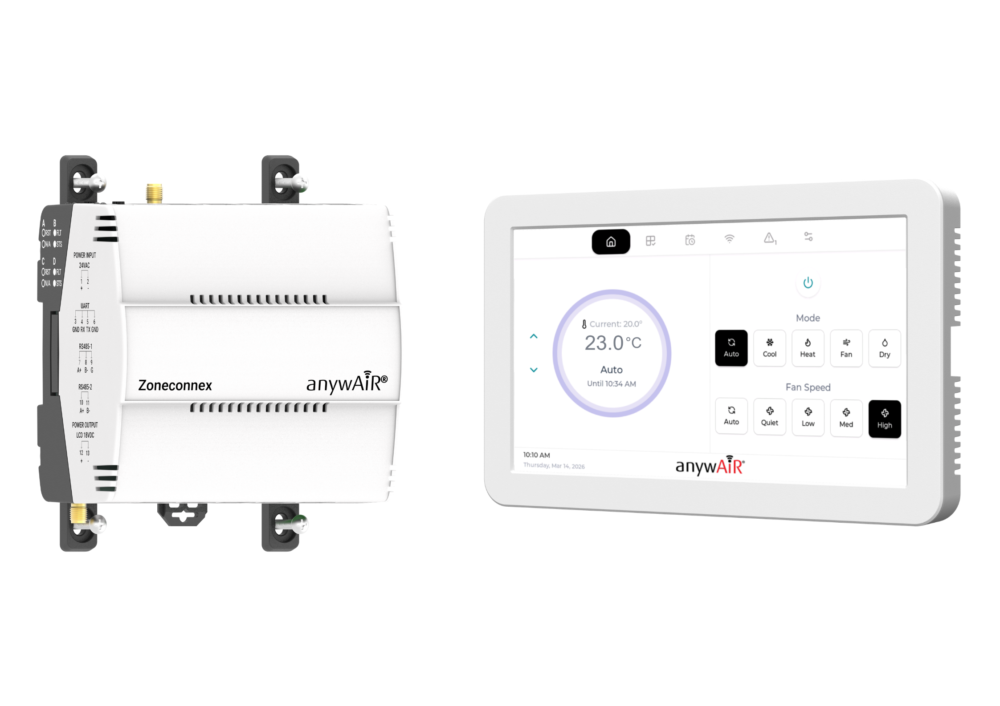
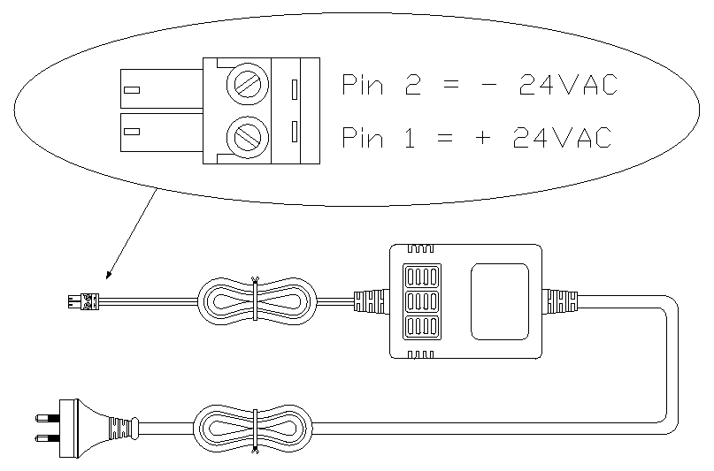
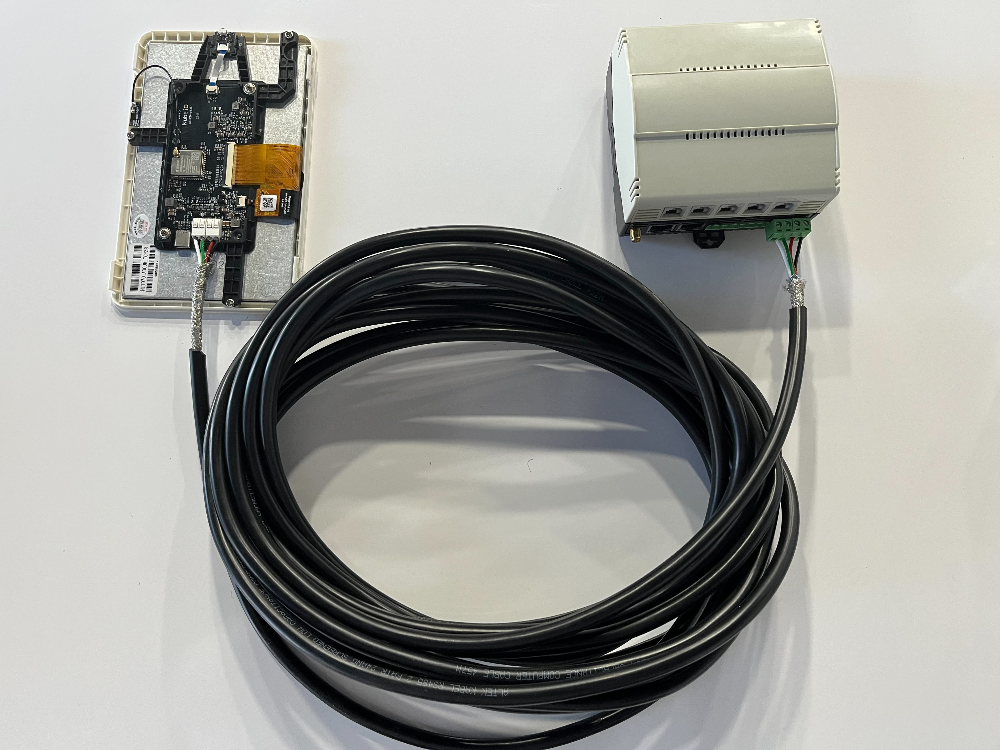

# Zoneconnex User Manual

# 1. Overview

## 1.1 About Product
Zoneconnex, paired with the TouchPoint LCD, delivers a complete HVAC control solution designed for residential and light commercial split ducted air conditioning systems. Together, they provide intelligent zone management, intuitive user control, and real-time environmental feedback.

Zoneconnex is Nube iO’s pre-programmed HVAC zone controller, enabling precise control and monitoring of multiple zones within a property. It seamlessly manages airflow, temperature, and system operation, improving comfort and energy efficiency while simplifying installation—particularly in retrofit and smart home environments.

The TouchPoint LCD complements Zoneconnex as a wall-mounted touchscreen interface, offering users a clear and responsive way to interact with the system locally. Through its intuitive display, users can easily adjust setpoints, fan modes, zoning preferences, and schedules. Integrated temperature and humidity sensors also provide valuable environmental data, enabling more intelligent and automated HVAC control.

Designed for IoT-enabled HVAC and Building Management Systems, the solution supports integration via RS485 with Modbus RTU and custom profiles, allowing seamless connectivity to centralised BMS platforms. In addition, remote access is available via the Nube iO MIA mobile app, giving users flexibility to monitor and control their system from anywhere.

Optimised for both new installations and retrofits, Zoneconnex with TouchPoint LCD enhances user interaction, system visibility, and overall control—delivering a smarter, more efficient indoor climate experience.

## 1.2 System Architecture
**Zoneconnex Controller:** Acts as the master device, interfacing with compatible RAC/PAC and VRF Air Conditioning units via the UART protocal. It manages data transmission to and from the field devices and manages the control of the air conditioning system.  
**Touch Point LCD:** This wall-mounted touchscreen provides a local control interface for the user to manage and monitor the air conditioning system.  
**anywAiR® Zone Mobile App:** This mobile application provides a remote control interface for the user to manage and monitor the air conditioning system.  
**Droplet (sold separately):** This wireless LoRa device monitors temperature and humitidy in each zone transmitting data to the Zoneconnex allowing for individual zone control.  

## 1.3 Packaging Contents
Check that you have received all items below.
- Zoneconnex Controller
- TouchPoint LCD
- LoRa Antenna
- 24VAC Power Supply 
- 15m 4-core 24 AWG LCD power/communication cable
- 2m PAP-04V-S UART communication cable
- Pan head self tapping screws (8x M3 x 25mm)

## 1.4 Product Features

## 1.4.1 Zoneconnex Features
**Wireless Connectivity:** The Zoneconnex supports Wi-Fi 2.4 GHz and Bluetooth 4.2 connectivity. 
**Ethernet:** 2x 100 Mbps RJ45 Ethernet Ports for LAN connection. 
**RS-485:** The Zoneconnex incorrporates 2x RS485 communication ports.
- 1 × Isolated RS-485 (for third party field-bus communication)
- 1 × RS-485 (for Touch Point LCD modbus communication).

**Zone Control Ports:** The Zoneconnex is rated to support 10x RJ12 24VAC Dampers up to 150mA each.  
**TouchPoint LCD Integration:** The Zoneconnex provides an 18VDC power source and Modbus connection point for the TouchPoint LCD. 
**LoRa® & LoRaWan:** The Zoneconnex supports LoRa and LoRaWan communication. 

## 1.4.2 TouchPoint LCD Features
**Wireless Connectivity:** The TouchPoint LCD supports Wi-Fi 802.11 b/g/n connectivity. 
**RS-485:** The TouchPoint LCD incorrporates 1x RS485 modbus communication port.  
**DC Power:** The TouchPoint LCD incorrporates an 18VDC power input port.  
**USB-C:** Service / Programming Port used to manage the TouchPoint LCD firmware.  

## 1.4.3 Control Features
**Operation Control:** Enable the unit on and off. 
**Mode Control:** Switch between Auto, Cool, Heat, Fan and Dry modes. (model dependent) 
**Temperature Setpoint Control:** Adjust the temperature setpoint.
- Auto, Cool and Dry setpoint: 18 to 30 degrees Celsius
- Heating setpoint: 16-18 to 30 degrees Celsius (low limit model dependent)

**Fan Speed Control:** Switch between Auto, Quiet, Low, Medium and High fan speeds (model dependent). 
**Zone Temperature Monitoring:** Monitor the return air temperature or the Primary Zone temperature. 
**Zone Control:** Via the anywAiR® Zone Mobile App and TouchPoint LCD users can interface with the Zoneconnex to control up to 10 zone dampers. Each damper can be controlled within a range of 0-100% airflow in 5% increments.  
**Schedule Management:** Via the anywAiR® Zone Mobile App and TouchPoint LCD, users can configure and manage schedules to automatically run their air conditioning unit at set times and days — helping maintain comfort, reduce manual adjustments, and improve energy efficiency.  
**Scene Management:** Via the anywAiR® Zone Mobile App TouchPoint LCD, users can create custom "scenes" that bundle specific run conditions such as mode, setpoint, and fan speed. These scenes can then be applied to schedules, or link them to run modes for consistent comfort with a single action.  
**Run Mode Management:** Via the anywAiR® Zone Mobile App, users can set timed On/Off actions based on the unit’s current state. If the system is already running, a Run Off timer can be enabled to automatically turn the unit off after the selected duration. If the system is currently off, a Run On timer can be set to automatically start the unit after the chosen time period.  
**Error Status Reporting:** Via the anywAiR® Zone Mobile App and TouchPoint LCD users can monitor the error status and error codes generated by the Air Conditioner unit whilst also monitoring system generated alerts such as communications errors.  

 

# 2. Hardware Overview

## 2.1 Zoneconnex Dimensions
|                	        |                                           |
|-----------------------	|-----------------------------------------	|
| Height:               	| 105.31 mm (134.1 incl. clips) / 4.15 inches (5.27 incl. clips)                  	  |
| Width:                	| 111.84 mm / 4.40 inches                      |
| Depth:                	| 70.25 mm (72.95 incl. clips) / 2.76 inches (2.87 incl. clips)                    	|
| Enclosure             	| PC/ABS blend (Flame Retardant Grade, UL94 V-0) Matte Black, IP2X Rated 	    |

 

## 2.2 Zoneconnex Component Breakdown

### 2.2.1 Front View
- 24VAC/DC Power Input: Termination block for connecting the ZoneConnex 24VAC/DC power input.
- U.FL LoRa Antenna: Connects the antenna for LoRa & LoRaWan communication.
- Wi-fi Antenna: Connects the antenna for Wifi communication.
- Din Rail Clip: Allows for secure din rail mounting and maintenance.
- Mounting Clips: Allows for secure mounting via use of appropriate fixings.
- UART Port: Termination block for connecting the Zoneconnex to UART communication.
- RS485-ISO: Termination block for connecting third party field-bus communication devices to the Zoneconnex.
- LCD RS485: Termination block for connecting the TouchPoint LCD Modbus communication to the Zoneconnex.
- LCD 18VDC Power: Termination block for powering the TouchPoint LCD from the Zoneconnex.

### 2.2.2 Top View
- 24VAC/DC Power Input: Termination block for connecting the Zoneconnex 24VAC/DC power input.
- Wi-fi Antenna: Connects the antenna for Wi-fi communication
- Zone Control Ports 1-5: RJ12 outputs to supply 24V AC to control the zone dampers.
- USB-C: Service / programming port used to manage the Zoneconnex firmware.
- 6-Pin STM32 Port: STM32 service / programming port used to manage the Zoneconnex firmware.
- ACBM Reset Button: Used to restart (reboot) the ACBM control board.
- ACBM User Button: Performs a factory reset, clearing all persisted data.
- Zone Control Reset Button: Used to restart (reboot) the Zone Control IO board
- Zone Control Button: Performs a factory reset, clearing all persisted data.

### 2.2.3 Bottom View
- Zone Control Ports 6-10: RJ12 outputs to supply 24V AC to control the zone dampers.
- U.FL LoRa Antenna: Connects the antenna for LoRa & LoRaWan communication.
- RJ45 Ethernet Port 1: 100 Mbps RJ45 Ethernet Port for LAN connection.
- RJ45 Ethernet Port 2: 100 Mbps RJ45 Ethernet Port for LAN connection.
- UART Port: Termination block for connecting the Zoneconnex to UART communication.
- RS485-ISO: Termination block for connecting third party field-bus communication devices to the Zoneconnex.
- LCD RS485: Termination block for connecting the TouchPoint LCD Modbus communication to the Zoneconnex.
- LCD 18VDC Power: Termination block for powering the Touch Point LCD from the ZoneConnex.

 

## 2.3 TouchPoint LCD Dimensions
|                	        |                                           |
|-----------------------	|-----------------------------------------	|
| Height:               	| 112.44 mm / 4.43 inches                	  |
| Width:                	| 180.97 mm / 7.13 inches                      |
| Depth:                	| 17.5 mm / 0.69 inches                   	|
| LCD Housing             	| White ABS Plastic	    |
| LCD Panel             	|  Glass, Liquid Crystal, Polarizer, LED    |

 

## 2.4 TouchPoint LCD Breakdown

### 2.4.1 LCD Screen

- 18V DC Power Input: Terminals for powering the TouchPoint LCD from the Zoneconnex.
- Wi-fi Antenna: Connects the antenna for Wi-fi communication.
- RS485 Connection: Terminals for connecting the Touch Point LCD to the ZoneConnex via RS485 communication.
- USB-C: Service / Programming Port used to manage the Touch Point LCD firmware.
- Reset Button: Used to perfom a soft reset on the Touch Point LCD.

***Update Image***

### 2.4.2 LCD Housing

- Mounting Points: Allows for secure mounting via use of appropriate fixings.
- Cable Entry Points: Allows for the 24AWG Power/communication cable from the Zoneconnex to be brought into the Touch Point LCD housing.

 

# 3. Installation

## 3.1 Zoneconnex Mounting
The Zoneconnex can be mounted in on din rail or via fixings utilising the mounting clips depending on the type of air conditioning system and mounting location. In all cases, the antenna must remain vertical (unless specifically noted). The Zoneconnex should always be mounted in a location such that it will not experience extreme high or low temperatures, liquids or high humidity.

### 3.1.1 Din Rail Mounting
Ensure the DIN rail is securely installed. Hook the top of the Zoneconnex onto the top of the DIN rail.
Pivot the bottom toward the rail until the lower clip snaps into place. Gently pull forward to confirm the controller is securely mounted.

### 3.1.2 Direct Mounting
Attach mounting clips to the back of the Zoneconnex controller (if not pre-fitted). Position the controller against the mounting location & mark the fixing points.

Drill the holes & insert wall plugs if required. Secure the controller using appropriate screws or fixings. Gently pull forward to confirm it is firmly mounted.

 

## 3.2 TouchPoint LCD Mounting
The TouchPoint LCD can be mounted via fixings utilising the mounting holes incorporated in the LCD housing. The TouchPoint LCD should always be mounted in a location such that it will not experience extreme high or low temperatures, liquids or high humidity.

Release the two bottom clips to remove the LCD from its housing. Hold the housing against the wall & mark the fixing points. Drill holes & insert wall plugs if needed. Secure the housing to the wall with screws. Feed the pre-wired cable through the desired entry point. Re-insert the LCD by: Engaging the top clips first, then pressing the bottom clips into place.

|**Correct**            | **Incorrect**                           |
|-----------------------|-----------------------------------------|
|Insert a flat blade screwdriver onto the angled edge of the retaining clip (furthest from the LCD screen) and gently lever the clip away from the housing.| Do not insert the screwdriver into the slot closest to the LCD screen, as the clip cannot be safely or effectively levered away from the housing in this position. |

 

# 4 Power & Wiring:
> ⚠️ **Please note:** Air Conditioning unit should be isolated and off prior to any power & wiring.

## 4.1 Zoneconnex Power Supply
Connect the Prewired AC power supply to the 24VAC terminals 
(1 & 2) on the Zoneconnex – see diagrams below:

|            |  |
|----------- |----------------------------------------|
| Pin 1 **(L)** | 24V AC **Live (L)** |
| Pin 2 **(N)** | 24V AC **Neutral (N)** |

 

## 4.2 UART Connection
Route the prewired UART cable into the Air Conditioning unit control panel and connect it to the **CN65** or **CN75** port via the UART interface. The UART cable is then connected to the Zoneconnex device. Refer to the diagrams below:

 

Zoneconnex UART Pin Reference shown below:

|           	|  |
|-----------	|----------------	                    |
| Pin 3 (**G**) | **Ground** of UART Network       |
| Pin 4 (**RX**) | **RX** of UART Network       |
| Pin 5 (**TX**) | **TX** of UART Network     	            |
| Pin 6 (**Spare**) | NOT USED   	            |

 

## 4.2 TouchPoint LCD RS485 & Power Supply
The TouchPoint LCD:
- Communicates the the Zoneconnex via **Modbus RS485**.
- Receives **18VDC power** from the Zonneconnex.

Connect the 15m 4-core 24 AWG LCD power/communication cable between the TouchPoint LCD and Zoneconnex as shown below. 

### 4.2.1 Zoneconnex Pin Connections

The RS485 connector is terminated as shown below.

|           	|   |
|-----------	|----------------	                    |
| Pin 10 (**+**) | **A** or **+** of RS485 Network       |
| Pin 11 (**-**) 	| **B** or **-** of of RS485 Network        |

 

The 18VDC power connector is terminated as shown below.

|            |  |
|----------- |----------------------------------------|
| Pin 12 **(+)** | 18V DC **+** |
| Pin 13 **(-)** | 18V DC **−** |

### 4.2.2 TouchPoint LCD Pin Connections
The TouchPoint LCD utilises Push-To-Release terminals. Gently press down on the terminal pin to release the clamp, insert or remove the cable, then release the pin to lock the cable in place.

The TouchPoint LCD pin connections are as shown in the following image:

|            |  |
|----------- |----------------------------------------|
| Pin 1 (**A** or **+**) | **A** or **+** of RS485 Network       |
| Pin 2 (**B** or **-**) 	| **B** or **-** of RS485 Network        |
| Pin 3 (**+**) | 18V DC **+** |
| Pin 4 (**-**) | 18V DC **−** |

 

The TouchPoint LCD pin connections are marked on the LCD as shown in the following image:

# 5 Configuration

## 5.1 anywAiR® Zone Mobile App

Scan the QR code below to download the anywAiR® Zone Mobile App for iOS or Android.

| Android  | iOS |
|----------|-----|
|  |  |
|    |  |

 

For further details outlining how top use the anywAiR® Zone Mobile App use the following link: **[anywAiR® Zone Mobile App](/rubix-ce-docs/docs/Zone%20Controller%20Stack/MIA%20Mobile%20App/MIA%20App%20User%20Manual)**

 

## 5.2 Wi-Fi Configuration:
Follow the steps below to connect the Zoneconnex system to Wi-Fi:

1. On the TouchPoint LCD, press **Wi-Fi**.  
2. Press **Scan Wi-Fi** to search for available networks.  

3. Select your network and press **Connect**.  
4. Enter the network password using the on-screen keyboard.  
5. Press **Connect**.  

Once connected, the screen will display network information including:
- **QR code** - Scan using the anywAiR® Zone Mobile App to add the home to the app for remote access and management.
- **Signal strength** - Indicates the quality of the Wi-Fi signal between the Zoneconnex device and the selected network.
- **Connection speed** - Displays the current data transfer rate between the Zoneconnex device and the Wi-Fi network.
- **Security type** - Shows the wireless security protocol used by the connected network (e.g. WPA2, WPA3). This identifies the level and type of network protection in use.
- **Channel** - Displays the Wi-Fi channel the network is operating on.

 

## 5.3 Installer Mode:
To access installer mode, follow the prompts below in accordance with the Installer Mode anywAiR® Zone Mobile App workflow:
1. On the TouchPoint LCD home screen, tap the Settings icon.
2. On the settings/about screen, tap the "System" card 8 times.

3. Enter the installer password (default 898989) and confirm.
4. Open the anywAiR® Zone Mobile App. Select Continue as Installer. Scan the left QR for connecting to Zoneconnex Access Point Wi-Fi.

5. Once connected to the Zoneconnex Access Point Wi-Fi, Scan the right QR to access installer mode for the Zoneconnex.

To exit Installer Mode, press Exit Installer Mode in the app.

## 5.4 Zone Configuration:
By default, zones are configured in a 1:1 pairing with dampers. This means Zone 1 is assigned to Damper 1, Zone 2 to Damper 2, and so on up to 10 zones.

This default setup allows for quick commissioning with minimal configuration. If required, zone-to-damper assignments can be customized during the zone configuration – refer to the configuration steps below:

Use the following steps to complete the zone configuration from the Installer menu in the anywAiR® Zone app:

1. Enter the total number of zones and required relief zones, then press **Next**.  
           **Note:** Relief zones can be configured from 0 to 3.
     - `Number Of Zones` - Enter the number of zones connected to the system.  
     - `Relief Zones` - Enter the number of zones required to be active to meet minimum airflow  
   

2. Select the required relief zones, then press **Configure Zones**. The relief zones required for selection is dependent on step 1.

3. Configure the first zone:
   - Set **Zone Name** - Rename the zone for easy identification by pressing the arrow `>` button beside the current zone name. After entering the desired name press the `Save` button to apply the changes or `cancel` button to cancel the changes.  
      

   - Enable **Primary Zone** (if required) -  Users can designate or disable the zone as the main zone for the system by pressing the toggle button beside the 'Main' setting. Note a zone requires a paired droplet sensor to be set as the Main zone.  
   

   - Enable **Relief Zone** (if required) - Users can enable or disable a zone as a relief zone by pressing the toggle button beside the 'Relief' setting.  
   

   - Toggle **Zone Power** - This allows the user to toggle the zones damper power to confirm damper pairing and control by pressing the toggle button.  
   

   - **Minimum Airflow (%)** – Specify the minimum airflow percentage the zone should maintain during operation using the plus  and minus  buttons.  

   - **Maximum Airflow (%)** – Specify the maximum airflow percentage the zone can maintain during operation using the plus  and minus  buttons.  
   

   - Add or remove **Dampers*** and **Droplets*** (*sold separately; the Zoneconnex is rated to support RJ12 24VAC dampers up to 150mA*) - Pair and manage associated dampers to the zone by using the `Add Dampers` button then selecting the appropriate damper from the list. To remove/unpair damper, press on the `>` button associated with the damper to open the Damper options screen then press the `Remove Damper` button. A popup will appear asking the user to confirm the deletion by pressing `Delete` or cancel by pressing `Cancel`.  
   
   
   
   

    - **Add and Manage Droplets** – Pair and manage associated droplets to the zone by using the `Add Droplets` button then selecting the appropriate droplet from the list. To add a new droplet, press the menu icon to the top right of the list and follow the steps outlined in section *3.3. Droplet Configuration & Management*. To remove/unpair a droplet, press on the `>` button associated with the droplet to open the droplet options screen then press the `Remove Droplet` button. A popup will appear asking the user to confirm the deletion by pressing `Delete` or cancel by pressing `Cancel`.  
   
   
   
   
   
   
   
   

4. Press **Next** to save the zone settings.  

5. Repeat the zone configuration process for all remaining zones (press **Back** if needed to return to the previous zone).

6. On the final zone, press **Complete** to finish and open the **Zones** screen for monitoring and control.

 

## 5.5 Home Setup

1. On the Touch Point LCD, press the Wi-Fi button on the navigation bar to open the Wi-Fi screen.
2. Make sure your Mobile device is connected to the same Wi-Fi network as the Touch Point LCD.
3. Now on your Mobile Device, open the anywAiR® Zone Mobile App and log in or sign up.  
    1. Existing Users: Log in and proceed to step 4  
    2. New Users: Follow the Sign Up process below:  
        1. From the Login screen, press Sign Up.  
        2. Enter prompted details (Email, Password, and Confirm Password) then continue Sign Up.  
        3. Verify Account by entering the OTP sent to your email (if not received or expired, you can request a new OTP after 2 minutes).  
        4. Once verified, you will be taken to the ‘Welcome Screen’ press ‘Next’ to continue to set-up a Username.        
        
        
        
        
        
        
        5. After setting your username, the user is presented with terms and conditions. Tap 'Accept Terms' to accept the terms and conditions and complete the account creation.
4. You will be taken to the Setup Home screen.  

5. Press Scan QR Code and scan the QR code displayed on the Touch Point LCD.  

6. Enter a name for the home, then press Add Home.  
7. You will be taken to the main control screen for your newly added home. 

 

# 6 Operation Guide

The Touch Point LCD provides users with full control and real-time visibility of their Zoneconnex system. From the LCD screen, users can start and stop the system, select operating modes, adjust comfort settings, and monitor temperatures, zones, and system status.

The Touch Point LCD allows users to tailor system behaviour to suit their lifestyle through manual controls, automation features, and advanced scheduling, helping maintain comfort while improving energy efficiency.

Key operational features include system on/off control, operating mode selection, temperature and fan adjustments (model dependent), and live temperature monitoring. Users can manage individual zone airflow, create schedules, apply custom scenes, and view system alerts and error information directly from the LCD screen.

This combination of real-time control, automation, and monitoring ensures users can easily manage their HVAC system from a single, intuitive interface.

The following are key control and monitoring points available to the user:

**Operation Control:** Enable the unit on and off. 
**Mode Control:** Switch between cool, heat, dry, auto, and fan modes. 
**Temperature Setpoint Control:** Adjust heating/cooling temperature setpoint.
- Cooling setpoint 18 to 30 degrees Celsius
- Heating setpoint 16-18 to 30 degrees Celsius (low limit model dependent)

**Fan Speed Control:** Control fan speeds (model dependent). 
**Return Air Temperature Monitoring:** Monitor the return air temperature. 
**Zone Temperature/Humidity Monitoring:**
**Zone Control:** Via the Touch Point LCD users can interface with the ZoneConnex to control up to 10 zone dampers. Each damper can be controller within a range of 0-100% airflow in 5% increments.  
**Schedule Management:** Via the Touch Point LCD, users can configure and manage schedules to automatically run their air conditioning unit at set times and days — helping maintain comfort, reduce manual adjustments, and improve energy efficiency.  
**Scene Management:** Via the Touch Point LCD, users can create custom “scenes” that bundle specific run conditions—such as mode, setpoint, and fan speed. These scenes can then be applied to schedules, or link them to run modes for consistent comfort with a single action.  
**Error Status Reporting:** Via the Touch Point LCD users can monitor the error status and error codes generated by the Air Conditioner unit whilst also monitoring system generated alerts such as communications errors.  

 

## 6.1 Navigation

 

## 6.2 Operation Control
Users can control the unit’s power from the Home screen of the Zoneconnex system using the Power  button. When the unit is ON, the power button is displayed in red. When the unit is OFF, the power button is displayed in black.

***Insert Screenshot***

 

## 6.3 Mode Control
Users can control the unit’s operating mode from the Home screen of the Zoneconnex system by selecting the desired mode on the mode selector. Available modes are model-dependent and may vary between units. Modes that are not supported by the connected unit will appear greyed out and cannot be selected.  

The active mode is displayed with a solid black background, while inactive modes appear with a white background.

Available operating modes include:
- **Auto:** The unit automatically selects heating or cooling based on the current room temperature and the setpoint.
- **Cool:** Actively cools the space to reach and maintain the selected temperature.
- **Dry:** Reduces humidity in the space with minimal cooling, helping improve comfort in humid conditions.
- **Fan:** Circulates air within the space without heating or cooling.
- **Heat:** Actively heats the space to reach and maintain the selected temperature.

To check available modes or further details on each operating mode, refer to the unit’s user manual.

***Insert Screenshot***

 

## 6.4 Temperature Setpoint Control
Users can adjust the temperature setpoint from the Home screen of the Zoneconnex system to control the temperature maintained by the unit. The setpoint can be increased or decreased in 0.5 °C increments within the following ranges.
- Cooling/Auto/Dry: Setpoint range is 18 to 30 degrees Celsius
- Heating: Setpoint 16-18 to 30 degrees Celsius (Low limit model dependent. Refer to the unit’s user manual)
- Fan: Setpoint control is diasbled in fan mode as the unit is circulating air within the space without heating or cooling.

Users can increase or decrease the setpoint value using the increase  and decrease  buttons to reach the desired setpoint. 

The current setpoint is displayed in the control ring above the control parameters.

When the maximum or minimum setpoint limit is reached, the corresponding increase or decrease button becomes unavailable, preventing the setpoint from being adjusted beyond the allowable range.

***Insert Screenshot***