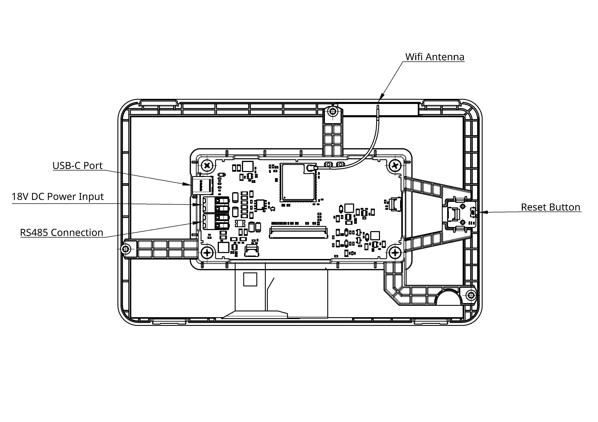
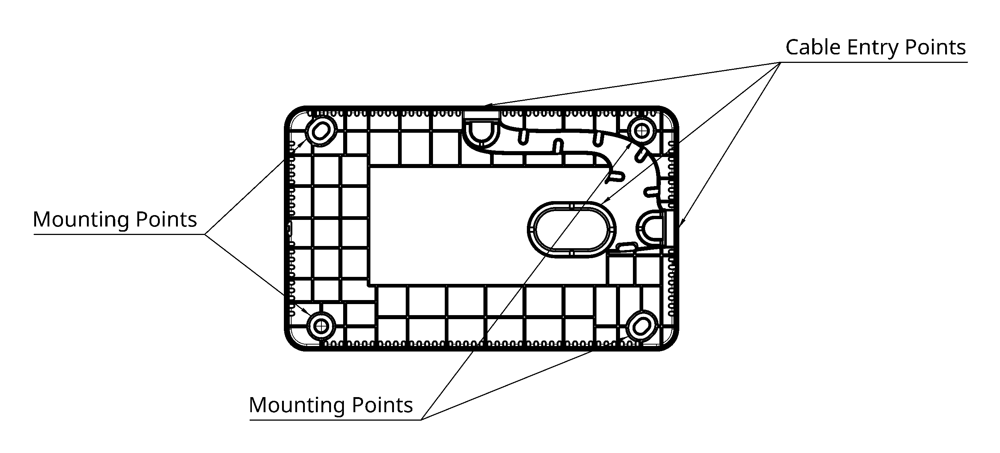
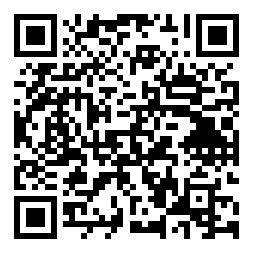
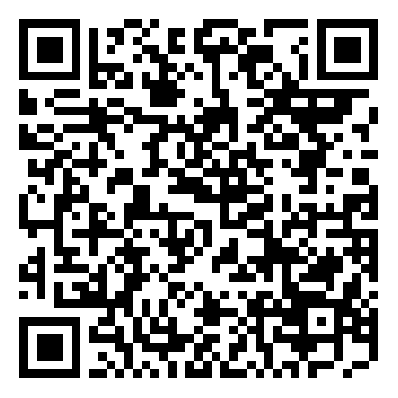

# Zoneconnex Quick Start Guide

# 1. Overview/About Product

## 1.1. Product Overview
The ZoneConnex System is Nube iO’s integrated HVAC zone control solution for split ducted air conditioning systems in residential and light commercial environments. It combines the ZoneConnex controller, the Nube iO MIA mobile app, and the Touch Point LCD screen to provide flexible local and mobile control of zoned HVAC systems.

Installers can quickly commission and configure the system using the mobile app via a direct Wi-Fi connection, while users can monitor and adjust temperature setpoints, operating modes, and zone airflow through either the mobile app or the wall-mounted LCD interface.

## 1.2. Architecture
- **ZoneConnex Controller:** The master device that communicates with compatible air conditioning units to manage system operation and control.  
- **Touch Point LCD:** Wall-mounted touchscreen for local control and monitoring of the air conditioning system.  
- **anywAiR Zone Mobile App:** Mobile interface for remote control and monitoring.  
- **Droplet (optional):** Wireless sensor that monitors temperature and humidity in each zone, enabling individual zone control.

## 1.3. Product Features
*Insert Product Features*

 

# 2. Hardware Overview

## 2.1. Packing List

Please check the package contents to verify that you have received the items below:
- Zoneconnex Quick Start Guide
- Zoneconnex Controller 
- Touch Point LCD 
- Wifi Antenna
- LoRa Antenna
- 15m 4 core 24AWG LCD power/communication cable
- 2m PAP-04V-S UART communication cable
- Pan head self tapping screws (8x M3x25mm)

## 2.2. Zoneconnex Controller Introduction

### 2.2.1 Zoneconnex Front View
<!-- - 24VAC/DC Power Input: Termination block for connecting the ZoneConnex 24VAC/DC power input.
- U.FL Antenna: Connects the antenna for LoRa & LoRaWan communication.
- Wifi Antenna: Connects the antenna for Wifi communication.
- Din Rail Clip: Allows for secure din rail mounting and maintenance.
- Mounting Clips: Allows for secure mounting via use of appropriate fixings.
- UART Port: Termination block for connecting the ZoneConnex to UART communication.
- RS485-ISO: Termination block for connecting third party field-bus communication devices to the ZoneConnex.
- LCD RS485: Termination block for connecting Touch Point LCD or local NubeiO Modbus devices to the ZoneConnex.
- LCD 18VDC Power: Termination block for powering the Touch Point LCD from the ZoneConnex. -->

### 2.2.2 Zoneconnex Top View
<!-- - 24VAC/DC Power Input: Termination block for connecting the ZoneConnex 24VAC/DC power input.
- Wifi Antenna: Connects the antenna for Wifi communication
- Zone Control Ports 1-5: RJ12 outputs to supply 24V AC to control the zone dampers.
- USB-C: Service / Programming Port used to manage the ZoneConnex firmware.
- 6-Pin STM32 Port: STM32 Programming Port ***used for?***
- ACBM Reset Button: ***used for?*** ***Factory reset?***
- ACBM User Button: ***used for?*** ***Reboot?***
- Zone Control Reset Button: ***used for?*** ***Factory reset?***
- Zone Control Button: ***used for?*** ***Reboot?*** -->

### 2.2.3 Zoneconnex Bottom View
<!-- - Zone Control Ports 6-10: RJ12 outputs to supply 24V AC to control the zone dampers.
- U.FL Antenna: Connects the antenna for LoRa & LoRaWan communication.
- RJ45 Ethernet Port 1: 100 Mbps RJ45 Ethernet Port for LAN Connection.
- RJ45 Ethernet Port 2: 100 Mbps RJ45 Ethernet Port for LAN Connection.
- UART Port: Termination block for connecting the ZoneConnex to UART communication.
- RS485-ISO: Termination block for connecting third party field-bus communication devices to the ZoneConnex.
- LCD RS485: Termination block for connecting Touch Point LCD or local Modbus devices to the ZoneConnex.
- LCD 18VDC Power: Termination block for powering the Touch Point LCD from the ZoneConnex. -->

 

## 2.3. Touch Point LCD Introduction

### 2.3.1 LCD Screen

<!-- - 18V DC Power Input: Terminals for powering the Touch Point LCD from the ZoneConnex.
- Wifi Antenna: Connects the antenna for Wifi communication.
- RS485 Connection: Terminals for connecting the Touch Point LCD to the ZoneConnex via RS485 communication.
- USB-C: Service / Programming Port used to manage the Touch Point LCD firmware.
- Reset Button: Used to perfom a soft reset on the Touch Point LCD. -->

### 2.3.2 LCD Housing

<!-- - Mounting Points: Allows for secure mounting via use of appropriate fixings.
- Cable Entry Points: Allows for the 24AWG Power/communication cable from the Zoneconnex to be brought into the Touch Point LCD housing. -->

 

# 3. Installation

# 3.1 Mounting

### 3.1.1 Zoneconnex DIN Rail Mounting
1. Ensure the DIN rail is securely installed inside your enclosure or control panel.
2. Hang the top of the ZoneConnex onto the top edge of the DIN rail.
3. Pivot the bottom of the controller toward the rail and snap the lower clip into place.
4. Gently pull the controller forward to confirm it is securely mounted.

### 3.1.2 Zoneconnex Wall Mounting
1. Attach the mounting clips to the back of the ZoneConnex (if not pre-fitted).  
2. Hold the controller against the wall and mark the fixing points using the clips as a guide.  
3. Drill the holes and insert wall plugs if needed.  
4. Secure the Zoneconnex to the wall with screws or fixings.  
5. Gently pull the controller forward to confirm it is firmly mounted.

### 3.1.3 Touch Point LCD Mounting
1. Carefully release the two bottom clips to remove the LCD from its housing.  
2. Hold the housing against the wall and mark the fixing points using the mounting holes as a guide.  
3. Drill holes and insert wall plugs if needed.  
4. Secure the housing to the wall with screws or fixings.  
5. Gently pull the housing to confirm it is firmly mounted.  
6. Feed the prewired cable through the desired entry point.  
7. Re-insert the LCD screen by first seating the top clips, then gently angle the bottom to re-seat the lower clips.

 

## 3.2 Zoneconnex Connections

### 3.2.1 Zoneconnex Power Supply
The ZoneConnex is powered by a 24V AC power supply on the 24VAC power terminals as shown below. The unit is supplied with a prewired power supply.

|            |  |
|----------- |----------------------------------------|
| Pin 1 **(+)** | 24V DC **+** |
| Pin 2 **(-)** | 24V DC **−** |

### 3.2.2 UART Connection
The Zoneconnex is equiped to interface with compatible RAC/PAC and VRF Air Conditioning units via the UART protocal. The UART connection is terminated and installed as shown below.

|           	|      |
|-----------	|----------------	                    |
| Pin 3 (**G**) | **Ground** of UART Network       |
| Pin 4 (**RX**) | **RX** of UART Network       |
| Pin 5 (**TX**) | **TX** of UART Network     	            |
| Pin 6 (**Spare**) | NOT USED   	            |

### 3.2.3 RS485-ISO
The RS485-ISO allows connection of third-party field-bus devices to the ZoneConnex. The RS485 connector is terminated and installed as shown below.

|           	|      |
|-----------	|----------------	                    |
| Pin 7 (**+**) | **A** or **+** of RS485 Network       |
| Pin 8 (**-**) 	| **B** or **-** of of RS485 Network        |
| Pin 9 (**G**) | **C** or **Ground**      	            |

### 3.2.4 LCD RS485
The LCD RS485 allows connection of the Touch Point LCD to the ZoneConnex. The RS485 connector is terminated and installed as shown below.

|           	|      |
|-----------	|----------------	                    |
| Pin 10 (**+**) | **A** or **+** of RS485 Network       |
| Pin 11 (**-**) 	| **B** or **-** of of RS485 Network        |

### 3.2.5 Touch Point LCD Power Supply
The ZoneConnex is equiped to power the NubeiO Touch Point LCD. The ZoneConnex supplys 18V DC via connection to the LCD 18VDC Power terminals as shown below. 

|            |  |
|----------- |----------------------------------------|
| Pin 12 **(+)** | 18V DC **+** |
| Pin 13 **(-)** | 18V DC **−** |

|           	|      |
|-----------	|----------------	                    |
| Pin 10 (**+**) | **A** or **+** of RS485 Network       |
| Pin 11 (**-**) 	| **B** or **-** of of RS485 Network        |
| Pin 12 **(+)** | 18V DC **+** |
| Pin 13 **(-)** | 18V DC **−** |

 

## 3.3 Touch Point LCD Connections

The Touch Point LCD is powered by a 18V DC connection supplied by the Zoneconnex on the power input pins and communicates to the ZoneConnex via a Modbus RS485 connection. The pins are terminated and installed as shown below. 

|            |  |
|----------- |----------------------------------------|
| Pin 1 (**A** or **+**) | **A** or **+** of RS485 Network       |
| Pin 2 (**B** or **-**) 	| **B** or **-** of RS485 Network        |
| Pin 3 (**+**) | 18V DC **+** |
| Pin 4 (**-**) | 18V DC **−** |

 

 

# 4. Configuration

 

## 4.1 anywAiR Zone Mobile App

Scan the QR code below to download the anywAiR Zone Mobile App for iOS or Android.

| Android | IOS |
|-|-|
|  |  |
|  |  |

 

## 4.2 Wifi Configuration

1. On the Touch Point LCD, press the **Wi-Fi**  button to open the Wi-Fi setup screen.  
2. If no network is connected, press **Scan Wi-Fi**  to search for available networks.  
3. Select your desired network and press **Connect** .  
4. Enter the network password using the on-screen keyboard, then press **Connect**.  
5. Once connected, the Wi-Fi setup screen will show the network and connection details, including QR code, signal strength, speed, security type, and channel.

## 4.3 Installer Mode

Use the following steps to enable installer mode access point on the Touch Point LCD.

1. Press the **System Info**  button to open the system info screen.  
2. Tap the **System** area 8 times to activate Installer Mode, then enter the password and confirm.  
3. Once in Installer Mode, the LCD’s access point is available for configuring the ZoneConnex system via the **anywAiR Zone Mobile App**.  
4. To exit at any time, press **Exit AP Mode** or the **Home**  button to return to the home screen.

 

Use the following steps to access installer mode via the anywAiR Zone Mobile App.
 
1. Scan the **Connect Wifi** QR code displayed on the Touch Point LCD to connect to the access point wifi.
2. Open the anywAiR Zone Mobile App to the login/welcome screen, press **Continue as Installer**.  
3. Confirm the caution popup by pressing **Continue** to enter Installer Mode (or **Cancel** to return to the login screen).  
4. Scan the **API Access** QR code displayed on the Touch Point LCD to enter installer mode.

**Note:** To exit Installer Mode at any time, press **Exit Installer Mode** to return to the login screen.

 

## 4.4 Zone Configuration
Use the following steps to complete the initial zone configuration from the installed menu on the anywAiR Zone app.

1. Enter the total Number of Zones and required Constant Zones, then press **Next**. 
2. Select the required Constant Zones, then press **Configure Zones**.
3. Configure the first zone:

    - Set Zone Name.  
    - Enable Main Zone (if required).  
    - Enable Constant Zone (if required).  
    - Toggle Zone Power to test control.  
    - Set Minimum and Maximum Airflow (%).  
    - Add/remove Dampers and Droplets.  

4. Press **Next** to save the zone settings. 
5. Repeat zone configuration for all remaining zones (press **Back** if needed to return to the previous zone).
6. On the final zone, press **Complete** to finish and open the Zones screen for monitoring and control.

 

## 5. User Manuals 

For full setup instructions and product documentation, scan the QR code below.

 

<!-- ## 4.1. Engineering Tool
*Insert Engineering Tool summarry and where to download* -->

<!-- ## 4.2. Modile App (If Applicable*)
*Insert Engineering Tool summarry and App name to download* -->

 

<!-- # 5. Document Revision

| Revision | Date       | Change Description                  |
|----------|------------|------------------------------------|
| 1.0      | 28-11-2025 | Initial release of the document.   |
| 1.1      | DD-MM-YYYY | Description of the next change.    |
| 1.2      | DD-MM-YYYY | Description of the next change.    | -->

