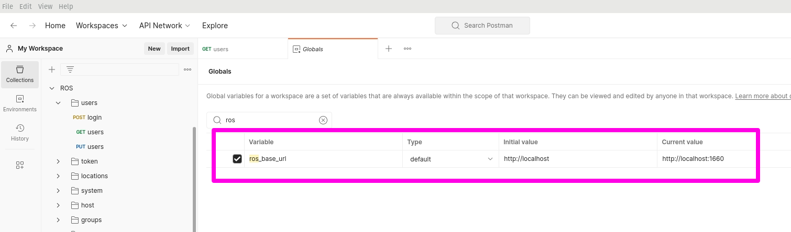
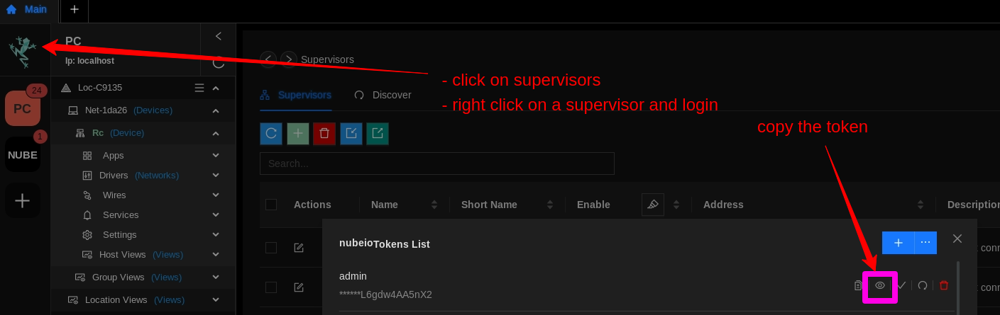

# API Docs

## Postman 

[postman api-docs](https://documenter.getpostman.com/view/666859/2s9Ykhg43Z)

## Set Global Variables



### URL

```
ros_base_url
```

For local or a Nube iO Rubix Compute `non https`
```
http://localhost:1660
```
```
http://192.168.15.10:1660
```

For Nube iO cloud account `https`
```
https://<NUBE-CLOUD-ACCOUNT>:443
```

### Access Tokens

Add an access token to allow the API to be used from a cloud hosted account. Accces the token from the Rubix CE software.

```
Access_token
```




## Rubix OS - Rubix Operating System or ROS

:::info
Rubix OS port: `1660`
:::


:::info
Rubix OS for https port: `443`
:::
