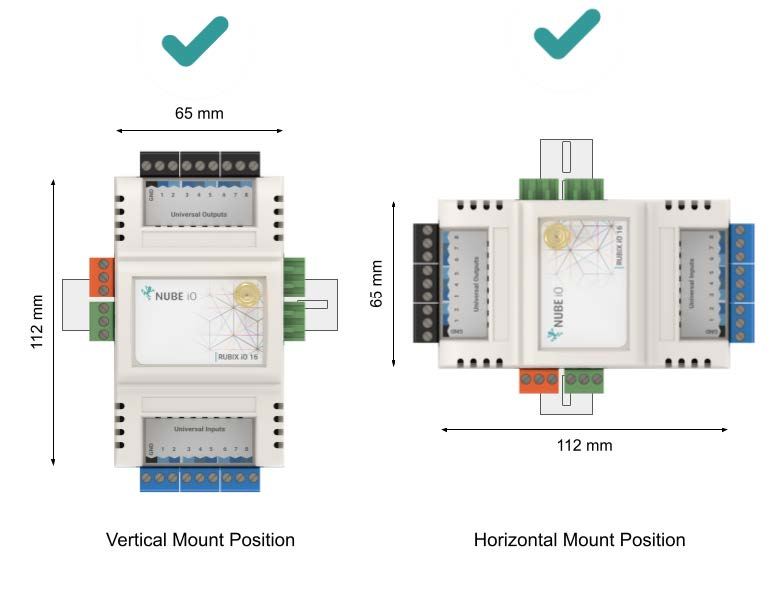
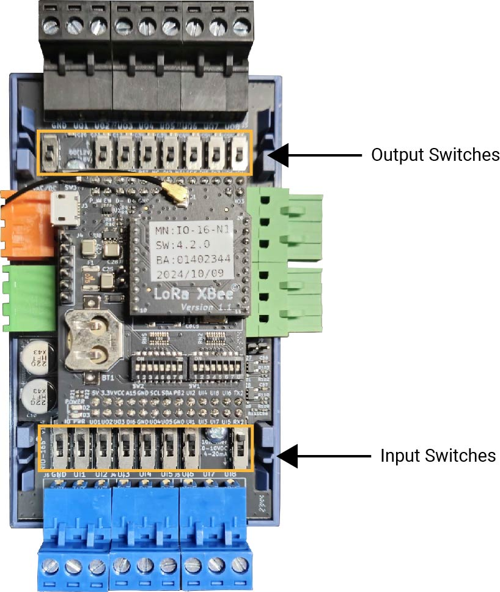
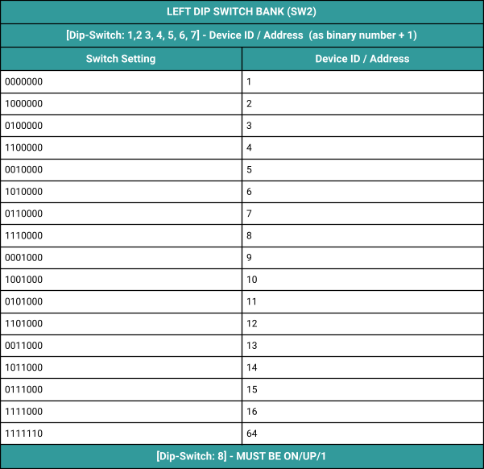
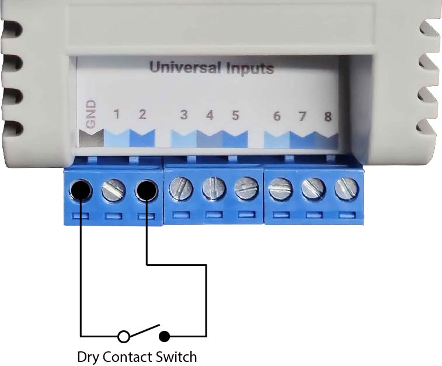
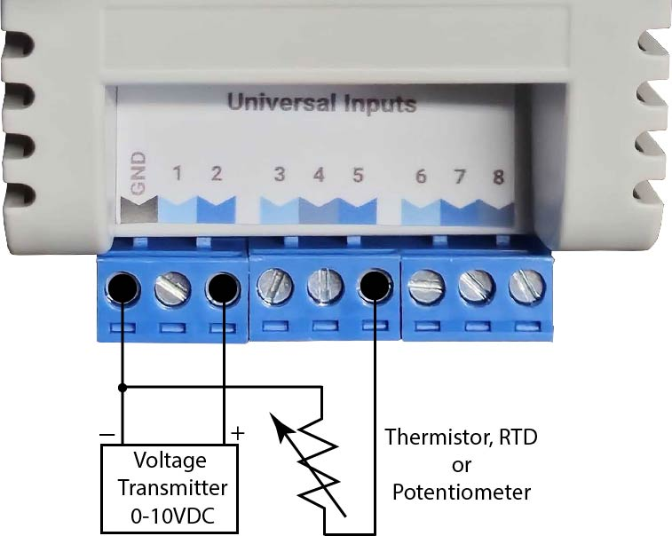
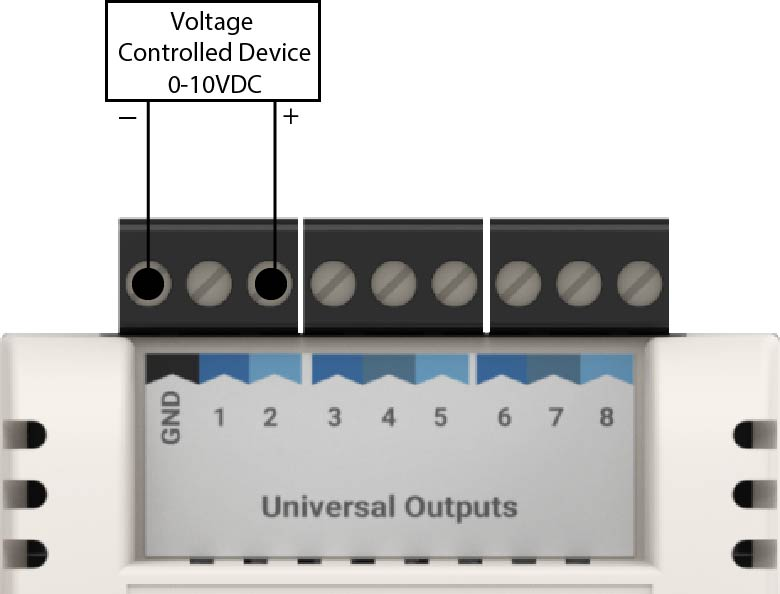

# Installation and Configuration #

## Mounting ##

The Nube-iO iO Module is 65mm x 112mm. It is designed to be mounted on electrical DIN
rail. It can be mounted vertically or horizontally. The controller should always be mounted in
a location such that it will not experience very high or low temperatures, liquids or high
humidity.

## Connecting Power ##

The Nube-iO iO Module is powered by a 24v AC or DC power supply on the `24 AC/DC
POWER` terminals as shown below.

*For 24VAC Full Wave Center Tapped Transformer, refer to the Knowledge Base Article 'Rubix iO: Power Requirements and Wiring' for more instructions*

## Connecting RS-485 Network (Wired Network) ##

When using the wired network connection, the Nube-iO iO Module RS-485 modbus
connection is used. The connector is terminated and installed as shown below.

When Networking multiple Nube-iO iO Modules on an RS485 network, each controller is
connected in a `Daisy Chain`. Controllers that are connected between 2 other controllers
will have 2 wires (one from the previous controller and one from the next controller) in the
same terminal. Ensure A/+ and B/- wires are kept consistent for all controllers on the
network.

### Modbus RS485 Passthrough - Wireless Modbus Extender ###

Modbus RS485 Passthrough is available on IO-11 Modules equipped with a LoRa (Wireless)
Comms. In this mode the wired Modbus RS485 data is sent wirelessly to the gateway.

When using a Nube-iO IO-11 as a wireless modbus passthrough, the RS485 network is
connected only to the third party device and the Nube-iO iO Module, as shown below. The
RS485 wiring is the same as described above.

## Configuring the Onboard Switches ##

There are several physical onboard switches that must be configured correctly for proper
communication and functionality. These switches are located under the front cover of the
Nube-iO iO Module; to remove the front cover, use a flat blade screwdriver to gently pry the
cover off at the cover join line.

### Input and Output Type Select Switches ###

There are several switches under the cover of the Nube-iO iO Module that are used to set the
Input (UI) and Output (UO) type configurations.

#### Input Type Select Switches ####

#### Output Type Select Switches ####

### DIP Configuration Switches ###

There are 2 banks of small DIP switches (8 DIP Switches per bank) under the cover of the
Nube-iO iO Module that are used to configure various functionalities of the controller.

#### Left Bank DIP Switches - Modbus Addressing ####

The Left Bank of DIP Switches (labeled SW2) is used to set the address of the Nube-iO iO
Module. The value is set as a binary number (lowest digit is DIP #1) plus 1 using DIP
Switches 1 to 7. See table below for examples of address settings. 1 is DIP switch UP, and
0 is DIP switch DOWN. DIP switch #8 must remain ON/UP/1 for normal operation.

#### Right Bank DIP Switches - Operation Modes ####

The Right Bank of DIP Switches (labeled SW1) is used to configure various functions of the
Nube-iO iO Module. DIP switch #8 must remain ON/UP/1 for normal operation.

## Physical Input and Output Wiring ##

This section describes how to connect/wire physical inputs and outputs.

### Physical Input Wiring ###

Wired Inputs consist of wired sensors or wired signals from other devices. They are wired to
Digital Input (DI), or Universal Input (UI) terminals.

Wired Inputs are grouped into 2 main groups:

1. **Digital** - Only 2 possible states: either an open circuit or a closed circuit. Includes:
simple switches/buttons, relays, and other types of dry contact (ex. status signals
from other devices).
2. **Analog** - Many possible states based on Voltage, Resistance, or Current. Includes:
Temperature, Humidity, Pressure, CO2, Position Feedback, etc…
Rubix

#### Digital Inputs ####

Digital Inputs are connected between the Ground(GND) terminal and the selected UI
terminal. There is no polarity for Digital Input wiring (ie. input wires can be swapped).

#### Analog Inputs ####

Analog Inputs are connected between the Ground(GND) terminal and the selected UI
terminal. There is usually a correct polarity for Analog Inputs (ie. correct wire must be on
the correct UI terminal).

There are 2 main types of Analog Inputs:

1. **Resistance** - Input is based on resistance. The most commonly used resistance
input is Thermistor temperature sensors where resistance varies with change in
temperature. There is no polarity for Resistance inputs (ie. input wires can be
swapped).
2. **0-10vdc** - Input is based on DC voltage signal over the range of 0v to 10v. This
voltage range is related to a defined range on the device that produces the 0-10v
signal.
3. **4-20mA** - Input is based on DC current signal over the range of 4mA to 20mA. This
current range is related to a defined range on the device that produces the 4-20mA
signal.
Rubix

### Physical Output Wiring ###

Wired outputs consist of wired output signals to be sent to other devices. They are wired
from the Digital Output (DO), Universal Output (UO), and Relay Output (R1, R2,etc.) terminals of controllers that support wired output points.

Wired Outputs are grouped into two main categories:

1. **Digital** – Only 2 possible states: ON or OFF. Digital Outputs can produce Voltage, or
activate a Switch/Dry Contact.
2. **Analog** – Many possible states based on a range of Voltage, or Current (specific to the output type).

#### Digital Outputs ####

Digital Outputs are connected between the Ground (GND) terminal and the selected DO or
UO terminal.

There are 2 types of Digital Outputs:

1. **Voltage** - Output is either 0v or a defined voltage level (eg. 12v DC). The Voltage
Signal will be produced at the DO/UO terminal.
2. **Switched** / Dry Contact / Relay - Output is either Open Circuit (OFF) or Closed Circuit (ON). There is no polarity for this type of Digital Output.

#### Analog Outputs ####

Analog Outputs are connected between Ground (GND) terminal and the selected UO
terminal. Analog Outputs are polarity sensitive, with Ground (GND) being 0v (-) and UO
terminal being positive Voltage or Current (+).

**0-10vdc** - Output is a DC voltage signal of the range of 0v to 10v. Voltage is produced on the
UO terminal.

## Adding the Antenna ##

For LoRa Wireless communication, an antenna may be required to achieve the required range
to the gateway controller. Please ensure the antenna is fitted to the top of the Nube-iO iO
Module if the Rubix Compute Gateway Controller is not receiving messages from the
Nube-iO iO Module.
