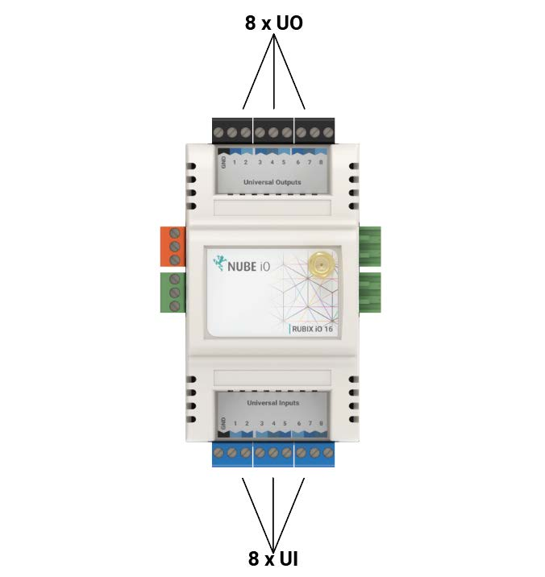

# Overviews

The Rubix iO Modules are Nube-iO’s versatile, low-cost physical Input/Output module. They
provide expandable modular monitoring and control points in a small package.
With one or more modules plugged directly into the side of a Rubix Compute, or wired via RS485,
these Rubix iO Modules allow for BMS implementations of any size.
In addition to being a slave physical input/output device, the Rubix iO Modules can be configured
as standalone HVAC application controllers. With configuration and monitoring of the HVAC
applications via Modbus these modules allow for low cost distributed control and central
monitoring of many types of systems.
The Rubix iO Modules are a pure Modbus device, making them useful in systems even beyond
the Nube-iO platform.
Optional LoRa wireless version of the Rubix iO allows for wireless communication with the iO
Modules. LoRa wireless technology provides a very long transmission range that is less
susceptible to object interference than other wireless technologies.
When using LoRa wireless to communicate with the Rubix iO Modules the RS485 port can be
used as a Modbus passthrough, this allows for wireless communication with any wired (RS485)
Modbus device.

# Technical Specifications

### Physical Attributes 

|                       	|                                         	|
|-----------------------	|-----------------------------------------	|
| Height:               	|  112 mm / 4.41 inches                   	|
| Width:                	| 65 mm / 2.56 inches                     	|
| Depth:                	| 56 mm / 2.20 inches                     	|
| Operating Temperature 	| 0°C to 65°C                             	|
| Enclosure             	| ABS Plastic, DIN Rail Mount, IP40 Rated 	|

### Power Requirements

|                                  	|                                                            	|
|----------------------------------	|------------------------------------------------------------	|
| Power Supply                     	| 24VDC ±10%                                                 	|
| Consumption                      	| **Base:** 1.2W (50mA at 24 VDC)  **36W** (1500mA at 24VDC) 	|
| Recommended Transformer Size* 	| 1050mA / 25VA                                              	|

### Communication Options

| Communication 	| Part                                       	| Details                                                                                                                                  	|
|---------------	|--------------------------------------------	|------------------------------------------------------------------------------------------------------------------------------------------	|
|                	| **Nube-xbee-485-3wire** All Models      	| **EIA-485 (BUS A,B) Three-wire, Half Duplex**  **Speed:** 9600, 38400, 19200 **Data Bits:** 8 **Parity:** None, Even, Odd    	|
|   **LoRa**           	| **nube-xbee-lora-RFM95** Optional addon 	| **Add in radio model**  **Supported Frequencies:** AU915, US915, AS232, EU863 **Spreading Factor:** 7 **Bandwidth:** 250 kHz 	|

### Physical Inputs and Outputs

| Type IO-11            	| Count 	| IO-16 	| Count Details                                                                                      	|
|-----------------------	|-------	|-------	|----------------------------------------------------------------------------------------------------	|
|  Universal Input (UI) 	|   6   	|   8   	| ● 0 - 10 VDC Signal   ● 10k Thermistor   ● Resistance   ● Digital / Switch / Dry Contact   ● 4-20mA Signal 	|
| Universal Output (UO) 	|   5   	|   8   	| ● Analog: 0 to 10 VDC (50ma Max)   ● Digital: 0 or 12 VDC 0V[OFF] / 12VDC[ON] (700mA Max)            	|
|  Digital Output (DO)  	|   2*  	|   0   	| ● 0 or 12 VDC 0V[OFF] / 12VDC[ON] (700mA Max)                                                      	|
_ The DO terminals on the IO-11 are located on the side of the controller. When Rubix iO Modules are plugged directly
into each other, or to a Rubix Compute via the side connections, the DO terminals will not be available._

### Regulatory Compliance ###

| **Manufacturer/Model** 	| **Regulatory**           	| **Notes**      	|
|------------------------	|--------------------------	|----------------	|
| Nube IO / IO-11        	| AS/NZS CISPR 32: 2015    	| IO-11 device   	|
| Nube IO / IO-16        	| AS/NZS CISPR 32: 2015    	| IO-16 device   	|
| HopeRF / RFM95         	| FCC: Class B 3M Radiated 	| LoRa RF module 	|

[def]: img/dimensions-t.png