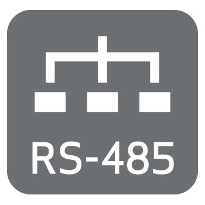

# 1. Overviews

the Rubix iO 16 is Nube iO’s versatile, low-cost physical Input/Output module. It provides expandable modular monitoring and control points in a small package. With one or more modules plugged directly into the side of a Rubix Compute or wired via RS485, these Rubix iO 16 allow for BMS implementations of any size. In addition to being a slave physical input/output device, OEM options are available for standalone HVAC applications. With configuration and monitoring of the HVAC applications via Modbus, these modules allow for low-cost distributed control and central monitoring of many types of systems. the Rubix iO 16 is a pure Modbus device, making it useful in systems beyond the Nube iO platform. Optional LoRa® wireless version of the Rubix iO allows for wireless communication with the Rubix iO 16. LoRa® wireless technology provides a very long transmission range less susceptible to object interference than other wireless technologies. When using LoRa® wireless to communicate with the Rubix iO 16s the RS485 port can be used as a Modbus passthrough, this allows for wireless communication with any wired (RS485) Modbus device.

## 1.1. Technical Specifications

### 1.1.1. Physical Attributes 

| General                  	|                                         	|
|-----------------------	|-----------------------------------------	|
| Height:               	|  112 mm / 4.41 inches                   	|
| Width:                	| 65 mm / 2.56 inches                     	|
| Depth:                	| 56 mm / 2.20 inches                     	|
| Operating Temperature 	| 0°C to 65°C                             	|
| Enclosure             	| ABS Plastic, DIN Rail Mount, IP40 Rated 	|

### Power Requirements

|                                  	|                                                            	|
|----------------------------------	|------------------------------------------------------------	|
| Power Supply                     	| 24VDC ±10%                                                 	|
| Consumption                      	| **Base:** 1.2W (50mA at 24 VDC)  **36W** (1500mA at 24VDC) 	|
| Recommended Transformer Size* 	| 1050mA / 25VA                                              	|

### Communication Options

| Communication 	| Part                                       	| Details                                                                                                                                  	|
|---------------	|--------------------------------------------	|------------------------------------------------------------------------------------------------------------------------------------------	|
|                	| **Nube-xbee-485-3wire** All Models      	| **EIA-485 (BUS A,B) Three-wire, Half Duplex**  **Speed:** 9600, 38400, 19200, 28800, 57600, 76800, 115200 **Data Bits:** 8 **Parity:** None, Even, Odd    	|
|              	| **nube-xbee-lora-RFM95** Optional addon 	| **Add in radio model**  **Supported Frequencies:** AU915, US915, AS232, EU863 **Data Bits:** 7 **Parity:** 250 kHz 	|

### 1.1.2. Physical Inputs and Outputs

| Type                  	| Count 	| Count Details                                                                                                                      	|
|-----------------------	|-------	|------------------------------------------------------------------------------------------------------------------------------------	|
| Universal Input (UI)  	| 8     	| - 0 - 10 VDC Signal - 10k Thermistor - Resistance - Digital / Switch / Dry Contact - 4-20mA Signal - Pulse Counter* 	|
| Universal Output (UO) 	| 8     	| - Analog: 0 to 10 VDC (50ma Max) - Digital: 0 or 12 VDC 0V[OFF] / 12VDC[ON] (700mA Max)                                         	|
_ Special configuration required (3.2.2.3. Universal Input Configurations). Only the first 3 UI’s support this mode._

### 1.1.3. Regulatory Compliance ###

| **Manufacturer/Model** 	| **Regulatory**           	| **Notes**      	|
|------------------------	|--------------------------	|----------------	|
| Nube IO / IO-16        	| AS/NZS CISPR 32: 2015    	| IO-16 device   	|
| HopeRF / RFM95         	| FCC: Class B 3M Radiated 	| LoRa RF module 	|

[def]: img/dimensions-t.png