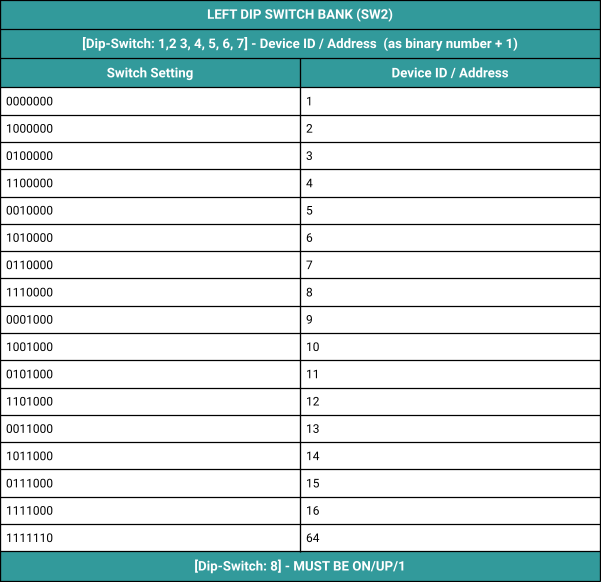
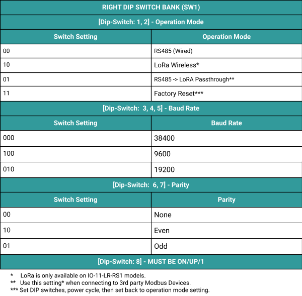

# Parameters

In order to communicate via Modbus the IO Modules must be configured correctly.   
The Modbus ID/Address, Baud Rate, and Parity must be configured correctly to communicate over the Modbus RS485 Network. 

# Communication Parameters 

## Operation Mode

This setting configures the Operation Mode of the Rubix IO Module.
* When using a wired RS485 Modbus network the IO Module should be configured to RS485 Wired Mode.
* When using Wireless Modbus over LoRa, the IO Module should be configured to LoRa Wireless Mode (LoRa wireless is only available on LR type IO Modules).
* When using the IO Module as a wireless Modbus Passthrough (to extend to a wired 3rd party Modbus device via LoRa wireless), the IO Module should be configured to RS485 -> LoRa Passthrough Mode (LoRa wireless is only available on LR type IO Modules).

## Device ID/Address
A Modbus Device ID/Address is assigned to each device on the (RS485) network.  Each device on the network must have a unique ID/Address; duplicate addresses may cause issues for communication with these devices.

The Modbus Device ID/Address on the Rubix IO Modules is set using DIP Switches 1-7 on the Left DIP Switch Bank.  
See table below for more information

## Baud Rate
The Baud Rate is the speed that the Modbus RS485 network communicates at.  
All devices on the same modbus network must be configured to the same Baud Rate.  
The Rubix IO Modules supports 3 Baud Rates (9600, 19200, and 38400).

The Baud Rate on the Rubix IO Modules is set using DIP Switches 3-5 on the Right DIP Switch Bank.  

See table below for more information.

## Parity
Parity is a communication parameter that must be consistent on all devices on a Modbus network.  
The Parity on the Rubix IO Modules is set using DIP Switches 6-7 on the Right DIP Switch Bank.  See table below for more information.

## DIP Switch Configuration
There are 2 banks of small DIP switches (8 DIP Switches per bank) under the cover of the Rubix IO Module that are used to configure the communication parameters discussed above.

* 1 is DIP switch UP
* 0 is DIP switch DOWN
* DIP switch 8 must remain ON/UP/1 for normal operation.

## Left Bank DIP Switches (SW2)
The Left Bank of DIP Switches (labeled SW2) is used to set the address of the IO Module.  
The value is set as a binary number (lowest digit is DIP 1) plus 1.  

See table below for reference.  

## Right Bank DIP Switches (SW1)
The Right Bank of DIP Switches (labeled SW1) is used to configure various functions of the IO Module.  

See table below for reference.  
