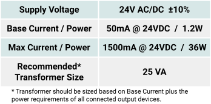
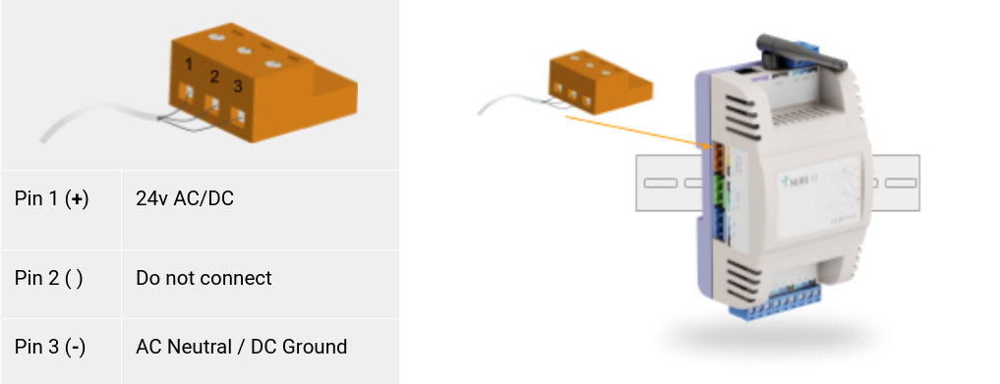

# Power

# Power Supply Requirements
The IO Module is powered by a 24v AC or DC power supply on the `24 AC/DC POWER` terminals as shown below.

## Power Supply Wiring
The IO Module is powered by a 24v AC or DC power supply on the `24 AC/DC POWER` terminals as shown below.

