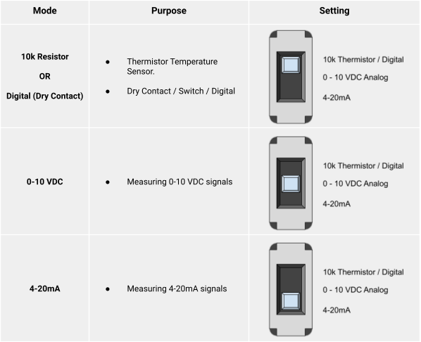
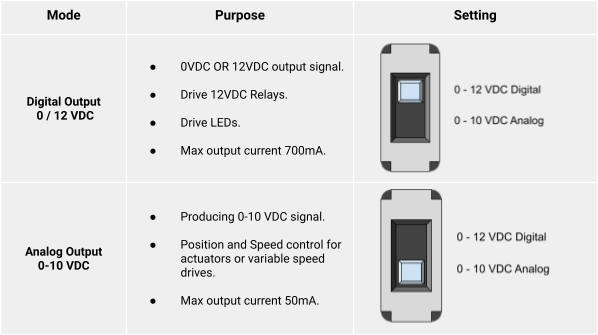

# Inputs & Outputs

# IO Configuration
There are several physical onboard switches that must be configured correctly for proper communication and functionality. These switches are located under the front cover of the Rubix iO Module. To remove the front cover, use a flat blade screwdriver to gently pry the cover off at the cover join line.
There are several switches under the cover of the Nube-iO iO Module that are used to set the Input (UI) and Output (UO) type configurations.

## Input Type Select Switches

## Output Type Select Switches

# Registers

## Inputs

| Sensor Type      | Register Number           | Type            | Data Type      | Length | Math Conversions |
|------------------|---------------------------|-----------------|----------------|--------|------------------|
| Temp             | 1 to 8 for UI1 to UI8     | Input Register  | int16          | 1      | x /100           |
| 0-10 V           | 201 to 208 for UI1 to UI8 | Input Register  | int16          | 1      | x /100           |
| 4-20ma           | 301 to 308 for UI1 to UI8 | Input Register  | int16          | 1      | x /100           |
| pulse            | 401 to 408 for UI1 to UI8 | Input Register  | unit32         | 2      | na               |
| open-closed      | 1 to 8 for UI1 to UI8     | Discrete Input  | bit1 / digital | 1      | na               |
| open-closed hold | 101 to 108 for UI1 to UI8 | Discrete Input  | bit1 / digital | 1      | na               |

## Outputs

| Sensor Type | Register Number       | Type             | Data Type      | Length | Math Conversions |
|-------------|-----------------------|------------------|----------------|--------|------------------|
| 0-10 V      | 1 to 8 for UI1 to UI8 | Holding Register | int16          | 1      | x /100           |
| on-off      | 1 to 8 for UI1 to UI8 | Coil             | bit1 / digital | 1      | na               |
