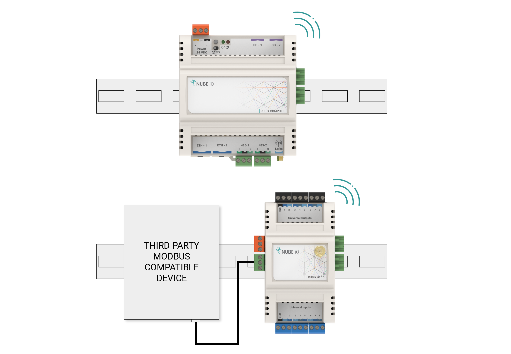
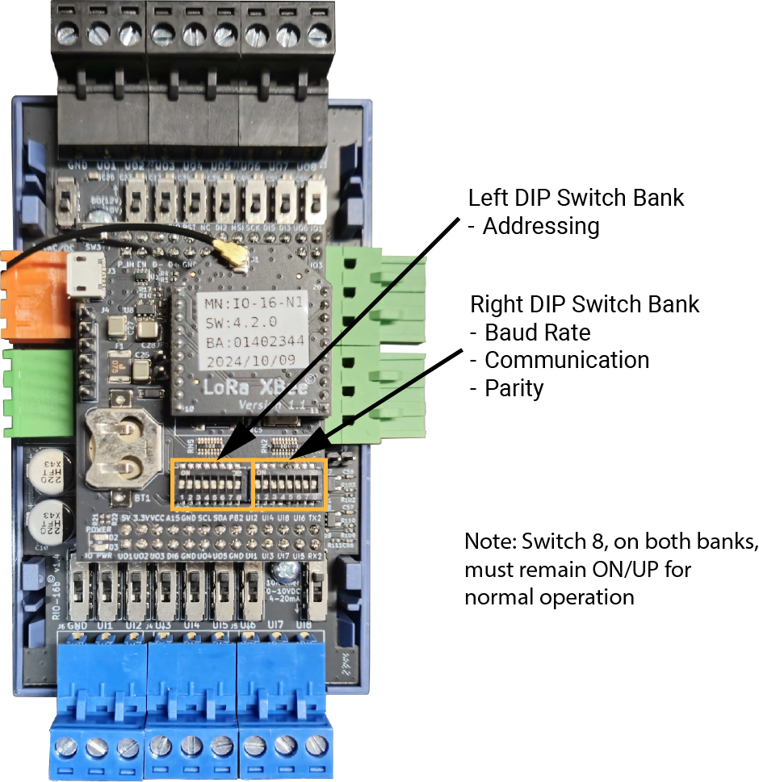

# User Manual

# 1. Overview

the Rubix iO 16 is Nube iO’s versatile, low-cost physical Input/Output module. It provides expandable modular monitoring and control points in a small package. With one or more modules plugged directly into the side of a Rubix Compute or wired via RS485, these Rubix iO 16 allow for BMS implementations of any size. In addition to being a slave physical input/output device, OEM options are available for standalone HVAC applications. With configuration and monitoring of the HVAC applications via Modbus, these modules allow for low-cost distributed control and central monitoring of many types of systems. the Rubix iO 16 is a pure Modbus device, making it useful in systems beyond the Nube iO platform. Optional LoRa® wireless version of the Rubix iO allows for wireless communication with the Rubix iO 16. LoRa® wireless technology provides a very long transmission range less susceptible to object interference than other wireless technologies. When using LoRa® wireless to communicate with the Rubix iO 16s the RS485 port can be used as a Modbus passthrough, this allows for wireless communication with any wired (RS485) Modbus device.

## 1.1. Technical Specifications

### 1.1.1. Physical Attributes 

| General                  	|                                         	|
|-----------------------	|-----------------------------------------	|
| Height:               	|  112 mm / 4.41 inches                   	|
| Width:                	| 65 mm / 2.56 inches                     	|
| Depth:                	| 56 mm / 2.20 inches                     	|
| Operating Temperature 	| 0°C to 65°C                             	|
| Enclosure             	| ABS Plastic, DIN Rail Mount, IP40 Rated 	|

### Power Requirements

|                                  	|                                                            	|
|----------------------------------	|------------------------------------------------------------	|
| Power Supply                     	| 24VDC ±10%                                                 	|
| Consumption                      	| **Base:** 1.2W (50mA at 24 VDC)  **Max:** 36W (1500mA at 24VDC) 	|
| Recommended Transformer Size* 	| 1050mA / 25VA                                              	|

### Communication Options

| Communication 	| Part                                       	| Details                                                                                                                                  	|
|---------------	|--------------------------------------------	|------------------------------------------------------------------------------------------------------------------------------------------	|
|                	| **Nube-xbee-485-3wire** All Models      	| **EIA-485 (BUS A,B) Three-wire, Half Duplex**  **Speed:** 9600, 38400, 19200, 28800, 57600, 76800, 115200 **Data Bits:** 8 **Parity:** None, Even, Odd    	|
|              	| **nube-xbee-lora-RFM95** Optional addon 	| **Add in radio model**  **Supported Frequencies:** AU915, US915, AS232, EU863 **Data Bits:** 7 **Parity:** 250 kHz 	|

### 1.1.2. Physical Inputs and Outputs

| Type                  	| Count 	| Count Details                                                                                                                      	|
|-----------------------	|-------	|------------------------------------------------------------------------------------------------------------------------------------	|
| Universal Input (UI)  	| 8     	| - 0 - 10 VDC Signal - 10k Thermistor - Resistance - Digital / Switch / Dry Contact - 4-20mA Signal - Pulse Counter* 	|
| Universal Output (UO) 	| 8     	| - Analog: 0 to 10 VDC (50ma Max) - Digital: 0 or 12 VDC 0V[OFF] / 12VDC[ON] (700mA Max)                                         	|
_ Special configuration required [3.2.2.3. Universal Input Configurations](#3223-universal-input-configurations). Only the first 3 UI’s support this mode._

### 1.1.3. Regulatory Compliance ###

| **Manufacturer/Model** 	| **Regulatory**           	| **Notes**      	|
|------------------------	|--------------------------	|----------------	|
| Nube IO / IO-16        	| AS/NZS CISPR 32: 2015    	| IO-16 device   	|
| HopeRF / RFM95         	| FCC: Class B 3M Radiated 	| LoRa® RF module 	|

 

# 2. Installation and Configuration #

## 2.1. Mounting ##

The Rubix iO 16 is 65mm x 112mm. It is designed to be mounted on an electrical DIN rail. It can be mounted vertically or horizontally. The controller should always be mounted in a location such that it will not experience very high or low temperatures, liquids or high humidity.

## 2.2. Connecting Power ##

The Nube iO Rubix iO 16 is powered by a 24VDC power supply on the 24VDC POWER terminals as shown below.

|           	|      |
|-----------	|----------------	|
| Pin 1 (+) 	| 24VDC          	|
| Pin 2 ( ) 	| Do Not Connect 	|
| Pin 3 (-) 	| DC Ground      	|

## 2.3. Connecting RS-485 Network (Wired Network) ##

When using the wired network connection, the Nube iO Rubix iO 16 RS-485 Modbus connection is used. The connector is terminated and installed as shown below.

|           	|      |
|-----------	|----------------	|
| Pin 1 (**+**) 	| **A** or **+** of RS485 Network         	|
| Pin 2 (-) 	| **B** or - of of RS485 Network  	|
| Pin 3 (**G**) 	| **C** or **Ground**      	|

When Networking multiple Nube iO Rubix iO 16 on an RS485 network, each controller is connected in a `Daisy Chain`. Controllers that are connected between 2 other controllers will have 2 wires (one from the previous controller and one from the next controller) in the same terminal. Ensure A/+ and B/- wires are kept consistent for all controllers on the network.

### 2.3.1. Modbus RS485 Passthrough - Wireless Modbus Extender ###

Modbus RS485 Passthrough is available on Rubix iO 16 Modules equipped with LoRa® (Wireless) Comms. In this mode, the wired Modbus RS485 data is sent wirelessly to the gateway.
When using a Nube iO Rubix iO 16 as a wireless Modbus passthrough, the RS485 network is connected only to the third-party device and the Nube iO Rubix iO 16, as shown below. The RS485 wiring is the same as described above.

## 2.4. Configuring the Onboard Switches ##

Several physical onboard switches must be configured correctly for proper communication and functionality. These switches are located under the front cover of the Nube iO Rubix iO 16; to remove the front cover, use a flat-blade screwdriver to gently pry the cover off from the side corners at the cover join line.

### 2.4.1. Input and Output Type Select Switches ###

There are several switches under the cover of the Nube iO Rubix iO 16 that are used to set the Input (UI) and Output (UO) type configurations.

#### 2.4.1.1. Input Type Select Switches ####

| Mode                                       	| Purpose                                                                 	| Setting                                                         	|
|--------------------------------------------	|-------------------------------------------------------------------------	|-----------------------------------------------------------------	|
| 1Ok Resistor OR Digital (Dry Contact) 	| - Thermistor Temperature Sensor.  - Dry Contact /Switch/ Digital 	| |
| 0-1O VDC                                   	| Measuring 0-1O VDC signals                                              	| |
| 4-2O mA                                    	| Measuring 4-2O mA signals                                               	|  	|

#### 2.4.1.2. Output Type Select Switches ####

| Mode                       	| Purpose                                                                                                                                   	| Setting 	|
|----------------------------	|-------------------------------------------------------------------------------------------------------------------------------------------	|---------	|
| Digital Output       0/ 12VDC 	| - 0VDC OR 12VDC output signal. - Drive 12VDC Relays. - Drive LEDs - Max output current 700mA.                                    	|     	|
| Analog Output 0-10VDC   	| - Producing 0-10 VDC signal. - Position and Speed, control for  actuators or variable speed drives. - Max output current 50mA. 	|      	|

### 2.4.2. DIP Configuration Switches ###

There are 2 banks of small DIP switches (8 DIP Switches per bank) under the cover of the Nube iO Rubix iO 16 that are used to configure various functionalities of the controller.

#### 2.4.2.1. Left Bank DIP Switches - Modbus Addressing ####

The Left Bank of DIP Switches (labelled SW2) is used to set the address of the Nube iO Rubix iO 16. The value is set as a binary number (the lowest digit is DIP #1) plus 1 using DIP Switches 1 to 7. See the table below for examples of address settings. 1 is DIP switch UP, and 0 is DIP switch DOWN. DIP switch #8 must remain ON/UP/1 for normal operation.

##### LEFT DIP SWITCH BANK (SW2) "Table"

|               	| [Dip-Switch: 1,2 3, 4, 5, 6, 7] - Device ID/ Address (as binary number+ 1)                                       |
|:----------------:	|:-----------------------------------:	|
| **Switch Setting** 	| **Device ID/ Address**                	|
| 0000000        	| 1                                 	|
| 1000000        	| 2                                 	|
| 0100000        	| 3                                 	|
| 1100000        	| 4                                 	|
| 0010000        	| 5                                 	|
| 1010000        	| 6                                 	|
| 0110000        	| 7                                 	|
| 1110000        	| 8                                 	|
| 0001000        	| 9                                 	|
| 1001000        	| 10                                	|
| 0101000        	| 11                                	|
| 1101000        	| 12                                	|
| 0011000        	| 13                                	|
| 1011000        	| 14                                	|
| 0111000        	| 15                                	|
| 1111000        	| 16                                	|
| 0000010        	| 33                                	|
| 0000001        	| 65                                	|
| 1111110        	| 128                                	|
|                	| **[Dip-Switch: 8] - MUST BE ON/UP/1**| 	|

#### 2.4.2.2. Right Bank DIP Switches - Operation Modes ####

The Right Bank of DIP Switches (labelled SW1) is used to configure various functions of the Nube iO Rubix iO 16. DIP switch #8 must remain ON/UP/1 for normal operation.

##### RIGHT DIP SWITCH BANK (SW1) "Table"
 

|                    	| **[Dip-Switch: 1, 2] - Operation Mode** 	|
|:--------------------:	|:--------------------------------------:	|
| **Switch Setting** 	| **Operation Mode**                     	|
| 00                 	| RS485 (Wired)                          	|
| 10                 	| LoRa® Wireless*                         	|
| 01                 	| RS485 -> LoRa® Passthrough**            	|
| 11                 	| Settings Reset***                       	|
|                    	|  **[Dip-Switch: 3, 4, 5]- Baud Rate**  	|
| **Switch Setting** 	| **Baud Rate**                          	|
| 000                	| 38400                                  	|
| 100                	| 9600                                   	|
| 0110               	| 19200                                  	|
|                    	|     **[Dip-Switch: 6, 7] - Parity**    	|
| **Switch Setting** 	| **Parity**                             	|
| 00                 	| None                                   	|
| 10                 	| Even                                   	|
| 01                 	| Odd                                    	|
|                    	|  **[Dip-Switch:8] - MUST BE ON/UP/1**  	|
*Use this setting when connecting to 3rd party Modbus Devices.* 
*Set DIP switches, power cycle, then set back to the operation mode setting* 

## 2.5. Physical Input and Output Wiring ##

This section describes how to connect/wire physical inputs and outputs.

### 2.5.1. Physical Input Wiring ###

Wired Inputs consist of wired sensors or wired signals from other devices. They are wired to
Digital Input (DI), or Universal Input (UI) terminals.

Wired Inputs are grouped into 2 main groups:

1. **Digital** - Only 2 possible states: either an open circuit or a closed circuit. Includes:
simple switches/buttons, relays, and other types of dry contact (ex. status signals
from other devices).
2. **Analog** - Many possible states based on Voltage, Resistance, or Current. Includes:
Temperature, Humidity, Pressure, CO2, Position Feedback, etc…
Rubix

#### 2.5.1.1. Digital Inputs ####

Digital Inputs are connected between the Ground(GND) terminal and the selected UI
terminal. There is no polarity for Digital Input wiring (ie. input wires can be swapped).

#### 2.5.1.2. Analog Inputs ####

Analog Inputs are connected between the Ground(GND) terminal and the selected UI
terminal. There is usually a correct polarity for Analog Inputs (ie. correct wire must be on
the correct UI terminal).

There are 2 main types of Analog Inputs:

1. **Resistance** - Input is based on resistance. The most commonly used resistance
input is Thermistor temperature sensors where resistance varies with change in
temperature. There is no polarity for Resistance inputs (ie. input wires can be
swapped).
2. **0-10vdc** - Input is based on DC voltage signal over the range of 0v to 10v. This
voltage range is related to a defined range on the device that produces the 0-10v
signal.
3. **4-20mA** - Input is based on DC current signal over the range of 4mA to 20mA. This
current range is related to a defined range on the device that produces the 4-20mA
signal.
Rubix

### 2.5.2. Physical Output Wiring ###

Wired outputs consist of wired output signals to be sent to other devices. They are wired
from the Digital Output (DO), Universal Output (UO), and Relay Output (R1, R2,etc.) terminals of controllers that support wired output points.

Wired Outputs are grouped into two main categories:

1. **Digital** – Only 2 possible states: ON or OFF. Digital Outputs can produce Voltage, or
activate a Switch/Dry Contact.
2. **Analog** – Many possible states based on a range of Voltage, or Current (specific to the output type).

#### 2.5.2.1. Digital Outputs ####

Digital Outputs are connected between the Ground (GND) terminal and the selected DO or
UO terminal.

There are 2 types of Digital Outputs:

1. **Voltage** - Output is either 0v or a defined voltage level (eg. 12v DC). The Voltage
Signal will be produced at the DO/UO terminal.
2. **Switched** / Dry Contact / Relay - Output is either Open Circuit (OFF) or Closed Circuit (ON). There is no polarity for this type of Digital Output.

#### 2.5.2.2. Analog Outputs ####

Analog Outputs are connected between Ground (GND) terminal and the selected UO
terminal. Analog Outputs are polarity sensitive, with Ground (GND) being 0v (-) and UO
terminal being positive Voltage or Current (+).

**0-10vdc** - Output is a DC voltage signal of the range of 0v to 10v. Voltage is produced on the
UO terminal.

## 2.6. Adding the Antenna ##

For LoRa® Wireless communication, an antenna may be required to achieve the required range to the gateway controller. Please ensure the antenna is fitted to the top of the Nube iO Rubix iO 16 if the Rubix Compute Gateway Controller is not receiving messages from the Nube iO Rubix iO 16.

 

# 3. Modbus Communications #

Nube iO Rubix iO 16 is a pure Modbus device; All communications with the Rubix iO 16 are via Modbus. Modbus settings are configured via the onboard DIP switches. Modbus settings on the gateway controller must match those set on the connected Rubix iO 16. All devices on a Modbus network must have the same Modbus network settings.

## 3.1. Default Modbus Network Settings ##

Initially, Modbus settings for the Rubix iO 16 will be set as follows:

        Device Address: 1
        Baud rate: 38400
        Parity: None
        Stopbits: 1
        Bytesize: 8

## 3.2. Modbus Points ##

This section describes the available Modbus registers that are used to interact with the Rubix iO 16

## 3.2.1. Universal Outputs​ ##
The following table details the registers involved in interacting with the Universal Output (UO) points. Writing to these registers will drive the Physical Output points. For UOs, the type of each output must be configured correctly via the Type Select Onboard Switches 

| **0-12VDC**    	|                          	|
|----------------	|--------------------------	|
| Register Type  	| Coils                    	|
| Data Type      	| DIGITAL                  	|
| Function Codes 	| 1,5,15                   	|
| Description    	| On/Off, True/False value 	|

| Point 	| Register 	|
|-------	|----------	|
| U01   	| 1        	|
| U02   	| 2        	|
| U03   	| 3        	|
| U04   	| 4        	|
| U05   	| 5        	|
| U06   	| 6        	|
| U07   	| 7        	|
| U08   	| 8        	|
 

| **0-10VDC**    	|                   	|
|----------------	|-------------------	|
| Register Type  	| Holding Registers 	|
| Data Type      	| UINT16            	|
| Function Codes 	| 3,6,16            	|
| Description    	| Set value         	|
| Value Scale    	| x100              	|

| Point 	| Register 	|
|-------	|----------	|
| U01   	| 1        	|
| U02   	| 2        	|
| U03   	| 3        	|
| U04   	| 4        	|
| U05   	| 5        	|
| U06   	| 6        	|
| U07   	| 7        	|
| U08   	| 8        	|

 

| Raw (0.0-1.0)  	|                   	|
|----------------	|-------------------	|
| Register Type  	| Holding Registers 	|
| Data Type      	| UINT16            	|
| Function Codes 	| 3,6,16            	|
| Description    	| Set value         	|
| Value Scale    	| 0.0-1.0           	|

| Point 	| Register 	|
|-------	|----------	|
| U01   	| 901      	|
| U02   	| 903      	|
| U03   	| 905      	|
| U04   	| 907      	|
| U05   	| 909      	|
| U06   	| 911      	|
| U07   	| 913      	|
| U08   	| 915      	|

## 3.2.2. Universal Inputs ##
The following table details the Modbus registers involved with interacting with the Universal Input (UO) points. The type of each output must be configured correctly via Type Select Onboard Switches [2.4. Configuring the Onboard Switches](#24-configuring-the-onboard-switches).

| Discrete Contacts (On/Off) 	|                 	|
|----------------------------	|-----------------	|
| Register Type              	| Discrete Inputs 	|
| Data Type                  	| DIGITAL         	|
| Function Codes             	| 2               	|
| Description                	| Read value      	|

| Point 	| Register 	|
|-------	|----------	|
| UI1   	| 1        	|
| UI2   	| 2        	|
| UI3   	| 3        	|
| UI4   	| 4        	|
| UI5   	| 5        	|
| UI6   	| 6        	|
| UI7   	| 7        	|
| UI8   	| 8        	|

#### 3.2.2.1. Discrete Contacts HOLD (On/Off) ####
These registers HOLD the value true once triggered UNTIL the value is read.
The Rubix iO 16 supports the Digital Input HOLD on the first 3 UI’s only. To configure this mode, special configuration registers must be set to configure the system. [See section 3.2.2.3](#3223-universal-input-configurations). Universal Input Configurations

|                	|                                                                                                              	|
|----------------	|--------------------------------------------------------------------------------------------------------------	|
| Register Type  	| Discrete Inputs                                                                                              	|
| Data Type      	| DIGITAL                                                                                                      	|
| Function Codes 	| 2                                                                                                            	|
| Description    	| Read value is kept HIGH after being triggered and is kept HIGH until the register has been successfully read 	|

| Point 	| Register 	|
|-------	|----------	|
| UI1   	| 101      	|
| UI2   	| 102      	|
| UI3   	| 103      	|
| UI4   	| 104      	|
| UI5   	| 105      	|
| UI6   	| 106      	|
| UI7   	| 107      	|
| UI8   	| 108      	|

 

| 10k Type 2 Input Temperature 	|                 	|
|------------------------------	|-----------------	|
| Register Type                	| Input Registers 	|
| Data Type                    	| UINT16          	|
| Function Codes               	| 4               	|
| Description                  	| Read value      	|
| Value Scale                  	| x100            	|

| Point 	| Register 	|
|-------	|----------	|
| UI1   	| 1        	|
| UI2   	| 2        	|
| UI3   	| 3        	|
| UI4   	| 4        	|
| UI5   	| 5        	|
| UI6   	| 6        	|
| UI7   	| 7        	|
| UI8   	| 8        	|

 

| 10k Type 2 Input Resistance 	|                 	|
|-----------------------------	|-----------------	|
| Register Type               	| Input Registers 	|
| Data Type                   	| FLOAT32         	|
| Function Codes              	| 4               	|
| Description                 	| Read value      	|

| Point 	| Register 	|
|-------	|----------	|
| UI1   	| 101      	|
| UI2   	| 103      	|
| UI3   	| 105      	|
| UI4   	| 107      	|
| UI5   	| 109      	|
| UI6   	| 111      	|
| UI7   	| 113      	|
| UI8   	| 115      	|

 

| 0-10ADC        	|                 	|
|----------------	|-----------------	|
| Register Type  	| Input Registers 	|
| Data Type      	| UINT16          	|
| Function Codes 	| 4               	|
| Description    	| Read value      	|
| Value Scale    	| x100            	|

| Point 	| Register 	|
|-------	|----------	|
| UI1   	| 201      	|
| UI2   	| 202      	|
| UI3   	| 203      	|
| UI4   	| 204      	|
| UI5   	| 205      	|
| UI6   	| 206      	|
| UI7   	| 207      	|
| UI8   	| 208      	|

 

| 4-20mA         	|                 	|
|----------------	|-----------------	|
| Register Type  	| Input Registers 	|
| Data Type      	| UINT16          	|
| Function Codes 	| 4               	|
| Description    	| Read value      	|
| Value Scale    	| x100            	|

| Point 	| Register 	|
|-------	|----------	|
| UI1   	| 301      	|
| UI2   	| 302      	|
| UI3   	| 303      	|
| UI4   	| 304      	|
| UI5   	| 305      	|
| UI6   	| 306      	|
| UI7   	| 307      	|
| UI8   	| 308      	|

 

#### 3.2.2.2. Pulse Counter ####
The Rubix iO 16 supports pulse counting on the first 3 UI’s only. To configure this mode, special configuration registers must be set to configure the system. [See section 3.2.2.3](#3223-universal-input-configurations). Universal Input Configurations 

|                	|                 	|
|----------------	|-----------------	|
| Register Type  	| Input Registers 	|
| Data Type      	| UINT36          	|
| Function Codes 	| 4               	|
| Description    	| Read value      	|

| Point 	| Register 	|
|-------	|----------	|
| UI1   	| 401      	|
| UI2   	| 403      	|
| UI3   	| 405      	|
| UI4   	| 407      	|
| UI5   	| 409      	|
| UI6   	| 411      	|
| UI7   	| 413      	|
| UI8   	| 415      	|

 

| Raw (0.0-1.0)  	|                    	|
|----------------	|--------------------	|
| Register Type  	| Input Registers    	|
| Data Type      	| FLOAT32            	|
| Function Codes 	| 4                  	|
| Description    	| Read value 0.0-1.0 	|

| Point 	| Register 	|
|-------	|----------	|
| UI1   	| 901      	|
| UI2   	| 903      	|
| UI3   	| 905      	|
| UI4   	| 907      	|
| UI5   	| 909      	|
| UI6   	| 911      	|
| UI7   	| 913      	|
| UI8   	| 915      	|

#### 3.2.2.3. Universal Input Configurations ####
The following registers are used to set the UI’s to special modes

|                	|                   	|
|----------------	|-------------------	|
| Register Type  	| Holding Registers 	|
| Data Type      	| UINT16            	|
| Function Codes 	| 3,6,16            	|
| Description    	| UI mode           	|

| Point 	| Register 	|
|-------	|----------	|
| UI1   	| 5201     	|
| UI2   	| 5202     	|
| UI3   	| 5203     	|
| UI4   	| 5204     	|
| UI5   	| 5205     	|
| UI6   	| 5206     	|
| UI7   	| 5207     	|

 

| **Accepted Values:** 	|                                    	|
|----------------------	|------------------------------------	|
| **Value**            	| **Description**                    	|
| 0                    	| Default                            	|
| 6                    	| Digital input HOLD on RISING edge  	|
| 7                    	| Digital input HOLD on FALLING edge 	|
| 8                    	| Pulse Counter on RISING edge       	|
| 9                    	| Pulse Counter on FALLING edge      	|

| **Global Configurations** 	|                              	|
|---------------------------	|------------------------------	|
| **Register Type**         	| **Holding Registers**        	|
| Function Codes            	| 3,6,16                       	|
| Description               	| General system configuration 	|

 

| Name                    	| Register 	| Data Type 	| Read/Write 	| Notes                                           	|
|-------------------------	|----------	|-----------	|------------	|-------------------------------------------------	|
| Version Major           	| 10001    	| UINT16    	| R          	|                                                 	|
| Version Minor           	| 10002    	| UINT16    	| R          	|                                                 	|
| Version Patch           	| 10003    	| UINT16    	| R          	|                                                 	|
| Development Build ID    	| 10004    	| UINT16    	| R          	|                                                 	|
| Production Build Flag   	| 10005    	| DIGITAL   	| R          	|                                                 	|
| I/O Persistence Enable  	| 10006    	| DIGITAL   	| R          	| Prevent I/O values/settings persisting on reset 	|
| I/O Persistence Wipe    	| 10007    	| DIGITAL   	| W          	| Wipes all I/O values/settings                   	|
| RTC Time                	| 10008    	| UINT32    	| R/W        	| UTC time in seconds                             	|
| RTC Timezone            	| 10010    	| UINT32    	| R/W        	| UTC offset in seconds                           	|
| Pulse Debounce ms       	| 10012    	| UINT16    	| R/W        	| Milliseconds                                    	|
| Modbus Watchdog Enable  	| 10013    	| DIGITAL   	| R/W        	|                                                 	|
| Modbus Watchdog Timeout 	| 10014    	| UINT16    	| R/W        	| Minutes                                         	|
| LoRa® RSSI              	| 10015    	| INT16     	| R          	| Last received packet                            	|
| LoRa® SNR               	| 10016    	| INT16     	| R          	| Last received packet                            	|
| LoRa® Publish Enable    	| 10017    	| DIGITAL   	| R/W        	|                                                 	|
| LoRa® Publish Interval  	| 10018    	| UINT16    	| R/W        	| Seconds                                         	|
| -                       	| -        	| -         	| -          	| -                                               	|
| Soft Reset              	| 10501    	| DIGITAL   	| W          	| Perform MCU soft reset                          	|
| Factory Reset           	| 10502    	| DIGITAL   	| W          	| Reset to factory settings                       	|

