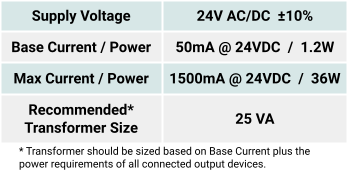

# Wiring

# Power

# Power Supply Requirements
The IO Module is powered by a 24v AC or DC power supply on the `24 AC/DC POWER` terminals as shown below.

## Power Supply Wiring
The IO Module is powered by a 24v AC or DC power supply on the `24 AC/DC POWER` terminals as shown below.

# Modbus RS485 Wiring

Nube-iO Rubix IO Modules are a pure Modbus device; All communications with the IO Modules are via Modbus.  
This article will detail the correct wiring for the Modbus RS485 Network.  
To communicate via Modbus the Rubix IO Module must also have its Onboard DIP Switches configured correctly to set the Modbus Serial Communication Parameters.

# Connecting RS485 Network (Wired Network)
When using the wired network connection, the IO Module RS485 Modbus connection is used.  

When Networking multiple Nube-iO iO Modules on an RS485 network, each controller is
connected in a `Daisy Chain`. Controllers that are connected between 2 other controllers
will have 2 wires (one from the previous controller and one from the next controller) in the
same terminal. Ensure A/+ and B/- wires are kept consistent for all controllers on the
network.

The connector is terminated and installed as shown below.

| Pin       |
|-----------|
| Pin 1 (+) |
| Pin 2 (-) |
| Pin 3 (G) |

## Serial Ports On the Rubix-Compute

| Port Name         | Serial Port Name |
|-------------------|------------------|
| 485-1             | /dev/ttyUSB0     |
| 485-2 and support | /dev/ttyAMA0     |

# Registers

## Inputs

| Sensor Type      | Register Number           | Type            | Data Type      | Length | Math Conversions |
|------------------|---------------------------|-----------------|----------------|--------|------------------|
| Temp             | 1 to 8 for UI1 to UI8     | Input Register  | int16          | 1      | x /100           |
| 0-10 V           | 201 to 208 for UI1 to UI8 | Input Register  | int16          | 1      | x /100           |
| 4-20ma           | 301 to 308 for UI1 to UI8 | Input Register  | int16          | 1      | x /100           |
| pulse            | 401 to 408 for UI1 to UI8 | Input Register  | unit32         | 2      | na               |
| open-closed      | 1 to 8 for UI1 to UI8     | Discrete Input  | bit1 / digital | 1      | na               |
| open-closed hold | 101 to 108 for UI1 to UI8 | Discrete Input  | bit1 / digital | 1      | na               |

### Pulse Inputs

set holding reg 5201 to 8 or 9 (default is 0 meaning its disabled)
- 0: Pulse Disabled (default)
- 8: Pulse On RISE
- 9: Pulse On FALL

example for UI1 , then read input reg 401 as UINT32

***note only first 3 inputs work as pulse***

## Outputs

| Sensor Type | Register Number       | Type             | Data Type      | Length | Math Conversions |
|-------------|-----------------------|------------------|----------------|--------|------------------|
| 0-10 V      | 1 to 8 for UI1 to UI8 | Holding Register | int16          | 1      | x /100           |
| on-off      | 1 to 8 for UI1 to UI8 | Coil             | bit1 / digital | 1      | na               |
