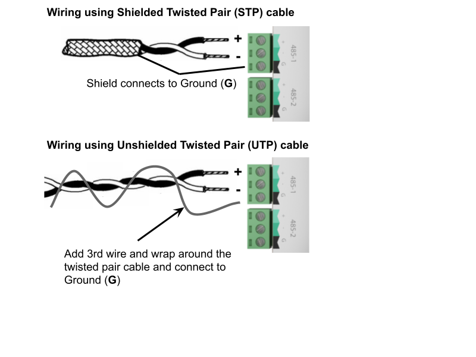

# Modbus

## Modbus RS485 Terminal Wiring
To establish communication with Modbus RS485 devices, the RS485 connectors are terminated and installed as shown below.

## ports

| Port Name         | Serial Port Name |
|-------------------|------------------|
| 485-1             | /dev/ttyUSB0     |
| 485-2 and support | /dev/ttyAMA0     |

## pins

| Pin       |
|-----------|
| Pin 1 (+) |
| Pin 2 (-) |
| Pin 3 (G) |

When wiring an RS485 network a single shielded twisted pair (STP) cable should be used.  The twisted pair cable cancels out interference and ensures that the 2 conductors are at the same lengths. Having a ground shield on the twisted pair cable further provides protection to interference on the RS485 network.

## Modbus RS485 Networking
When Networking multiple devices on an RS485 network, each controller is connected in a `Daisy Chain`.   Controllers that are connected between 2 other controllers will have 2 wires (one from the previous controller and one from the next controller) in the same terminal.  

:exclamation:Ensure A/+ and B/- wires are kept consistent for all controllers on the network.  

## End Of Line Termination
When connecting a RS485 network, the first and last device on the network must have an End Of Line (EOL) resistor installed.  On the Rubix Compute this is done via an Onboard Jumper.  The location of the EOL Jumper is shown below.  When the jumper is installed in the upper position the EOL resistor is set.  When the jumper is installed in the lower position the EOL resistor is not set.  There are 2 sets of jumpers, 1 for each of the RS485 networks. 