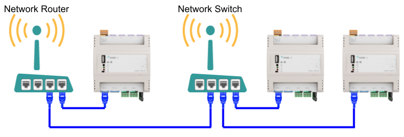

# Network Connection and Discovery

This article explains the best practices in how to connect Rubix Compute device to a network, and how to locate Rubix Compute device on the network.

# Network Connection and Discovery
In order to connect to and interact with a Rubix Compute controller it must be connected to a network via Ethernet cable.  
The best way to connect to the Rubix Compute is via a router.  
Alternatively, the Rubix Compute Controller can be connected directly to a PC via ethernet.

## Network Architecture
To add a Nube-iO Rubix Compute Gateway Controller to a network, an ethernet cable must be connected to one of the Ethernet ports on the controller; generally this will be using the ETH-2 port.  
The other end of the Ethernet cable should be connected (directly or indirectly) to the Network Router.  
The cable architecture back to the Network Router can be via a number of Network Switches.  

Below are examples of valid Ethernet networking architectures.

# Default Network Configuration
When a Rubix Compute Controller is reset to factory defaults the 2 x Ethernet ports will be configured as follows:

| Port Name | Linux Port Name | Type  | IP            | Subnet        | Gateway      |
|-----------|-----------------|-------|---------------|---------------|--------------|
| ETH-1     | eth0            | Fixed | 192.168.15.10 | 255.255.255.0 | 192.168.15.1 |
| ETH-2     | eth1            | DHCP  | na            | na            | na           |

# Connecting Via Router (recommended)
* When connecting to the Rubix Compute controller via a network router, ethernet port  ETH-2 should be used (at default network settings).
* Once connected via an ethernet cable, find the automatically assigned IP Address by using the router’s admin user interface; or by running an IP/Port Scanning Software (Port Scanner - Wikipedia https://en.wikipedia.org/wiki/Port_scanner).
* Recommended IP/Port scanners include Angry IP Scanner or  Advanced IP Scanner https://angryip.org/.
* When you think you have found the correct IP Address, try running a PING check on that IP Address; If successful, unplug the Rubix Compute controller, and re-run a PING check to see that the PING check now fails.  Then reconnect your Rubix Compute controller.

# Direct Connection to PC
When connecting a Rubix Compute controller directly to a PC via an ethernet cable,  ethernet port ETH-1 should be used (at default network settings).  Ensure that the PC has self-assigned a static IP Address in the same subnet range as the Rubix Compute (default 192.168.15.xxx)

:exclamation:`There cannot be identical IP Addresses on the same network`

Once connected, and the PC IP Address is configured, try running a PING check on the Rubix Compute IP Address (default: 192.168.15.10).

This method is not recommended as it is quite difficult to provide the Rubix Compute Controller an internet connection when connected directly to a PC.  It is recommended to connect via a network router.