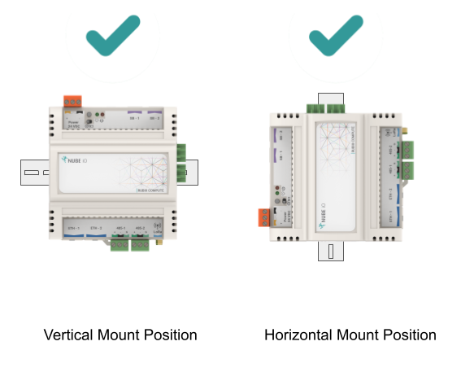

# Overview

The Rubix Compute is the Nube iO Multi protocol Edge gateway. It is a small wireless gateway capable of monitoring and controlling various
applications. 
For example, it can be used in building to control and monitor the heating, cooling and ventilation
systems whilst communicating to LoRa wirelss sensors.

The Rubix Compute IoT multi-gateway will collect data from both wired and wireless devices in a bi direcitonal method.
It will enable you to aggregate data from multiple sensors and send it anywhere. Such as cloud server instances, a local server, or
3rd-party BMS and automation hardware.

## One Gateway, Multiple Data Types.

The Rubix Compute is a one of a kind gateway that aggregates and manages all types of building BMS and Energy data, removing the frustration of
running multiple gateways in one solution.

* Integrate into any BMS via BACnet/IP
* Has Flow-based programming environment for BMS programing
* Receive wireless signals
* LoRa® & LoRaWAN®
* Convert Modbus & BACnet to wireless
* Has onboard Rest-api

## Overview of specs

* 1GB of RAM
* 8GB of onboard storage
* Dual Ethernet ports
* Dual RS485 ports
* LoRa Reciever
* Input/Output expansion ready
* LoRaWAN expansion ready

## Overview of interfaces

* 2 x Ethernet ports
* 2 x RS485 ports
* 2 x RJ12 ports
* 1 x USB port

## Overview of protocols

* BACnet Sever (Run the Rubix Compute as a BACnet Device over BACnet/IP)
* BACnet Master (Run the Rubix Compute as a BACnet Client over BACnet/IP to read and write to other BACnet devices)
* Modbus Master
* LoRaWAN Gateway and Server
* LoRa Gateway (For Nube iO sensors and Rubix IO controllers)

# Mounting

The Rubix Compute is designed to be mounted on electrical DIN rail. It can be mounted vertically or horizontally. The
controller should always be mounted in a location such that it will not experience very high or low temperatures,
liquids or high humidity.

# Rubix IO add on modules

Up to 4x [IO-16s](../../io-controllers/IO-16/overview.md) can be plugged into the right-side of the Rubix Compute to create an Edge based BMS controller.

To communicate with a Rubix Compute you have two communication options
1. Add a Modbus-RTU network
2. Or add a BACnet Server node in [rubix-wires](../../../../rubix-ce/wires/bacnet.md)

:::danger Modbus networks conflict
You can not add a `modbus network` in `driver's` and the `BACnet-server` node in Rubix Wires with the same `serial-port`.
:::

