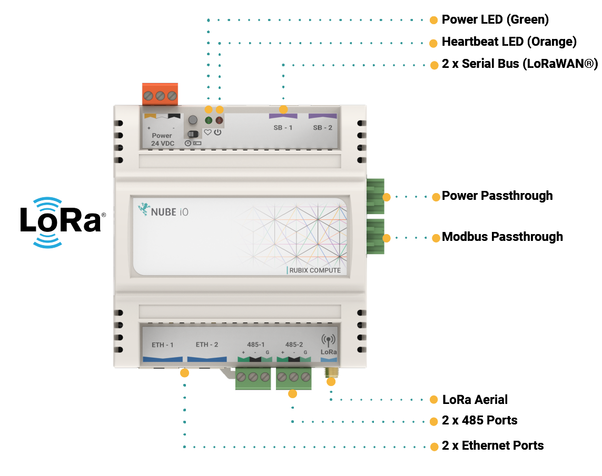

# 1. Overview

The Rubix Compute is the Nube iO Multi protocol Edge gateway. It is a small wireless gateway capable of monitoring and controlling various applications. For example, it can be used in buildings to control and monitor the heating, cooling and ventilation systems whilst communicating to LoRa® wireless sensors.

The Rubix Compute IoT multi-gateway will collect data from both wired and wireless devices in a bi-directional method. It will enable you to aggregate data from multiple sensors and send it anywhere. Such as cloud server instances, a local server, or 3rd-party BMS and automation hardware.

## 1.1. One Gateway, Multiple Data Types.

The Rubix Compute is a one-of-a-kind gateway that aggregates and manages all types of building BMS and Energy data, removing the frustration of running multiple gateways in one solution.

* Integrate into any BMS via BACnet/IP
* Has Flow-based programming environment for BMS programing
* Receive wireless signals
* LoRa® & LoRaWAN®
* Convert Modbus & BACnet to wireless
* Has onboard Rest-API

## 1.2. Hardware

* Dual Ethernet ports
* Dual RS485 ports
* LoRa® Reciever
* Input/Output expansion ready
* LoRaWAN® expansion ready

### 1.2.1. Overview of protocols

* BACnet Sever (Run the Rubix Compute as a BACnet Device over BACnet/IP)
* BACnet Master (Run the Rubix Compute as a BACnet Client over BACnet/IP to read and write to other BACnet devices)
* Modbus Master
* LoRaWAN® Gateway and Server
* LoRa® Gateway (For Nube iO sensors and Rubix IO controllers)

## 1.3. Serial ports

|                                             	|                                            	|
|---------------------------------------------	|--------------------------------------------	|
| **Device Type**                             	| LoRa® Port selection on the Rubix Platform 	|
| **Wireless sensors - Droplets & MicroEdge** 	| /data/socat/loRa1                          	|
| **Rubix IO 16 in Wireless Mode**            	| /data/socat/serialBridge1                  	|
| **Rubix IO 16 in 485 Mode**                 	| /dev/ttyAMA0                               	|

# 2. Mounting

The Rubix Compute is designed to be mounted on electrical DIN rail. It can be mounted vertically or horizontally. The
controller should always be mounted in a location such that it will not experience very high or low temperatures,
liquids or high humidity.

# 3. Direct Digital Control - DDC
Up to 4x Rubix iO 16s can be plugged into the right side of the Rubix Compute to create an Edge-based BMS controller.

The Rubix Compute can be communicated over BACnet. The Rubix Compute communicates to the Rubix iO 16s over Modbus RTU and exposes the points to as one unit over BACnet Server.

To enable this:
1. Add a BACnet Server node in Rubix Wires
2. Edit the node settings to configure the added number of Rubix iO 16s and serial port settings.

:::danger Modbus networks conflict
You can not add a `Modbus network` in `drivers` and the `BACnet-server` node (for DDC) in Rubix Wires with the same `serial port`.

:::

