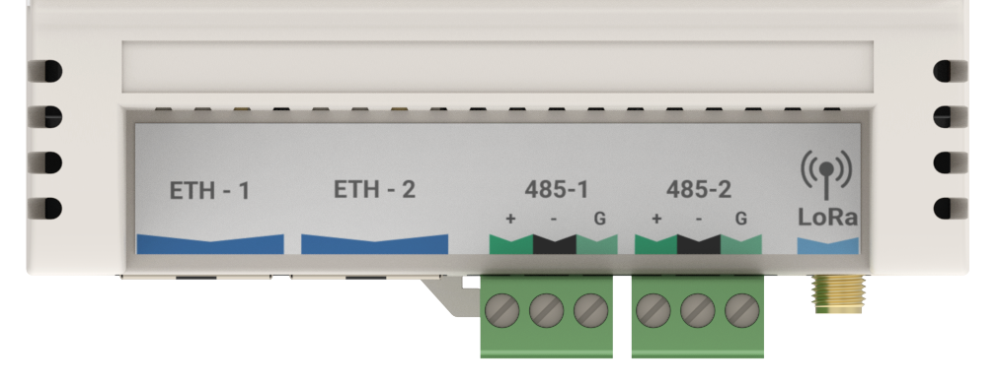

# Networking and Interfaces

# networking

| Port Name | Linux Port Name | Type  | IP            | Subnet        | Gateway      |
|-----------|-----------------|-------|---------------|---------------|--------------|
| ETH-1     | eth0            | Fixed | 192.168.15.10 | 255.255.255.0 | 192.168.15.1 |
| ETH-2     | eth1            | DHCP  | na            | na            | na           |

# 485 ports

| Port Name         | Serial Port Name |
|-------------------|------------------|
| 485-1             | /dev/ttyUSB0     |
| 485-2 and support | /dev/ttyAMA0     |

# LoRa For Droplets and Micro-Edges

| Port Name | Serial Port Name  |
|-----------|-------------------|
| LoRa      | /data/socat/loRa1 |

# Modbus Over LoRa For the IO-16

| Port Name | Serial Port Name          |
|-----------|---------------------------|
| LoRa      | /data/socat/serialBridge1 |