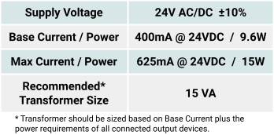
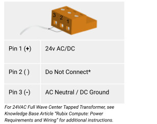

#  Power Requirements and Wiring

:exclamation: Warning:  Power requirements are different for older models of Rubix Compute. To determine the device version of Rubix Compute, 

see: Rubix Compute: Identifying Hardware Version

If Rubix Compute hardware is Version 0.8 or below, DO NOT FOLLOW the instructions below and 

see: Rubix Compute: Legacy Power Requirements and Wiring

# Power Supply Requirements

# Power Supply Wiring

The Nube-iO Rubix Compute Gateway Controller is powered by a 24v AC or DC power supply on the `24 AC/DC POWER` terminals as shown below. 

