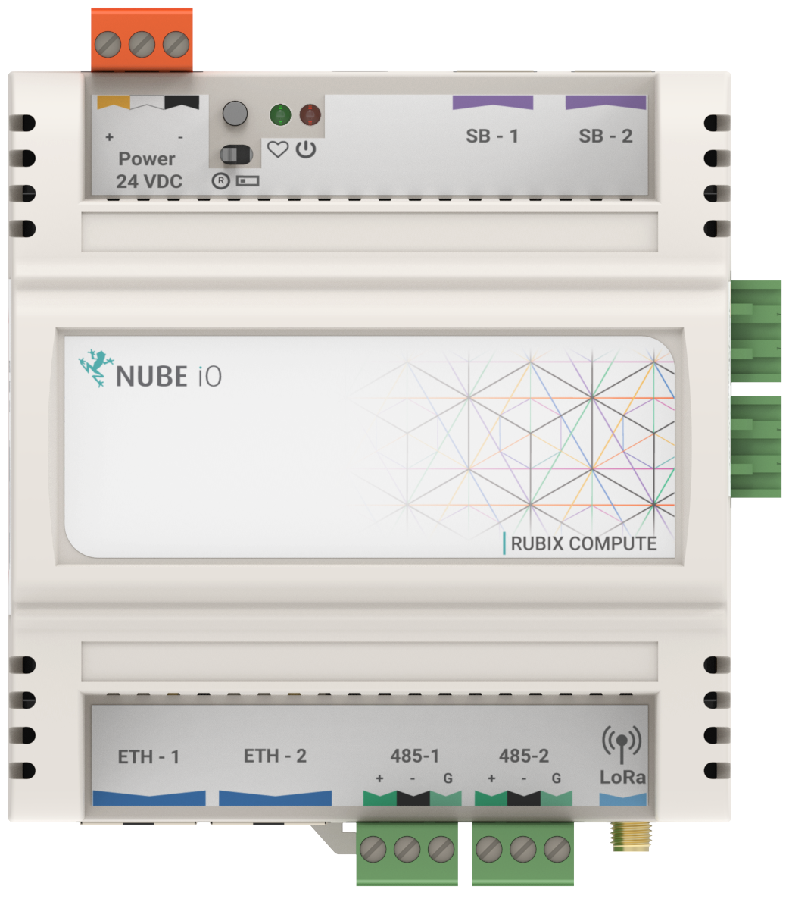
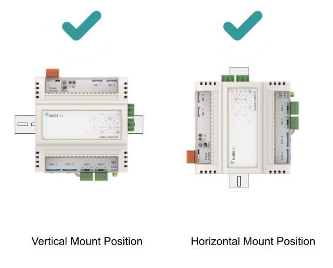
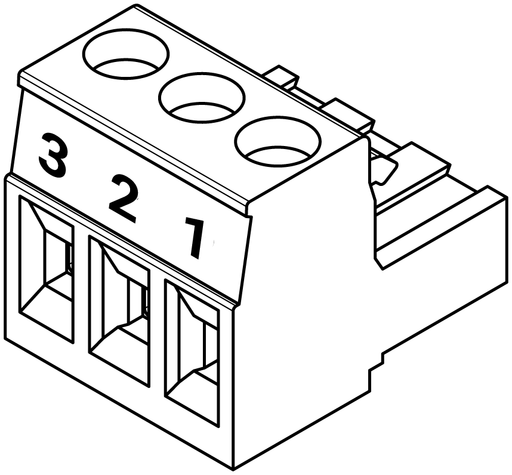
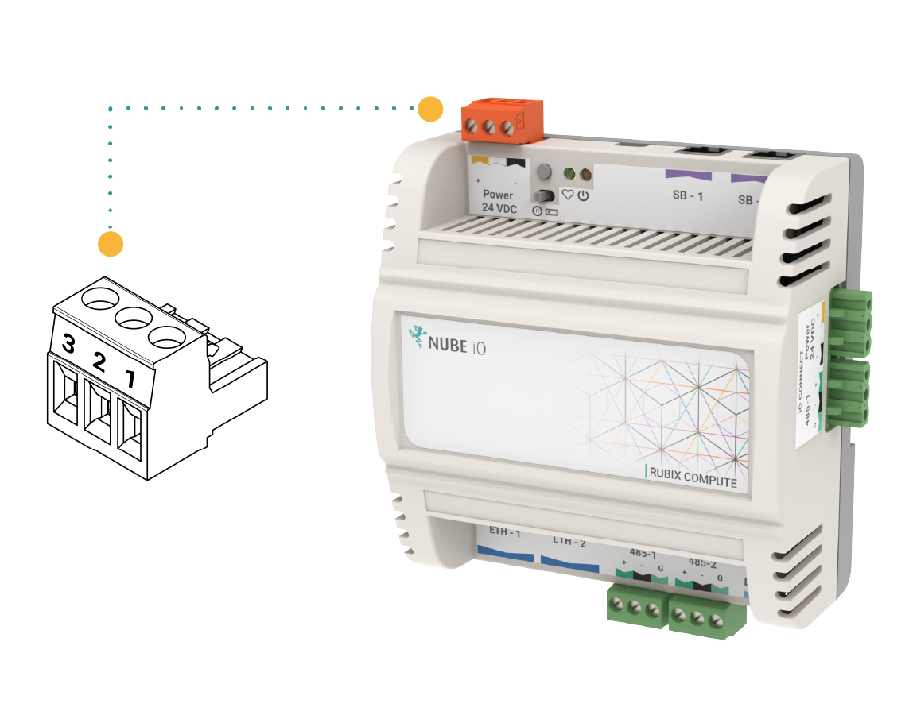
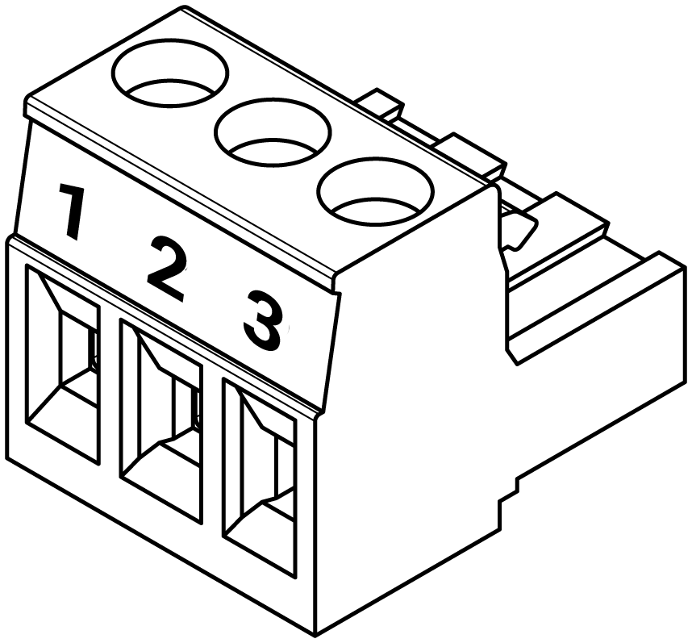
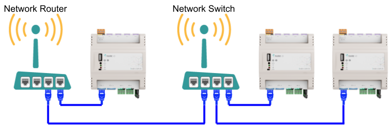

# User Manual

# 1. Overview #

The Rubix Compute is the Nube iO Multi protocol Edge gateway. It is a small wireless gateway capable of monitoring and controlling various applications. For example, it can be used in buildings to control and monitor the heating, cooling and ventilation systems whilst communicating to LoRa® wireless sensors.

The Rubix Compute IoT multi-gateway will collect data from both wired and wireless devices in a bi-directional method. It will enable you to aggregate data from multiple sensors and send it anywhere. Such as cloud server instances, a local server, or 3rd-party BMS and automation hardware.

## 1.1. One Gateway, Multiple Data Types.

The Rubix Compute is a one-of-a-kind gateway that aggregates and manages all types of building BMS and Energy data, removing the frustration of running multiple gateways in one solution.

* Integrate into any BMS via BACnet/IP
* Has Flow-based programming environment for BMS programing
* Receive wireless signals
* LoRa® & LoRaWAN®®
* Convert Modbus & BACnet to wireless
* Has onboard Rest-API

## 1.2. Hardware

* Dual Ethernet ports
* Dual RS485 ports
* LoRa® Reciever
* Input/Output expansion ready
* LoRaWAN® expansion ready

### 1.2.1. Overview of protocols

* BACnet Sever (Run the Rubix Compute as a BACnet Device over BACnet/IP)
* BACnet Master (Run the Rubix Compute as a BACnet Client over BACnet/IP to read and write to other BACnet devices)
* Modbus Master
* LoRaWAN® Gateway and Server
* LoRa® Gateway (For Nube iO sensors and Rubix IO controllers)

## 1.3. Serial ports

|                                             	|                                            	|
|---------------------------------------------	|--------------------------------------------	|
| **Device Type**                             	| LoRa® Port selection on the Rubix Platform 	|
| **Wireless sensors - Droplets & MicroEdge** 	| /data/socat/loRa1                          	|
| **Rubix IO 16 in Wireless Mode**            	| /data/socat/serialBridge1                  	|
| **Rubix IO 16 in 485 Mode**                 	| /dev/ttyAMA0                               	|

 

# 2. Mounting

The Rubix Compute is designed to be mounted on electrical DIN rail. It can be mounted vertically or horizontally. The
controller should always be mounted in a location such that it will not experience very high or low temperatures,
liquids or high humidity.

# 3. Direct Digital Control - DDC
Up to 4x Rubix iO 16s can be plugged into the right side of the Rubix Compute to create an Edge-based BMS controller.

The Rubix Compute can be communicated over BACnet. The Rubix Compute communicates to the Rubix iO 16s over Modbus RTU and exposes the points to as one unit over BACnet Server.

To enable this:
1. Add a BACnet Server node in Rubix Wires
2. Edit the node settings to configure the added number of Rubix iO 16s and serial port settings.

:::danger Modbus networks conflict
You can not add a `Modbus network` in `drivers` and the `BACnet-server` node (for DDC) in Rubix Wires with the same `serial port`.

:::

#  4. Power Requirements and Wiring

## 4.1. Power Supply Requirements

|                               	|                     	|
|-------------------------------	|---------------------	|
| Supply Voltage                	| 24VDC +-10%        	|
| Current / Power         	| 450mA @ 24VDC / 11W 	|
| Recommended* Transformer Size 	| 15 VA               	|              	|
_ *Transformer should be sized based on Base Current plus the power requirements of all connected output devices._

## 4.2. Power Supply Wiring

The Rubix Compute Gateway is powered by a 24VDC power supply on the `24VDC POWER` terminals as shown below. 

|           	|      |
|-----------	|----------------	|
| Pin 1 (+) 	| 24VDC          	|
| Pin 2 ( ) 	| Do Not Connect 	|
| Pin 3 (-) 	| DC Ground      	|

# 5. LoRa®
LoRa® Gateway (For Nube iO sensors and Rubix IO controllers)
The data is streamed over the following serial file in hexadecimal format

| Droplet, Micro-Edge 	|                   	|
|---------------------	|-------------------	|
| Port Name           	| Serial Port Name  	|
| LoRa®               	| /data/socat/loRa1 	|

 

# 6. Modbus RTU 

## 6.1. Terminal Wiring​

To establish communication with Modbus RS485 devices to a Rubix Compute, the RS485 connectors are terminated and installed as shown below.

| Pin        |
|-----------|
| Pin 1 (+) |
| Pin 2 (-) |
| Pin 3 (G) |

 

When wiring an RS485 network a single shielded twisted pair (STP) cable should be used. The twisted pair cable cancels out interference and ensures that the 2 conductors are at the same lengths. Having a ground shield on the twisted pair cable further protects interference on the RS485 network.

When Networking multiple devices on an RS485 network, each controller is connected in a `Daisy Chain`. Controllers that are connected between 2 other controllers will have 2 wires (one from the previous controller and one from the next controller) in the same terminal.

:::caution
Ensure A/+ and B/- wires are kept consistent for all controllers on the network. 
::: 

## 6.2. End Of Line Termination

When connecting an RS485 network, the first and last device on the network must have an End Of Line (EOL) resistor installed. On the Rubix Compute, this is done via an Onboard Jumper. The location of the EOL Jumper is shown below. When the jumper is installed in the upper position the EOL resistor is set. When the jumper is installed in the lower position the EOL resistor is not set, there are 2 sets of jumpers, 1 for each of the RS485 networks.

## 6.3. Serial ports

| Port Name         | Serial Port Name |
|-------------------|------------------|
| 485-1             | /dev/ttyUSB0     |
| 485-2 and support | /dev/ttyAMA0     |

 

## 6.4. Modbus Over LoRa® For the Rubix iO

This section describes the serial port available to send Modbus RTU packets over LoRa® to Rubix iO devices (in LoRa® IO or Passthrough modes). This requires driver-Lora® software to be installed on the device via Rubix CE.

This is a pseudo serial port so any baud rate can be used.
Due to radio regulations around the duty cycle, the required / minimum settings for Modbus are as follows:

- Max poll rate: 4 seconds (minimum)
- Timeout: 1 second

Speeds faster than the max poll rate will result in dropped packets.

| Port Name 	| Serial Port Name          	|
|-----------	|---------------------------	|
| LoRa®     	| /data/socat/serialBridge1 	|

 

# 7. Network 

This article explains the best practices in how to connect a Rubix Compute device to a network, and how to locate a Rubix Compute device on the network.

## 7.1. Network Connection and Discovery
To connect to and interact with a Rubix Compute it must be connected to a network via Ethernet cable. The best way to connect to the Rubix Compute is via a router with a DHCP server.
Alternatively, the Rubix Compute Controller can be connected directly to a PC via ethernet, see (Direct Connection to PC)

## 7.2. Network Architecture
To add a Rubix Compute Gateway Controller to a network, an ethernet cable must be connected to one of the Ethernet ports on the controller. Generally, this will be using the ETH-2 port.

The other end of the Ethernet cable should be connected (directly or indirectly) to the Network Router.

The cable architecture back to the Network Router can be via several Network Switches.

Below are examples of valid Ethernet networking architectures.

## 7.3. Default Network Configuration
When a Rubix Compute Controller is reset to factory defaults the 2 x Ethernet ports will be configured as follows:

| Port Name | Linux Port Name | Type  | IP            | Subnet        | Gateway      |
|-----------|-----------------|-------|---------------|---------------|--------------|
| ETH-1     | eth0            | Fixed | 192.168.15.10 | 255.255.255.0 | 192.168.15.1 |
| ETH-2     | eth1            | DHCP  | na            | na            | na           |

 

## 7.4. Connecting Via Router (recommended)
* When connecting to the Rubix Compute controller via a network router, ethernet port ETH-2 should be used (default network settings).
* Once connected via an ethernet cable, find the automatically assigned IP Address by using the router’s admin user interface. Or by running an IP/Port Scanning Software (Port Scanner - Wikipedia https://en.wikipedia.org/wiki/Port_scanner).
* Recommended IP/Port scanners include Angry IP Scanner or Advanced IP Scanner https://angryip.org/.
* When you think you have found the correct IP Address, try running a PING check on that IP Address. If successful, unplug the Rubix Compute controller and re-run a PING check to see that the PING check now fails.  Then reconnect your Rubix Compute controller and PING again.

# 7.5. Direct Connection to PC
When connecting a Rubix Compute controller directly to a PC via an ethernet cable,  ethernet port ETH-1 should be used (at default network settings).  Ensure that the PC has self-assigned a static IP Address in the same subnet range as the Rubix Compute (default 192.168.15.xxx)

:exclamation:`Each RC must be configured with an individual IP address`

Once connected and the PC IP Address is configured, try running a PING check on the Rubix Compute IP Address (default: 192.168.15.10).

This method is not recommended as it is quite difficult to provide the Rubix Compute Controller an internet connection when connected directly to a PC.  It is recommended to connect via a network router.
