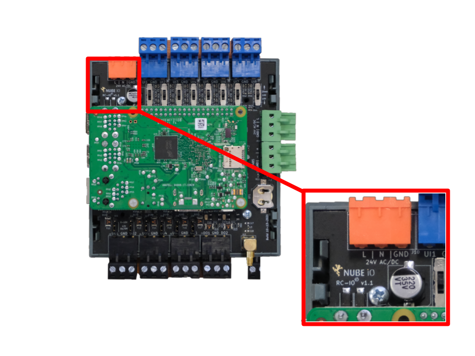

# Identifying Hardware Version

The Rubix Compute has had a number of hardware improvements since its release.
It is important to know which version of the Rubix Compute you are working with so that the correct versions of manuals and documentation are used.
Using mismatched devices and documents can result in damage to the device or non-functional configurations.

The Rubix Compute hardware version is printed on the base PCB at the top left corner just below the power input pins.   
The front case of the Rubix Compute must be removed to view the PCB and version number.  

See diagram below.

