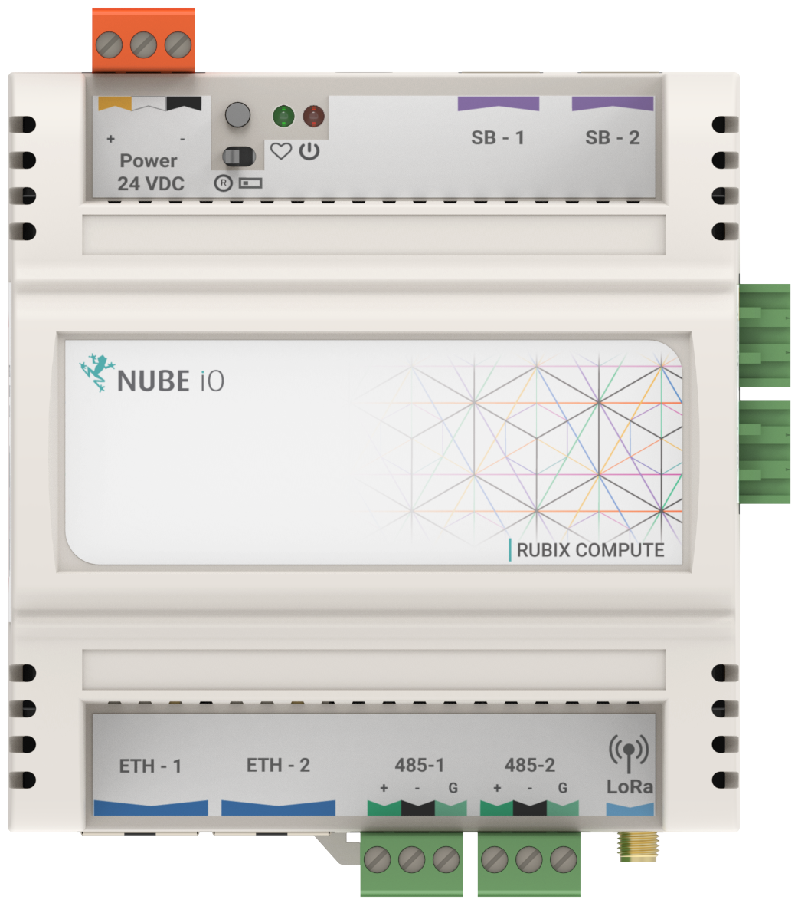
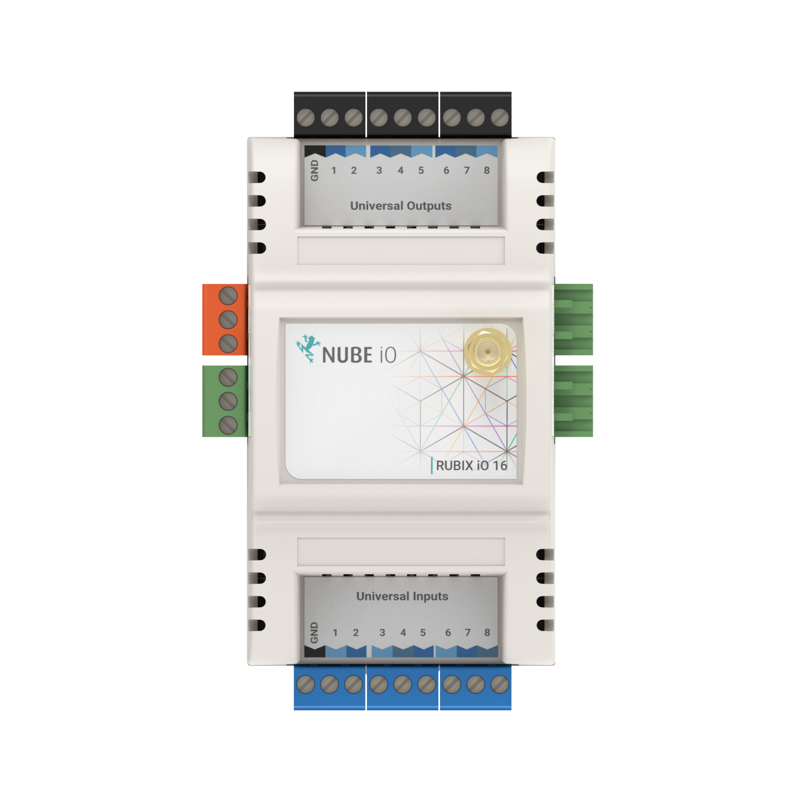

# Controllers

# Rubix-Compute
Rubix-Compute

:::tip Downloads
:arrow_down: [Datasheet](https://raw.githubusercontent.com/NubeIO/rubix-docs/master/pdfs/hardware/rubix-compute/Rubix%20Compute%205%20-%20Datasheet.pdf)

:arrow_down: [Installation manual](https://raw.githubusercontent.com/NubeIO/rubix-docs/master/pdfs/hardware/rubix-compute/Rubix%20Compute%20-%20Installation%20and%20User%20Manual%20-%2020220909.pdf)
:::

# Rubix-IO-16

:::tip Downloads
:arrow_down: [Datasheet](https://raw.githubusercontent.com/NubeIO/rubix-docs/master/pdfs/hardware/io-modules/Rubix%20IO-16%20-%20Datasheet.pdf)

:arrow_down: [Installation manual](https://raw.githubusercontent.com/NubeIO/rubix-docs/master/pdfs/hardware/io-modules/Rubix%20IO-16%20Modules%20-%20Installation%20and%20User%20Manual.pdf)
:::
