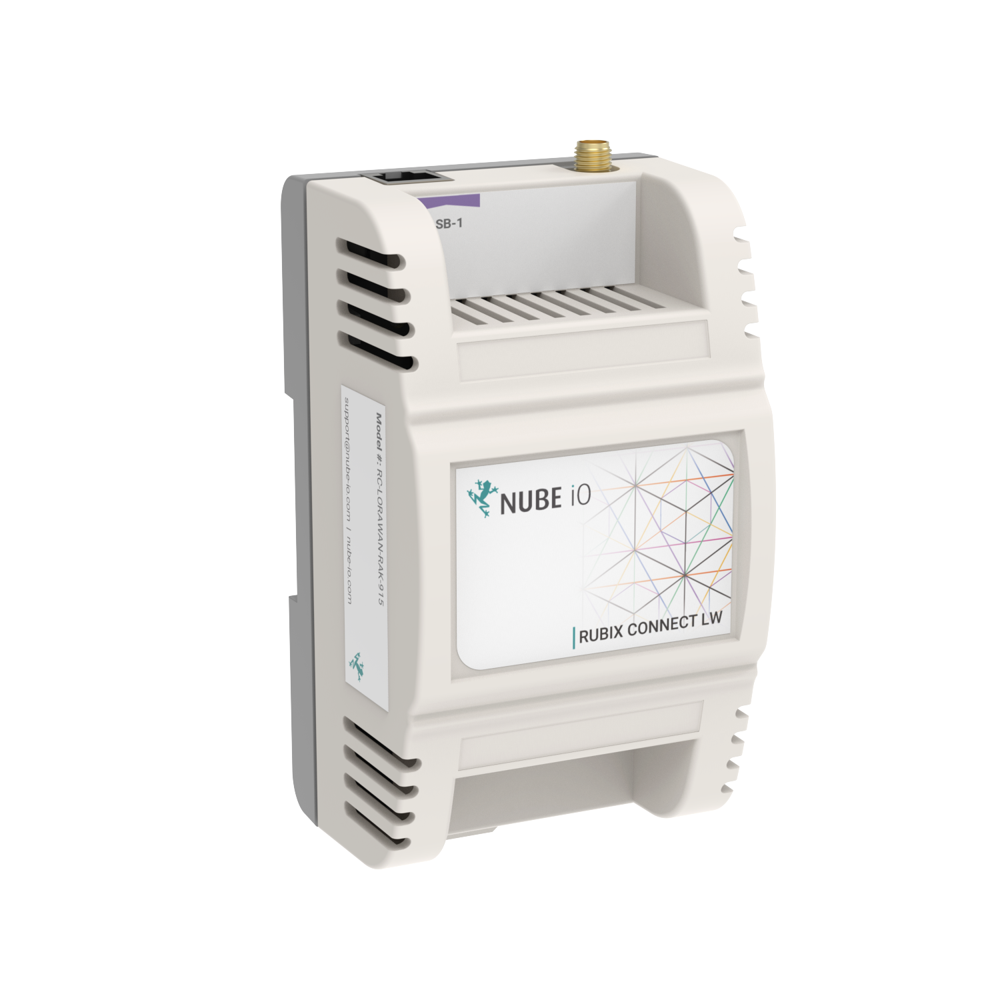
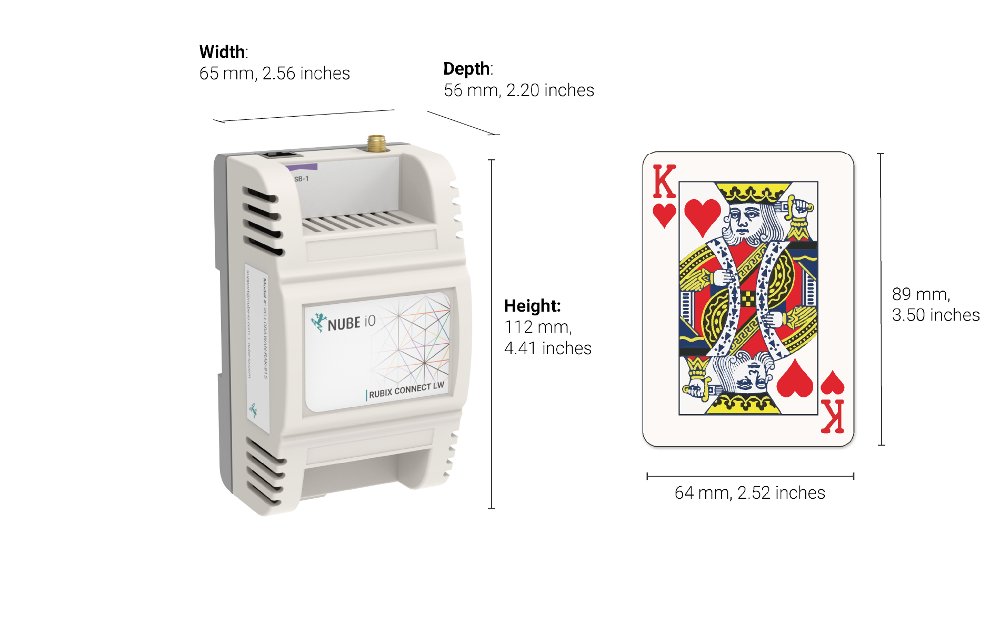
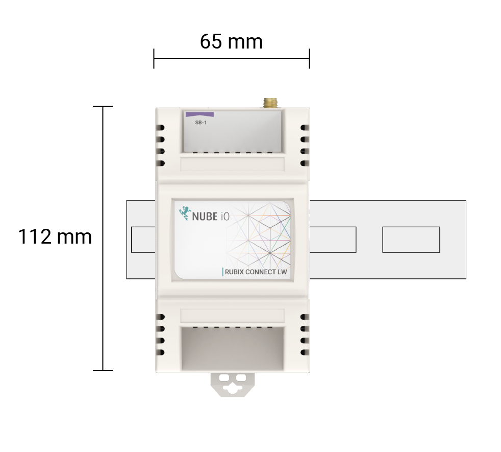
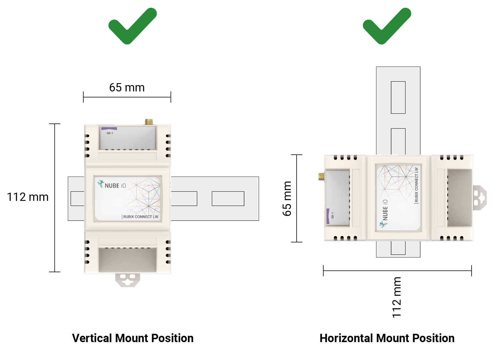
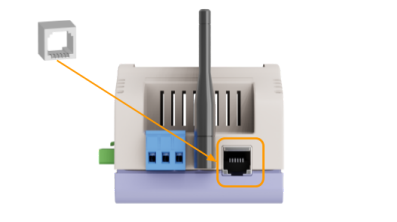

# User Manual

# 1. Overview
The Rubix Connect LW features a high-performance LoRaWAN® concentrator card seamlessly integrated into a specialised module for use with the Rubix Compute and other IOT systems. 
A powerful, efficient platform for deploying LoRaWAN® networks. Designed for low power consumption and multi-channel support, it streamlines network setup and scales easily to accommodate various applications such as smart cities, agricultural monitoring, environmental sensing, industrial automation, and smart metering.

The RC-LW-CON-1 is an add-on module to the Nube iO Rubix-Compute. Once plugged into the Rubix Compute this enables the Rubix Compute to run as a LoRaWAN® server. 

# 2. Technical Specifications

## 2.1. Power Requirements 

| Power Options and Requirements: 	|                                                                                 	|
|---------------------------------	|---------------------------------------------------------------------------------	|
|        Power Via Terminal       	| Power Supply: 5VDC supplied through the RJ12 cable from the Rubix compute S-BUS 	|

## 2.2. Physical Size 

## 2.3. Communication Options 

| Communication Options:                                     	| Part Comms                                                                                                                                                                                              	|
|:----------------------------------------------------------------:	|---------------------------------------------------------------------------------------------------------------------------------------------------------------------------------------------------------	|
|  **RJ12** 	| **N/A Edge Connect R12 interface**   Provides power and breakout for USB, UART for add-on modules                                                                                                    	|
|          	| **Add in radio model** **Supported Frequencies:** AU915-92 **Spreading Facto**  6-12 **Bandwidth:** 7.8 - 500 kHz **Effective Bitrate:** 018 - 37.5 kbps **Est. Sensitivity:** -111 to -148 dBm 	|

 

# 3. Mounting and Size

## 3.1. Dimensions

## 3.2. Mounting

# 4. Power Connection

The Rubix Connect LW is powered through the RJ12 cable. 

# 5. RJ12 Service Port 

The RJ12 port is used for the following; 
Used in conjunction with the Nube iO Edge Compute for IO expansion. (When used for input IO expansion the bus from the Edge Compute can power the Rubix Connect LW) 

## 5.1. RJ12 Drawing

## 5.2. RJ12 Cable Selection 

| RJ12 Cable                                    	| |
|:----------------------------------------------------------------:	|---------------------------------------------------------------------------------------------------------------------------------------------------------------------------------------------------------	|
|  	| RJ12 cable can be used. Additionally, the RJ12 connector could supply power to the Rubix Connect LW. RJ11 will not provide power to the module but can provide comms|
 

## 5.3. Pin Connections 

| RJ12 Cable                                    	| |
|:----------------------------------------------------------------:	|---------------------------------------------------------------------------------------------------------------------------------------------------------------------------------------------------------	|
|  	| **Pin 1:**    Power (5V dc) **Pin 2:**    Enable (EN) **Pin 3:**    USB Data **Pin 4:**    USB Data +  **Pin 5:**    Ground (GND)   **Pin 6:**    Ground (GND)|
 

# 6. Regulatory Compliance

| Regulatory          	|                            	|
|---------------------	|----------------------------	|
| LoRa end node radio 	| ● FCC: Class B 3M Radiated 	|
 