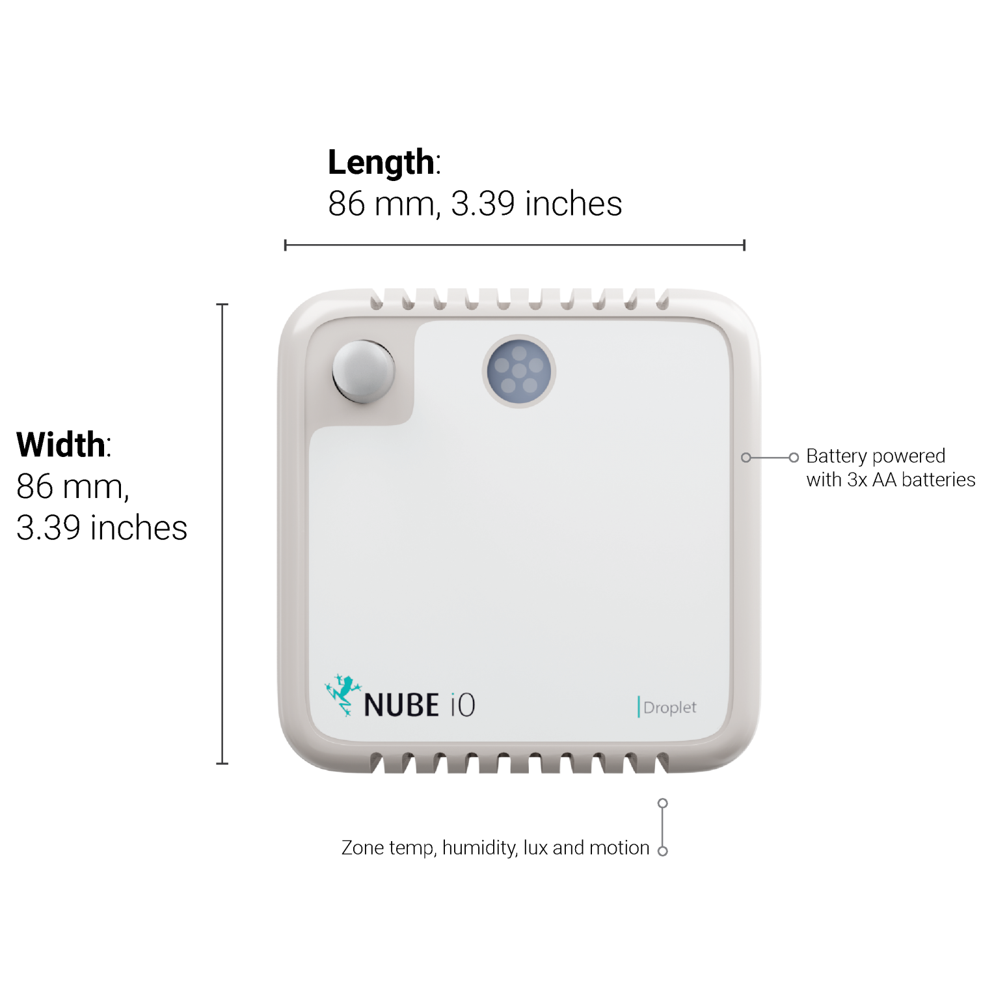

# User Manual

# 1. Overview

The Droplet is a LoRa® IoT sensor. It captures multiple points of data: 
* Temperature
* Humidity
* Lux
* Motion (PIR)

The Droplet is avalible in 3 different models:
* Droplet TH -Temperature & Humidity
* Droplet THL -Temperature, Humidity & Lux
* Droplet THLM -Temperature, Humidity, Lux and Motion (PIR)

:::info
Upto 5 year battery life with 3x AA batteries
:::

# 2. Why LoRa®

LoRa® is a low-powered, long-range wireless technology designed for the Internet of Things. 
It is less affected by buildings and other obstructions than regular WiFi and Bluetooth, with one gateway generally being able to provide coverage for a 70x70m, 3 story building.

The LoRa® community is expanding rapidly, with many new contributions and developments occurring every day.

* Significantly longer range compared to Bluetooth and WiFi
* Drastically lower power consumption than for Bluetooth, WiFi, or 4G
* AES128 encryption on data packets
* Excellent penetration through obstacles such as walls and ceilings
* Highly versatile application, which translates into easier integration and a more efficiant installation

## 1.2. LoRa® capabilities

* Supported Frequencies: 868/915Mhz 
* Spreading Factor 6-12
* Bandwidth 7.8 – 500 kHz
* Effective Bitrate .018 – 37.5 kbps
* Est. Sensitivity -111 to -148 dBm

Sensor specifications
* Temperature sensor: @25°C ± 0.5°C, from 0…65°C ±1°C
* Humidity Sensor: -40°C -> 85°C, Resolution .008 %RH
* Light Sensor: Range of 1 – 65535lx

# 3. Installation and Configuration
This article details the installation and configuration of the Nube iO Droplet LoRa® Wireless Sensor.  

## 3.1. Mounting
Droplets are 86mm x 86mm.  They are designed to be mounted on flat surfaces using screws or double sided tape.  
They can be mounted vertically or horizontally.  
The sensor should always be mounted in a location such that it will not experience very high or low temperatures,  liquids or high humidity.   
Mounting locations should be selected such that the sensor will experience conditions representative of the entire sensing space.

## 3.2. Power
Droplet sensors are powered by 3 x AA Batteries as shown below.   
Battery runtime should be between 3-5 years depending on the configured push rate and battery quality (more frequent data pushes means lower battery runtime).

## 3.3. Sensor Positioning and LoRa® Signal Quality

Droplet sensors utilise LoRa® IOT Wireless radio technology.
This wireless system features long-range, and good object penetration.
However, care still must be taken to position sensors such that they have a good communication signal with the LoRa® Gateway.
The quality of the communication signal depends on the distance from the LoRa® Gateway, and the objects between the Droplet sensor and the LoRa® Gateway.

# 4. Onboard Reset/Push Button

Droplet sensors have a small Reset Button within the sensor. This Reset Button is used to trigger a data push.
This function is frequently used when deploying and testing Droplet sensors.
The Reset Button is also used in some configuration steps.
The location is shown below.

# 5. Onboard DIP Switch Configuration

Droplet sensors have a bank of 8 small DIP switches within the sensor.  
These DIP switches are used to configure the functionality of the sensor.  
These DIP switches are located near the batteries on the sensor PCB.  
Remove the sensor from the back plate to find the DIP switches within.  
DIP switches are ON/1 when pushed UP,  and they are OFF/0 when they are pushed down.

# 6. Push Rate
DIP switches 1-3 are used to set the push rate of the Droplet sensor.  
The sensor will send the sensor data at the configured period as configured by these first 3 DIP switches.

| Push Rate  	| DIP Switch Configuration (RED Switches Only) 	|
|------------	|----------------------------------------------	|
| 15 minutes 	|       	|
| 30 Seconds 	|                     	|
| 1 Minute   	|                    	|
| 3 Minutes  	|                     	|
| 5 Minutes  	|                     	|
| 10 Minutes 	|                     	|
| 30 Minutes 	|                     	|
| 1 Hour     	|                     	|

 

# 7. Motion / PIR Interrupt

DIP switch 4 configures the Motion/PIR interrupt. 
When DIP switch 4 is set ON/1 the Droplet sensor will send a data push immediately when motion is detected for the first time in each configured Push Rate Period. 
This is intended to give an instant indication of motion in space. 
When DIP 4 is OFF/0 the Droplet sensor will only send data pushes at the configured Push rate Period.

| Motion/PIR Interrupt 	| DIP Switch Configuration (RED Switches Only) 	|
|----------------------	|:--------------------------------------------:	|
| OFF                  	|              	|
| ON                   	|               	|

 

# 8. Reset Sensor ID

DIP switch 6 will cause the Droplet sensor to self-assign a new Sensor ID.  
This is seldom used.  
The Droplet sensor is generally labeled with the original Sensor ID, using this Sensor ID Reset will cause the Droplet sensor to no longer use the previous Sensor ID.

Follow the below instructions to reset the Sensor ID:

| Procedure Step 	|                                                                                                         Description                                                                                                        	|       DIP Switch Configuration (RED Switches Only)      	|
|-------------------	|:--------------------------------------------------------------------------------------------------------------------------------------------------------------------------------------------------------------------------:	|:-------------------------------------------------------:	|
| 1                 	|                                                                                                      Normal Operation                                                                                                      	|                         	|
| 2                 	|                                                                                          Set DIP switch 6 to the ON/1/UP position                                                                                          	|                         	|
| 3                 	|                                                                                           Push the reset Button. Wait 10 Seconds.                                                                                          	| [See Section 4.](#4-onboard-resetpush-button) for Reset Button Location. 	|
| 4                 	|                                                                                         Set DIP switch 6 to the OFF/0/DOWN position                                                                                        	|                         	|
| 5                 	|                                                                                           Push the Reset Button. Wait 10 Seconds                                                                                           	| [See Section 4.](#Onboard-Reset/Push-Button) for Reset Button Location. 	|
| 6                 	| The Droplet should have a new Sensor ID. The Sensor ID will need to be discovered by monitoring the Gateway Controller Lora® Service for data pushes (which includes the NewSensor ID) as the Reset/Push Button is pressed                                                          	||

 

# 9. Testing Mode
DIP switches 7 and 8 are used to set the Droplet sensor in Testing Mode. 
In Testing Mode the Droplet Sensor will temporarily self-assign a known Sensor ID and send a Data Push every 6 seconds.   
Testing Mode is enabled when either DIP switch 7 OR 8 are ON/1/UP.  
Testing Mode aids in identifying and positioning the Droplet sensor. 

| Testing Mode Function                                                                                         	| DIP Switch Configuration (RED Switches Only) 	|
|---------------------------------------------------------------------------------------------------------------	|:--------------------------------------------:	|
| **Testing Mode:**OFF **Sensor ID:**Individual Sensor ID **Push Rate:**As Configured by DIP Switches 1-3 	|        	|
| **Testing Mode:**ON **Sensor ID:**AAB2AAAA **Push Rate:**6 Seconds                                      	|        	|
| **Testing Mode:**ON **Sensor ID:**BBB2BBBB **Push Rate:**6 Seconds                                      	|        	|
| **Testing Mode:**ON **Sensor ID:**CCB2CCCC **Push Rate:**6 Seconds                                      	|        	|

 

# 10. DIP Switch Configuration Summary Table

| DIP Switch Settings                                         	|                                                                                                                                                                                                                                                                                                                                	|
|-------------------------------------------------------------	|--------------------------------------------------------------------------------------------------------------------------------------------------------------------------------------------------------------------------------------------------------------------------------------------------------------------------------	|
| **DIP Switches 1-3** Data Interval/Push Rate             	| **Interval......... \|** 30sec \| 1min \| 3min \| 5min \| 10min \| 15min \| 30min \| 1hour \| **Switches 1,2,3 \|** 100      \| 010   \| 110   \| 001   \| 101    \| 000     \| 011     \| 111     \|                                                                                                                  	|
| **DIP Switch 4** PIR Interrupt Enable                    	| _Set the switch to ON/1 to enable data push-on Motion (PIR) detection. *Only on D-LR-THLM_                                                                                                                                                                                                                                     	|
| **DIP Switch 5** Serial Debug Enable                     	| Set the switch to ON/1 to enable debug messages over serial.                                                                                                                                                                                                                                                                   	|
| **DIP Switch 6** Hard Reset                              	| Hard reset. When the switch is set to ON/1 a new Sensor ID will be assigned every time the device is powered up.                                                                                                                                                                                                               	|
| **DIP Switches 7-8** Testing Mode - Sensor ID Assignment 	| If switches 7 or 8 are set to 1 (Testing Mode), the device will override any other Push Rate settings and automatically assign a fixed Sensor ID. Data will be sent at a 6-second Push Rate. When both switches are set to 0, the device will revert to its default push rate and use its self-assigned Sensor ID.    	|
|                                                             	| **Switch Position**     \|   **Switch Position**   00                      \|     Self Assigned ID   10                      \|  AAB2AAAA - 6 Sec Interval   01                      \| BBB2BBBB - 6 Sec Intervals   11                      \| CCB2CCCC- 6 Sec Intervals                                          	|

 

# 11. Identifying Hardware Version

The Nube iO Wireless Droplet sensor has had a number of hardware improvements since its initial release.  
It is important to know which version of the Droplet you are working with so that the correct versions of manuals and documentation are used.  
Using mismatched devices and documents can result in damage to the device or non-functional configurations.

## 11.1. Identifying Hardware Version
The Droplet hardware version is printed on the base PCB at the top of the board just below the `NUBE iO` logo.   
The front case of the Droplet must be removed to view the PCB and version number.  

See diagram below.

