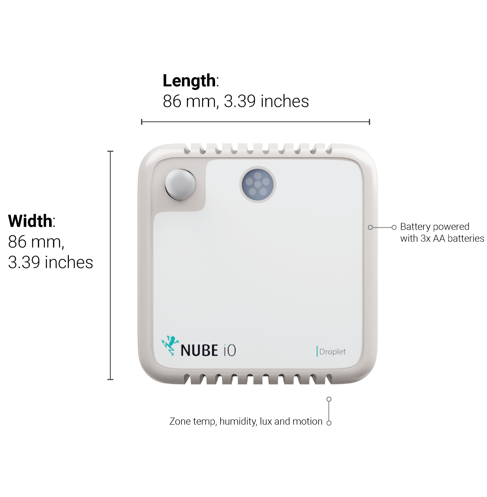

# Installation and Configuration

This article details the installation and configuration of the Nube-iO MicroEdge LoRa Wireless Asset Sensor.  
# Mounting
Droplets are 86mm x 86mm.  They are designed to be mounted on flat surfaces using screws or double sided tape.  
They can be mounted vertically or horizontally.  
The sensor should always be mounted in a location such that it will not experience very high or low temperatures,  liquids or high humidity.   
Mounting locations should be selected such that the sensor will experience conditions representative of the entire sensing space.

# Power
Droplet sensors are powered by 3 x AA Batteries as shown below.   
Battery runtime should be between 3-5 years depending on the configured push rate (more data pushes means lower battery runtime).

# Sensor Positioning and LoRa Signal Quality

Droplet sensors utilize LoRa IOT Wireless radio technology.  
This wireless system features long range, and good object penetration.  
However, care still must be taken to position sensors such that they have a good communication signal with the LoRa Gateway.   
The quality of the communication signal depends on the distance from the LoRa Gateway, and the objects between the Droplet sensor and the LoRa Gateway.

# Onboard Reset/Push Button

Droplet sensors have a small Reset Button within the sensor. 
This Reset Button is used to trigger a data push.  
This function is frequently used when deploying and testing Droplet sensors.  
The Reset Button is also used in some configuration steps.   

Location is shown below.

# Onboard DIP Switch Configuration

Droplet sensors have a bank of 8 small DIP switches within the sensor.  
These DIP switches are used to configure the functionality of the sensor.  
These DIP switches are located near the batteries on the sensor PCB.  
Remove the sensor from the back plate to find the DIP switches within.  
DIP switches are ON/1 when pushed UP,  and they are OFF/0 when they are pushed down.

# Push Rate
DIP switches 1-3 are used to set the push rate of the Droplet sensor.  
The sensor will send the sensor data at the configured period as configured by these first 3 DIP switches.

# Motion / PIR Interrupt

DIP switch 4 configures the Motion/PIR interrupt. 
When DIP switch 4 is set ON/1 the Droplet sensor will send a data push immediately when motion is detected for the first time in each configured Push Rate Period. 
This is intended to give an instant indication of motion in space. 
When DIP 4 is OFF/0 the Droplet sensor will only send data pushes at the configured Push rate Period.

# Reset Sensor ID

DIP switch 6 will cause the Droplet sensor to self-assign a new Sensor ID.  
This is seldom used.  
The Droplet sensor is generally labeled with the original Sensor ID, using this Sensor ID Reset will cause the Droplet sensor to no longer use the previous Sensor ID.

Follow the below instructions to reset the Sensor ID:

# Testing Mode
DIP switches 7 and 8 are used to set the Droplet sensor in Testing Mode. 
In Testing Mode the Droplet Sensor will temporarily self-assign a known Sensor ID and send a Data Push every 6 seconds.   
Testing Mode is enabled when either DIP switch 7 OR 8 are ON/1/UP.  
Testing Mode aids in identifying and positioning the Droplet sensor. 

# DIP Switch Configuration Summary Table

