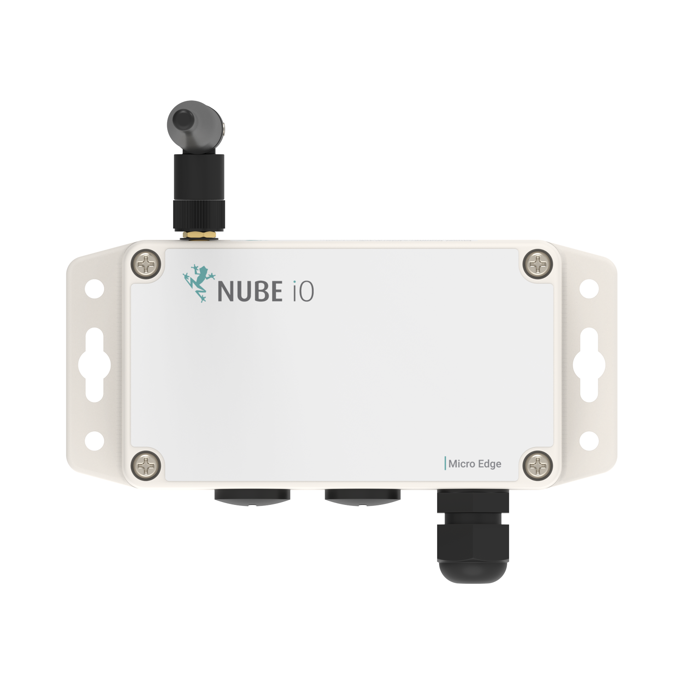
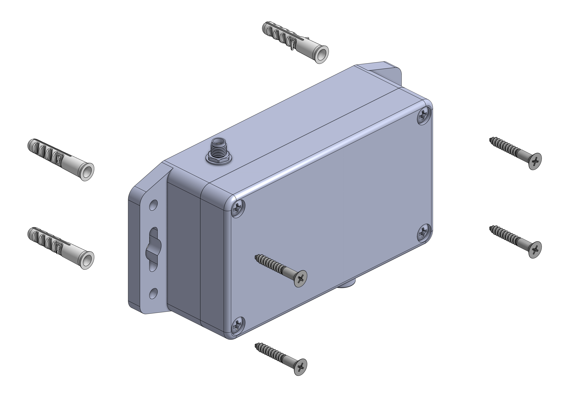

# MicroEdge Quick Start Guide

# 1. Product Overview

The MicroEdge is Nube iO’s multi-purpose wireless (LoRa®) IoT asset monitoring sensor. Designed to interface with low-level sensors, and pulse sensors (water, electrical, gas, etc.), in a small package, with minimum install time.
LoRa® wireless IoT technology provides a very long transmission range that is energy efficient and less susceptible to object interference than other wireless technologies.
The MicroEdge provides 3 analog Inputs and 1 Digital Pulse Accumulation Input. Values are sent wirelessly to the gateway controller, making installation hassle-free.
Powered by a 4000mAh battery, the MicroEdge has a runtime of 2 - 8 years depending on the configured push rate.

## 1.3 Product Features
- **LoRa®:** Provides long-range, low-power wireless connectivity for IoT devices, easily penetrating walls and obstacles.
- **3 x Analog input:** 10k thermistor, digital / dry contact
- **1 x Digital pulse:** (Dry Contact or 3.3v max) accumulation
- **Battery:** Powered by a 4000 mAh battery for multi-year operation

 

# 2. Hardware Overview

## 2.1 Packing List

Please check the package contents to verify that you have received the items below:
- MicroEdge Start Guide
- MicroEdge 
- 4000 mAh battery 
- LoRa Antenna

## 2.2 MicroEdge Introduction

### 2.2.1 External View

 

 

### 2.2.2 Internal View

 

 

 

# 3. Installation

 

# 3.1 Mounting

1. Hold the MicroEdge against the wall and mark the fixing points using the mounting holes as a guide.  
3. Drill the holes and insert wall plugs if needed.  
4. Secure the MicroEdge to the wall with screws or fixings.  
5. Gently pull the controller forward to confirm it is firmly mounted.

 

## 3.2 Connections

### 3.2.1 Battery Connection
Connect the battery to power the device; LEDs will flash briefly during activation and transmission, then turn off to save energy.

### 3.2.1 Universal & Pulse Inputs Connections
<!-- Universal Inputs: Can be used as analog or digital. Digital reads open/closed circuits (switches, buttons, relays), while analog reads sensor values like temperature, humidity, pressure, CO₂, or position.  -->

**Universal Inputs (UI1–UI3)** can be configured as:
- **Digital:** On/Off signals (e.g. switches, relays)  
- **Analog:** Resistive sensors (e.g. 10K thermistors)

> ⚠️ Max input voltage: **3.3V**

**Pulse Input:**
- Used for counting pulses (e.g. energy, water, or gas meters)

Refer to the example connections in the diagram below.

 

 

 

# 4. Dip Switch Configuration

The MicroEdge sensor includes a bank of 8 DIP switches used for configuration. To access them, remove the cover by loosening the four captive screws.

* Switches 1-3: Control the LoRa® data push rate.
* Switch 6: Resets the pulse count.
* Switch 7: Activates test mode for device diagnostics.

DIP switches 1 to 3 are used to set the push rate of the MicroEdge sensor. After setting the desired push rate, press the reset button to apply the new configuration. 

**Note:** The **UP** position is active.

| Minutes | DIP Switch Position  |
|---------|-------------------| 
| 0.5     |  |
| 1       |  |
| 3       |  |
| 5       |  |
| 10      |  |
| 15      |  | 
| 30      |  |
| 60      |  |

 

 

## 5. Engineering Tool

Scan the QR code below to download the Rubix Computer Edition engineering software for MacOS, Windows or Linux.

<!-- | Android | IOS |
|-|-|
|  |  |
|  |  | -->

 

 

## 6. User Manuals 

For full setup instructions and product documentation, scan the QR code below.

 

 

<!-- # 5. Document Revision

| Revision | Date       | Change Description                  |
|----------|------------|------------------------------------|
| 1.0      | 28-11-2025 | Initial release of the document.   |
| 1.1      | DD-MM-YYYY | Description of the next change.    |
| 1.2      | DD-MM-YYYY | Description of the next change.    | -->

