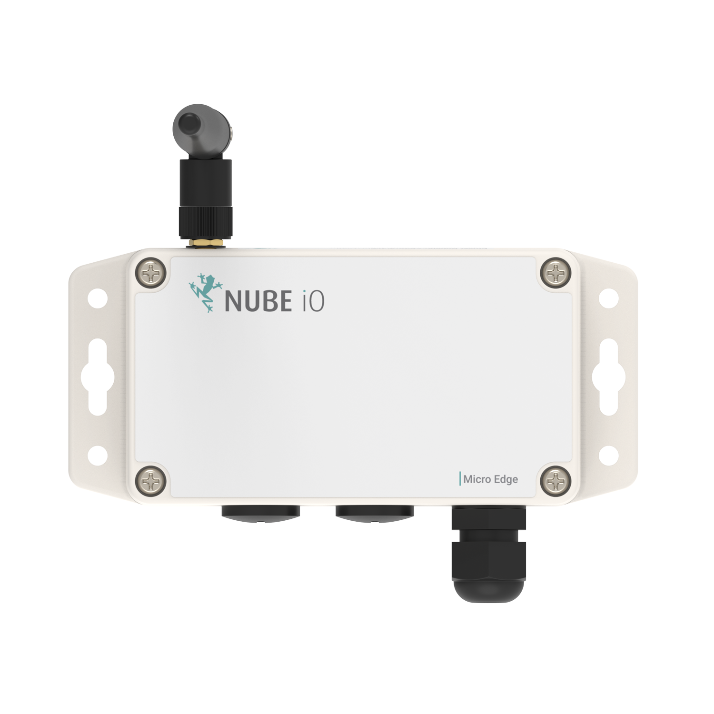

# User Manual

## 1. Overview

The MicroEdge is Nube iO’s multi-purpose wireless (LoRa®) IoT asset monitoring sensor. Designed to interface with low-level sensors, and pulse sensors (water, electrical, gas, etc.), in a small package, with minimum install time.
LoRa® wireless IoT technology provides a very long transmission range that is energy efficient and less susceptible to object interference than other wireless technologies.
The MicroEdge provides 3 analog Inputs and 1 Digital Pulse Accumulation Input. Values are sent wirelessly to the gateway controller, making installation hassle-free.
Powered by a 4000mAh battery, the MicroEdge has a runtime of 2 - 8 years depending on the configured push rate.

## 1.1. Pulse Input
- Dedicated input for counting and accumulating pulse signals.
- Suitable for measuring flow rates in utilities like water, gas, and electricity.

## 1.2. U1, UI2 and UI3
The  Universal Inputs can be used as Analog or Digital inputs.
- 10K temp sensors
- On/Off input

## 1.3. Push rates
DIP switches 1 to 3 are used to set the push rate of the MicroEdge sensor. After setting the desired push rate, press the reset button to apply the new configuration.

| Minutes | Register Number   |
|---------|-------------------| 
| 0.5     |  |
| 1       |  |
| 3       |  |
| 5       |  |
| 10      |  |
| 15      |  | 
| 30      |  |
| 60      |  |

 

# 2. Why LoRa®
LoRa® is a low-power, long-range wireless technology designed for the Internet of Things. It is less affected by buildings and other obstructions than regular WiFi, with one gateway generally providing coverage for a 70x70m 3-story building.
LoRa® is expected to hold 75% of the IoT device market share soon. The LoRa® community is expanding rapidly, with many new contributions and developments occurring daily.

* Significantly longer range than for Bluetooth and WiFi
* Drastically lower power consumption than for Bluetooth, WiFi, or 4G
* AES128 encryption
* Excellent penetration through obstacles
* Highly versatile application, which translates into easier integration

# 3. Installation and Configuration

## 3.1. External

* U.FL Connector: Connects the antenna for wireless communication.
* Mounting Holes: Enables secure attachment to fixtures.
* Captive Screws: Allows for easy opening of the device.
* Cable Gland: Facilitates the entry of cables into the device.
* M16 Plug: Accommodates extra cable glands for additional wiring.

## 3.2. Internal

* PUSH: not used
* BOOT: not used
* RST: Pressing this button will reset the Micro-Edge and restart the firmware and publish a lora message.
* Dip Switches: Adjusts the data push rate and resets the pulse counter.
* Screw Terminal: Connects analog and digital inputs to the device.
* Battery Connector: Links the battery to the device for power supply.
* Battery: Provides a long-lasting power source for the device.

## 3.3. Dip Switches
The MicroEdge sensors feature a bank of 8 small DIP switches located on the top of PCB.
These switches are used to configure the functionality of the MicroEdge.
To access them, simply open the sensor cover, by undoing the four captive screws.

* Switches 1-3: Control the LoRa® data push rate.
* Switch 6: Resets the pulse count.
* Switch 7: Activates test mode for device diagnostics.

## 3.4. Inputs

### 3.4.1. Universal inputs
The  Universal Inputs can be used as Analog or Digital inputs.
An integrated pull-up resistor ensures reliable digital input readings.

- Digital Inputs:
    - Binary states: Open (no connection) or Closed (connected) circuit.
    - Suitable for: Switches, buttons, relays, and dry contacts (e.g., device status signals).
- Analog Inputs:
    - Varied states based on Resistance measurements.
    - Compatible with sensors for: Temperature, Humidity, Pressure, CO2 levels, Position Feedback.

:::info 
Maximum input voltage is 3.3V.
:::

### 3.4.2. Pulse input
* Dedicated input for counting and accumulating pulse signals.
* Suitable for measuring flow rates in utilities like water, gas, and electricity.

## 3.5. Mounting
* Surface Mounting: Designed for attachment to flat surfaces using external screws.
* Antenna Orientation: Optimal performance when mounted with the antenna facing upwards.
* Temperature Considerations: Avoid locations with extreme temperatures for consistent operation.
* Gateway Proximity: Choose a mounting location considering its relative position to the LoRa® gateway for optimal signal strength.

## 3.6. Connecting the battery
* Connect the battery to power the device.
* Upon activation, LEDs will flash, indicating the device is on and a message is being transmitted.
* LEDs will turn off post-transmission to conserve energy.

## 3.7. Reset Pulse Count
The procedure for resetting the pulse count involves a series of steps with the device's DIP switch and reset button.
1. Set DIP switch 7 to ON/1.
2. Press the Reset Button.
3. Wait for 5 seconds.
4. Set DIP switch 6 back to OFF/0.
5. Press the Reset Button again to complete the reset process.

## 3.8. Testing pulse input
Due to the power-saving feature of the MicroEdge, which records pulse count only during the wake phase from sleep state, it's important to avoid pressing the reset button before the device wakes up on its own. 
This precaution is necessary to prevent loss of pulse data. To effectively test the pulse counter, follow these steps:
1. Water Meter Disconnection: Ensure the water meter is disconnected from the device to facilitate an isolated test environment.
2. Configuration Setting: Adjust the device's push interval to 30 seconds,  Refer to the datasheet, dips = '100' for 30 seconds .
3. Device Reset: Initiate a reset by pressing the device's reset button.
4. Terminal Shorting: Manually short the pulse terminals several times to simulate input signals.
5. Wait for Data Transmission : After the terminal shorting, allow a wait time of 30 seconds you will see the leds flash when a message is sent.

## 3.9. Test mode
Test mode is used for diagnostics and performance verification, ensuring reliable operation before deployment. In test mode, the device transmits data at a fixed, rapid interval (every 8 seconds) with a static Sensor ID, facilitating real-time testing and troubleshooting.

* Set DIP switch 6 ON/1
  * State: Overrides all Push Rate settings.
  * Uses a fixed Sensor ID (AAACAAAA).
  * Transmits data every 8 seconds.
* Set DIP switch 6 OFF/0
  * State: Returns to normal operation.
  * Follows pre-configured push rate.
  * Utilises the device's unique Sensor ID.
  After setting the test mode switch to ON/1 or OFF/0, press the reset button to apply the new configuration.

