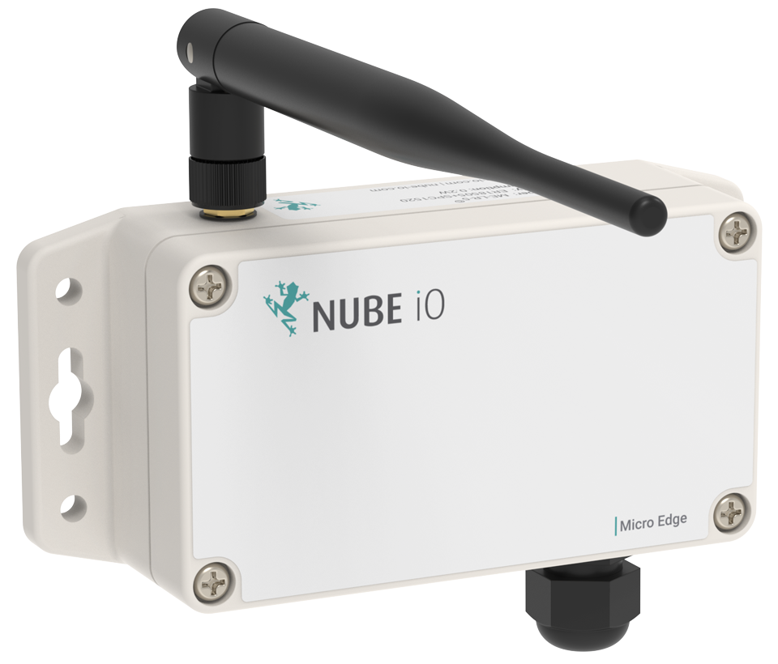

# Overview

Micro Edge is a LoRa® technology-based IoT sensor. 
It seamlessly captures data from your equipment and other assets, enabling you to make smart, data-driven decisions.

The micro-edge supports `3x UI` (universal inputs) and `1x pulse input` (normally used for a gas or water meter reading)

:::info
upto 5 year battery life with 3x AA batteries 
:::

## P-IN
is a dry contact from a pulse water meter

## UI, UI2 and UI3
supports the following input types

- 10K temp sensors
- 0-10dc input
- On/Off input

# Why LoRa

LoRa® is a low-power, long-range wireless technology designed for the Internet of Things.
It is less affected by buildings and other obstructions than regular WiFi, with one gateway generally being able to provide coverage for a 70x70m 3-story building.

LoRa® is expected to hold 75% of the IoT device market share soon.
The LoRa® community is expanding rapidly, with many new contributions and developments occurring every day.

* Significantly longer range than for Bluetooth and WiFi
* Drastically lower power consumption than for Bluetooth, WiFi, or 4G
* AES128 encryption
* Excellent penetration through obstacles
* Highly versatile application, which translates into easier integration

