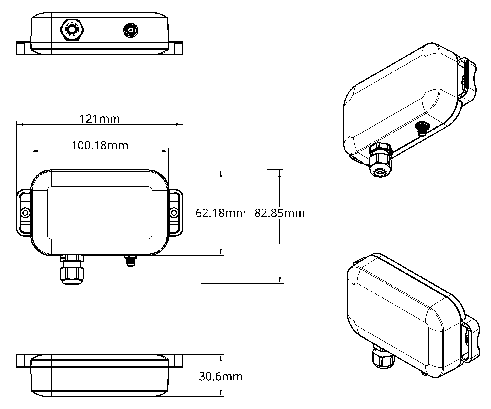

# MicroEdge Gen2 Install and User Manual

# 1. Overview

## 1.1 About Product
The MicroEdge is Nube iO’s multi-purpose wireless (LoRa®) IoT asset monitoring sensor. Designed to interface with low-level sensors, and pulse sensors (water, electrical, gas, etc.), in a small package, with minimum install time.
LoRa® wireless IoT technology provides a very long transmission range that is energy efficient and less susceptible to object interference than other wireless technologies.
The MicroEdge provides 3 analog Inputs and 1 Digital Pulse Accumulation Input. Values are sent wirelessly to the gateway controller, making installation hassle-free.
Powered by a 4000mAh battery, the MicroEdge has a runtime of 2 - 8 years depending on the configured push rate.

<!--  -->

<!-- ## 1.2 System Architecture
**Zoneconnex Controller:** Acts as the master device, interfacing with compatible RAC/PAC and VRF Air Conditioning units via the UART protocol. It manages data transmission to and from the field devices and manages the control of the air conditioning system.  
**TouchPoint LCD:** This wall-mounted touchscreen provides a local control interface for the user to manage and monitor the air conditioning system.  
**anywAiR® Zone Mobile App:** This mobile application provides a remote control interface for the user to manage and monitor the air conditioning system.  
**Droplet (sold separately):** This wireless LoRa device monitors temperature and humidity in each zone transmitting data to the Zoneconnex allowing for individual zone monitoring.   -->

## 1.2 Packaging Contents
Check that you have received all items below.
- MicroEdge Sensor
- 1 x LoRa Antenna
- 1 x 3.6V Lithium Battery
- 1 x Optical Pulse Cable (Optional, pre-wired to the MicroEdge sensor)

## 1.3 Product Features
**LoRa®:** The MicroEdge supports LoRa communication. 
**Battery Power:** The MicroEdge is powered by a 3.6V lithium battery.  
**IP67 Rated:** The MicroEdge is IP67 rated, making it suitable for outdoor use.   ***Confirm Rating***
**Pulse Input:** The MicroEdge supports a digital pulse input typically used for water, gas, or electrical meters*. (Note: The Optical Pulse Cable for electrical meters is sold separately.*) 
**Universal Analog Inputs:** The MicroEdge supports 3 analog inputs for interfacing with low-level sensors.   ***Check Input count***
**Serial Port:** Service / Programming Port used to manage the MicroEdge firmware.  

 

# 2. Hardware Overview

## 2.1 MicroEdge Dimensions
|                	        |                                           |
|---------------------------|-------------------------------------------|
| Height              	    | 62.18 mm (82.85 incl. gland) / 2.44 inches (3.26 incl. gland)                	  |
| Width                	    | 100.18 mm (121 incl. clips) / 3.94 inches (4.76 incl. clips)                     |
| Depth                	    | 30.6 mm  / 1.2 inches                     	|
| Enclosure             	| ***TBC*** Matte White, IP2X Rated 	    |

 

## 2.2 Optical Sensor Components

### 2.2.1 Front View
- U.FL LoRa Connector: Connects the LoRa antenna for wireless communication.
- Mounting Holes: For secure attachment using fixings.
- Cable Tie Slots: For secure attachment using cable ties.
- Cable Entry Gland: Allows the optical pulse cable to pass through while maintaining a weatherproof seal.

### 2.2.2 Rear View
- U.FL LoRa Connector: Connects the LoRa antenna for wireless communication.
- Mounting Holes: For secure attachment using fixings.
- Cable Tie Slots: For secure attachment using cable ties.
- Captive Screws: To secure the optical sensor to the backplate and prevent tampering.
- Cable Entry Gland: Allows the optical pulse cable to pass through while maintaining a weatherproof seal.

### 2.2.3 Internal View
- Battery: 3.6V Lithium Battery powers the Optical sensor.
- Battery Connector: Connects the battery to the Optical sensor.
- Antenna Connector: Connects the U.FL LoRa Connector to the PCB for wireless communication.
- Optical Sensor Terminals: Connects the optical pulse cable to the Optical sensor.
- SW1: USER. The USER button transmits data upon a press-and-release action; releasing the button immediately sends the data via LoRa.
- SW2: RESET. The RESET button resets the entire program and resets the pulse counting to 0.
- SW3: BOOT. Spare button for future use.

# 3. Installation

## 3.1 MicroEdge Mounting
The MicroEdge can be mounted by utilising fixings andthe mounting clips or via doublesided tape depending on the type of system and mounting location. In all cases, the antenna must remain vertical (unless specifically noted). The MicroEdge should always be mounted in a location suitable to its IP rating (IP2X). ***Confirm rating***
