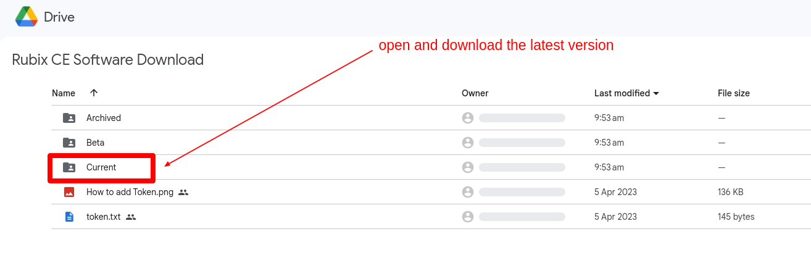

# Intro 

Rubix Platform CE is Nube iO's new desktop software designed for offline programming and product management.
Built to be fast, lightweight and portable, it allows users and technicians to configure and modify remotely without requiring a constant internet connection.

## Downloads

### Rubix-CE Download

:arrow_down: [link to latest version](https://drive.google.com/drive/folders/1EY1bF_T503HGjCt3KOKtp5LyakRAAj5Z)

:arrow_down: [link to all downloads](https://drive.google.com/drive/folders/1slMWRrk0-apIV1HEBnewk-_PWTgDcmn8)

for windows download the version folder called `windows` and then download the build inside for example named `rubix-ce-windows-2023.05.05.exe`

### Rubix-Compute
Rubix-Compute-5

:arrow_down: [download link](https://raw.githubusercontent.com/NubeIO/rubix-docs/master/pdfs/hardware/rubix-compute/Rubix%20Compute%205%20-%20Datasheet.pdf) 

