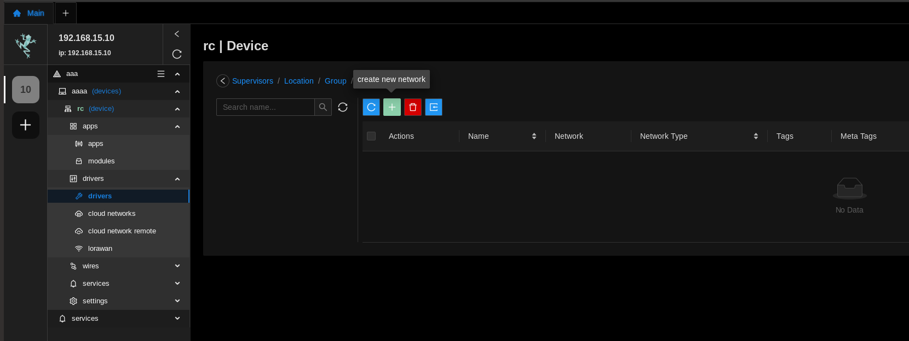

# Getting Started

see more info for each protocol
- [BACnet master](bacnet-master.md)
- [BACnet Server](bacnet-server.md)
- [LoRa](lora.md)
- [LoRaWAN](lorawan.md)

# Drivers (Protocols)
To add a driver for a new network, return to the driver tab in the controller page. Select "+Create" and then select the driver from the available list on the dropdown menu. If the required driver does not appear in the menu the plugin will need to be installed, see previous section for instructions.

