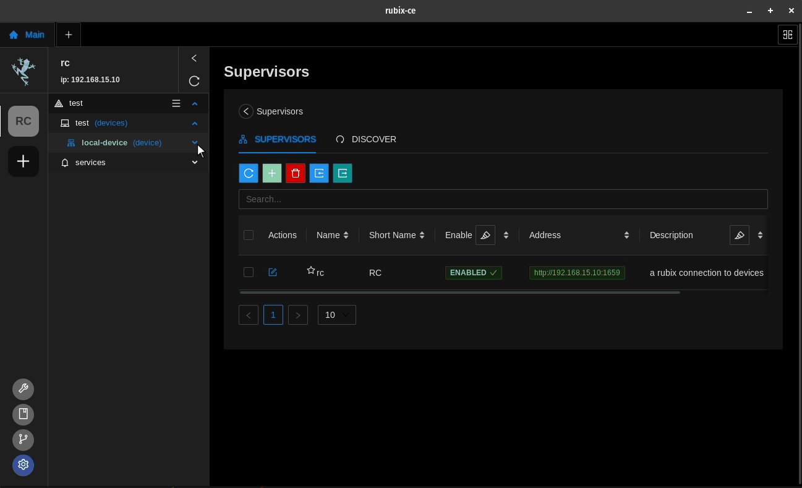
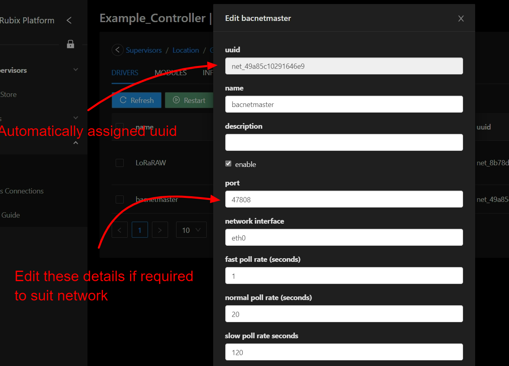
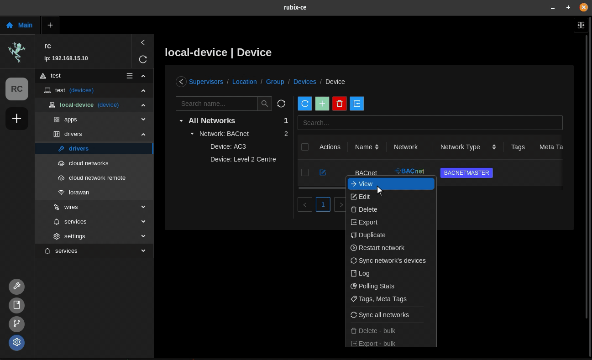
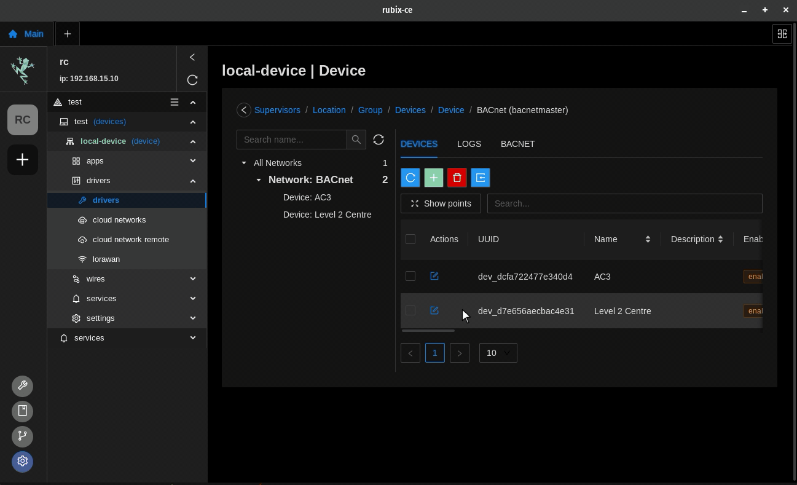

# Getting Started

To add the BACnet-Mas

ter driver to a controller follow the steps in the previous sections: Modules (Modules/Plugins) and
Drivers (Protocols).

When adding the bacnet driver the default settings should be suitable for most applications but can be changed if
required.

# Adding a network

## name
Name of the network

## description
Description of the network, eg: `level 1 network`

## show advanced options

### port
Default port is `47808` you can also set it to another port like `47809` if required

### network interface 
Select the network interface
`ETH-1 interface eth0, ETH-2 interface eth1`

### max poll rate
Set max polling rate

# Editing a network
You can either click on the **edit icon**  or **right-click** and **edit**

# Adding a BACnet device

## Add manually

Click on the **add button**  

## BACnet network device discovery (BACnet WhoIs)

## Adding a points to a device

### Add manually

1. Open the BACnet device by **right-click** and **View**
2. Click on the **add button** 
3. Enter the point details then save

### BACnet network points discovery (BACnet Discover Device Objects)

You can also discover and add the points ass required

#### Point settings

##### Poll  Priority

- high
- normal
- low

##### Poll Rate
Select the required poll rate

**the time settings are set in the device settings**

- fast
- normal
- slow

## About

BACnet is a data communications protocol for Building Automation and Control Networks. It is an approved and
standard protocol by American Society of Heating, Refrigerating and Air Conditioning Engineers (ASHRAE),
American National Standards Institute (ANSI), and International Organization for Standardization (ISO). The
BACnet protocol supports communication and control of applications such as heating, ventilation, air-conditioning,
lighting, access, and fire detection systems and their associated equipment.

## Supported services

### Whois

The BACnet: Who-Is Node allows you to broadcast a Who-Is message and await I-Am replies from BACnet-compatible devices
on your network.

| Service                                | Supported |
|----------------------------------------|-----------|
| Who-Is (Device and Object Discovery)   | yes       |
| I-Am (Device and Object Discovery)     | yes       |
| Read-Property (Data Sharing)           | yes       |
| Read-Property Multiple (Data Sharing)  | yes       |
| Write-Property (Data Sharing)          | yes       |
| Write-Property Multiple (Data Sharing) | yes       |
| Subscribe COV                          | no        |

### Read properties

For example for a BACnet point

| Object             | Number | Supported For Read |
|--------------------|--------|--------------------|
| Analog Input       | 0      | yes                |
| Analog Output      | 1      | yes                |
| Analog Value       | 2      | yes                |
| Binary Input       | 3      | yes                |
| Binary Output      | 4      | yes                |
| Binary Value       | 5      | yes                |
| Calendar           | 6      | no                 |
| Command            | 7      | no                 |
| Device             | 8      | no                 |
| Event Enrollment   | 9      | no                 |
| File               | 10     | no                 |
| Group              | 11     | no                 |
| Loop               | 12     | no                 |
| Multi-state Input  | 13     | yes                |
| Multi-state Output | 14     | yes                |
| Notification Class | 15     | no                 |
| Program            | 16     | no                 |
| Schedule           | 17     | no                 |
| Multi-state Value  | 19     | yes                |

### Write properties

For example for a BACnet point

| Object             | Number | Supported For Write |
|--------------------|--------|---------------------|
| Analog Input       | 0      | no                  |
| Analog Output      | 1      | yes                 |
| Analog Value       | 2      | yes                 |
| Binary Input       | 3      | no                  |
| Binary Output      | 4      | yes                 |
| Binary Value       | 5      | yes                 |
| Calendar           | 6      | no                  |
| Command            | 7      | no                  |
| Device             | 8      | no                  |
| Event Enrollment   | 9      | no                  |
| File               | 10     | no                  |
| Group              | 11     | no                  |
| Loop               | 12     | no                  |
| Multi-state Input  | 13     | no                  |
| Multi-state Output | 14     | yes                 |
| Notification Class | 15     | no                  |
| Program            | 16     | no                  |
| Schedule           | 17     | no                  |
| Multi-state Value  | 19     | yes                 |