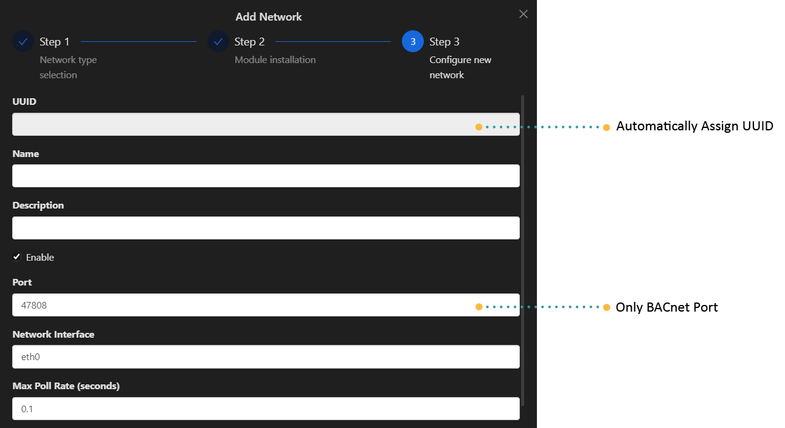

# Getting Started

To add the BACnet-Master driver to a controller follow the steps in the previous sections: 

Modules (Modules/Plugins) and Drivers (Protocols).

When adding the BACnet driver the default settings should be suitable for most applications but can be changed if
required.

:::info Important things to note before proceeding:
* Install required **[Apps](../../../setup/apps.md) and [Modules](../../../setup/Modules.md)** **Bacnet Master**
:::

# Adding a BACnet Network

1. Open the host device you wish to add the BACnet network to
2. Click on the Add 
3. A pop up window will appear, click the BACnet Master.
4. Provide the required details for your BACnet Server, including its Name, Port, and Network Interface. These fields are mandatory.
5. Click `Create Network`.

| Attribute   | Description                                       |
|-------------|---------------------------------------------------|
| Name        | Name of the network                               |
| Description | Description of the network, eg: `level 1 network` |
| Port              | Default port is `47808` you can also set it to another port like `47809` if required.    |
|Enable               |Enable the network                                                                     |
| Network interface | Select the network interface:   - ETH-1 interface eth0   - ETH-2 interface eth1 |
| Max poll rate     | Set max polling rate.                                                                    |
|History Enable     | Enable network history                                                                    |
|Tags               | Right-click the network then `tags, meta-tags` to add in query key words                    |
|Meta-Tags          | Right-click the network then `tags, meta-tags` to add in query key words                   |
|Message            | See **[Troubleshooting](../../../setup/Troubleshoot.md)** for list of messages|
|State              | `last_ok`:  Indicates the time since the system has been error-free.
||`last_fail`: Specifies the date and time of the most recent occurrence of a failure.|

# Editing a BACnet Network

1. You can either click on the **edit icon**  or **right-click** and **edit**
2. Update as required or as needed.
3. To save, hit the save button

# Adding a BACnet Device

1. Open the network you added by **right-click** Open
2. Click on the Add 
3. Enter the details required like Name, Object ID, Object Type etc.
4. To save, hit the `save` button.

| Attribute   | Description                                       |
|-------------|---------------------------------------------------|
| Name        | Name of the device                               |
| Description | Description of the device, eg: `sensor 1` |
|Host IP| Fill in for BACnet IP only, IP of the device you wanted to connect with|
| Port              | Default port is `47808` you can also set it to another port like `47809` if required.    |
|Enable               |Enable the device                                                                    |
| Object ID | Refers to the identifier of a specific object instance within a BACnet device or network. |
| Network Number    | Identifier that distinguishes different BACnet networks within a larger system.           |
|Device MS/TP MAC Address    | For BACnet networks using MS/TP (Master-Slave/Token-Passing) communication, the MAC address (Media Access Control address) uniquely identifies each device on the network segment. It's essential for addressing and communication.|
|Device Max-ADPU (Application Data Protocol Unit)| ADPU refers to the maximum size of data packets that the BACnet master can handle during communication with BACnet devices. It defines the maximum amount of data that can be sent or received in a single transmission.|
|Device Segmentation| Refers to the capability of the BACnet master to handle large amounts of data by breaking them into smaller segments (ADPUs). It ensures efficient communication, especially over networks with limited bandwidth or where devices support different data sizes.|
|Poll Delay Between Points| This parameter specifies the time interval between successive polls (requests for data) sent by Rubix CE to different BACnet devices or points (e.g., sensors, actuators).|
|Tags               | Right-click the device then `tags, meta-tags` to add in query key words                    |
|Meta-Tags          | Right-click the device then `tags, meta-tags` to add in query key words                   |
|Message            | See **[Troubleshooting](../../../setup/Troubleshoot.md)** for list of messages|
|State              | `last_ok`:  Indicates the time since the system has been error-free.
||`last_fail`: Specifies the date and time of the most recent occurrence of a failure.|

## BACnet Network Device Discovery (BACnet Who Is)

You can also do a BACnet device discovery to add the devices.

To add BACnet device automatically, follow these steps:

1. Navigate to the Discover tab.
2. Click on the Discover icon.
3. Wait for the device list to populate.
4. Select the checkboxes next to the devices you want to connect to BACnet.
5. Click on `Add Devices`.

## Adding BACnet Points to a device

### Add Manually

1. Open the BACnet device by **right-click** and **Open**
2. Click on the **add button** 
3. Enter the point details then save

| Attribute   | Description                                       |
|-------------|---------------------------------------------------|
| Name        | Name of the point                               |
| Description | Description of the point, eg: `temperature` |
|Enable               |Enable the point                                                                     |
|Object ID|  A unique identifier within a BACnet device that specifies a particular object instance. Each object in BACnet (such as analog input, binary output, etc.) is identified by a unique Object ID.|
|Object Type      | Object Type specifies the class or type of the BACnet object.   |
|Write Mode|Refers to how the data associated with a particular point can be written or updated.  |
|Read/Write Type|Defines how a BACnet object can be accessed and manipulated by other devices or controllers on the network|
|Round to Decimals|Defines the number of decimal places to which the value of a numeric object (like analog inputs or outputs) should be rounded.|
|Fallback|Refers to the number of retries or attempts a device makes to establish communication or to perform an operation before it considers an action as unsuccessful.|
|Unit|Refer to the specification of the measurement or data type associated with a particular data point or object|
|History Type|Determines how historical data is recorded or stored for the object.|
|History Interval|Specifies the time interval between consecutive history samples recorded for the object. |
|History COV Threshold (Change of Value Threshold)| Sets the threshold value that triggers a change of value notification for historical records. When the object's value changes by an amount exceeding this threshold, a history update is recorded.|
|Tags               | Right-click the device then `tags, meta-tags` to add in query key words                    |
|Meta-Tags          | Right-click the device then `tags, meta-tags` to add in query key words                   |
|Message            | See **[Troubleshooting](../../../setup/Troubleshoot.md)** for list of messages|
|State              | `last_ok`: Indicates the most recent successful update of the latest value.|
||`last_fail`:  Indicates the time when the issue first appeared, as specified in the message field.|

### BACnet Network Points Discovery (BACnet Discover Device Objects)

Here are the steps to add points to your BACnet device using `Discovery`:

1. Open the BACnet device where the points you want to add reside.
2. Navigate to the Discover tab.
3. Click on `Count Device Objects` and then click `Discover.`
4. Click on `Discover Device Objects` and then click `Discover.`
5. Select the checkboxes next to the device objects you want to move to the BACnet points table.
6. Click on `Discover Points` and then click `Discover.`
7. Wait for the table to populate with points.
8. Again, select the checkboxes next to the points you wish to add.
9. Finally, click `Add Points` to complete the process of adding your BACnet points.

#### Point Settings

##### Poll  Priority

| Attribute | Description                        |
|-----------|------------------------------------|
| Name      | - High   - Normal    - Low |

##### Poll Rate
Select the required poll rate.

:::info
**the time settings are set in the device settings**
:::

| Attribute | Description                         |
|-----------|-------------------------------------|
| Poll Rate | - Fast   - Normal    - Slow |

## Supported Services

### Who Is

The BACnet: Who-Is Node allows you to broadcast a Who-Is message and await I-Am replies from BACnet compatible devices
on your network.

| Service                                | Supported |
|----------------------------------------|-----------|
| Who-Is (Device and Object Discovery)   | Yes       |
| I-Am (Device and Object Discovery)     | Yes       |
| Read-Property (Data Sharing)           | Yes       |
| Read-Property Multiple (Data Sharing)  | Yes       |
| Write-Property (Data Sharing)          | Yes       |
| Write-Property Multiple (Data Sharing) | Yes       |
| Subscribe COV                          | No        |

### Read Properties

BACnet point example:

| Object             | Number | Supported For Read |
|--------------------|--------|--------------------|
| Analog Input       | 0      | Yes                |
| Analog Output      | 1      | Yes                |
| Analog Value       | 2      | Yes                |
| Binary Input       | 3      | Yes                |
| Binary Output      | 4      | Yes                |
| Binary Value       | 5      | Yes                |
| Calendar           | 6      | No                 |
| Command            | 7      | No                 |
| Device             | 8      | No                 |
| Event Enrollment   | 9      | No                 |
| File               | 10     | No                 |
| Group              | 11     | No                 |
| Loop               | 12     | No                 |
| Multi-state Input  | 13     | Yes                |
| Multi-state Output | 14     | Yes                |
| Notification Class | 15     | No                 |
| Program            | 16     | No                 |
| Schedule           | 17     | No                 |
| Multi-state Value  | 19     | Yes                |

### Write Properties

BACnet point example:

| Object             | Number | Supported For Write |
|--------------------|--------|---------------------|
| Analog Input       | 0      | No                  |
| Analog Output      | 1      | Yes                 |
| Analog Value       | 2      | Yes                 |
| Binary Input       | 3      | No                  |
| Binary Output      | 4      | Yes                 |
| Binary Value       | 5      | Yes                 |
| Calendar           | 6      | No                  |
| Command            | 7      | No                  |
| Device             | 8      | No                  |
| Event Enrollment   | 9      | No                  |
| File               | 10     | No                  |
| Group              | 11     | No                  |
| Loop               | 12     | No                  |
| Multi-state Input  | 13     | No                  |
| Multi-state Output | 14     | Yes                 |
| Notification Class | 15     | No                  |
| Program            | 16     | No                  |
| Schedule           | 17     | No                  |
| Multi-state Value  | 19     | Yes                 |
