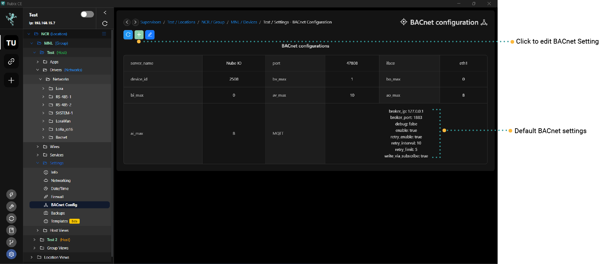

# Getting Started

BACnet Server Integration (make the Rubix Compute a discoverable BACnet device.

:::info Important things to note before proceeding:
* Install required **[apps](../../../setup/apps.md)** **driver-bacnet**
:::

:::info
Make sure the config is set for the number of AIs and AOs needed. (eg 2x **[Nube-IO IO-16](../../../../hardware/controllers/io-controllers/IO-16/overview.md)** we would need to add in the bacnet-config
16-AIs and 16-AOs)
:::

:::info rubix-wires bacnet-server node
To make the Rubix Compute a native BACnet device please see link: **[bacnet](../../../wires/bacnet.md)** 
:::

See below for installing the BACnet-driver and editing the sever settings

## BACnet Server Settings

:::info Important things to note before proceeding
Please make sure the correct ethernet port is select.
* ETH-1 is would be set for `iface` `eth0`
* ETH-2 is would be set for `iface` `eth1`
:::

1. On the `device level` of the supervisor. Click into the device's `settings` tab, then click the `BACnet Config` tab.
2. Click the `edit` button to see all the configurable fields (server name, BACnet ports, device ID etc)
3. Click the `Ok` button and refresh for the changes to update. 

| Attribute   | Description                                       |
|-------------|---------------------------------------------------|
|Server Name    | User define name that helps identify the network|
|Port           | The port number is the communication endpoint where the BACnet server listens for incoming communication from BACnet clients. Common ports used for BACnet are 47808 (UDP) and 47809 (TCP)|
|IFace (Interface)|Refers to the network interface or interfaces through which the server communicates with other devices on the network.|
|Device ID|This is a unique identifier assigned to the BACnet device (server) on the network. It distinguishes one BACnet device from another and is crucial for addressing and communication.|
|AI Max (Analog Input Maximum)|Represents the maximum number of analog input (AI) points or objects that the BACnet server can handle.|
|AO Max (Analog Output Maximum)|Indicates the maximum number of analog output (AO) points or objects that the BACnet server can support. |
|AV Max (Analog Value Maximum)|Refers to the maximum number of analog value (AV) points or objects that the BACnet server can manage.|
|BI Max (Binary Input Maximum)|Denotes the maximum number of binary input (BI) points or objects that the BACnet server supports.|
|BO Max (Binary Output Maximum)|Indicates the maximum number of binary output (BO) points or objects that the BACnet server can handle.|
|BV Max (Binary Value Maximum)|Represents the maximum number of binary value (BV) points or objects that the BACnet server can accommodate.|