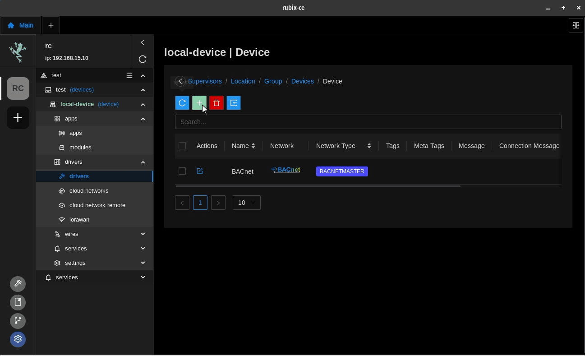
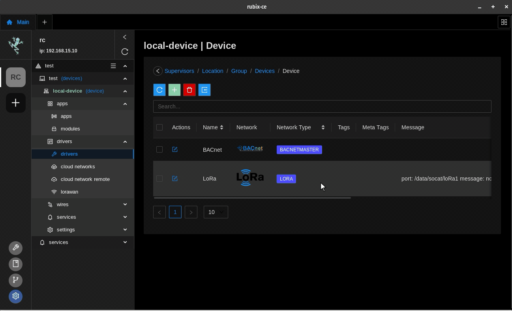

# Getting Started

This page will demonstrate how to add wireless LoRa Droplets and Micro Edges to the Rubix Compute.

## Adding a network

:::info
Important things to note before proceeding:
Install the BACnet app see link: **[installing apps](../../../setup/apps.md)** and install the **driver-lora** app
:::

**Step-1** On the controller level, under `drivers`, click the **create**  to
select and download and install the relevant network. Follow the wizard to continue installing the network.

**Step-2** Select the LoRa network. This will download the appropriate modules and drivers.

Check the default communication settings for the sensor by ticking the 'show advanced options' checkbox.

**Step-3** Once all the settings are added click on **Submit** button

This should now create the LoRa and network. Now open the LoRa network to add a device

:::info
adding the LoRa driver for the first time it will install a module/plugin dependency called `LoRa`
:::

## Adding a sensor

:::info
see nube supported sensors for more info **[sensors.md](../../../../hardware/downloads/sensors.md)**
:::

:::info droplet sensors
- THLM -> temperature, humidity, motion, lux
- THL -> temperature, humidity, lux
- TH -> temperature, humidity
  :::

**Step-1** Once inside the `network`, click the **create**  button and a pop-up
will give you the type of sensors to select from. For this example, we will be using a `THLM` droplet.

**Step-2** Follow the wizard by assigning a name and description, and then press 'submit' to continue.

**Step-3** Enter the 8 digit serial number printed on the sensor and press submit.

**Step-4** Once the sensor has been added, view the points by clicking on the arrow point on the newly added device.

:::info
It may be necessary to wait or force a push from the sensor (by clicking the reset button on the sensor) for the values
to show. Additional offsets, scaling fallback values, multiplication factors can also be applied if required. Try also
clicking the 'refresh' button if the values do not update.
:::

