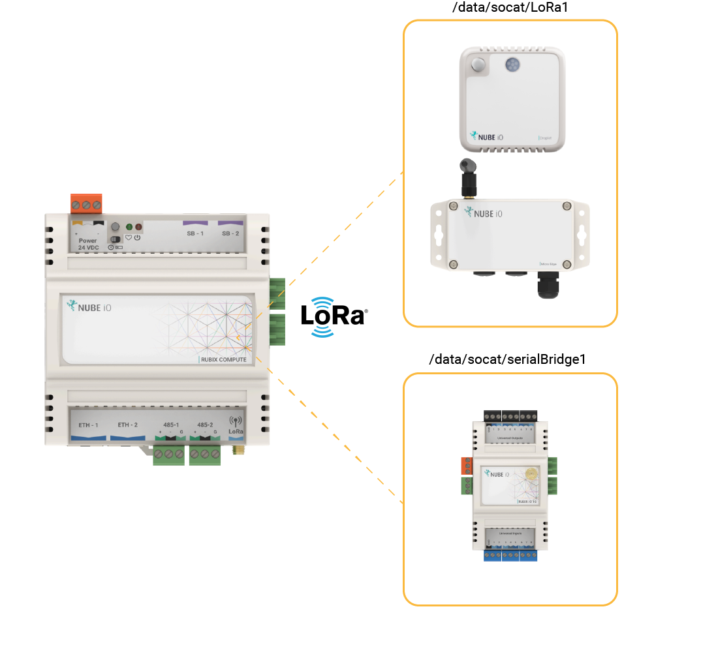

# Getting Started

This page will demonstrate how to add wireless LoRa® Droplets and Micro Edges to the Rubix Compute.
The Rubix Compute is a LoRa® Gateway/Reciever. 

## Adding a LoRa® Network

:::info Important things to note before proceeding:
* Install required **[apps](../../../setup/apps.md)** **driver-LoRa®**
* Install required **[modules/plugins](../../../setup/plugins.md)** **LoRa®** 
:::

1. **Step-1** On the controller level, under `drivers`, click the **create**  to select and download and install the relevant network. Follow the wizard to continue installing the LoRa® network.
2. **Step-2** Select the LoRa® network. This will download the appropriate modules and drivers. Check the default communication settings for the sensor by ticking the 'show advanced options' checkbox.
3. **Step-3** Once all the settings are added click on **Submit** button This should now create the LoRa® and network. Now open the LoRa® network to add a device.

:::info
Adding the LoRa® driver for the first time it will install a module/plugin dependency called `LoRa®`.
:::

## Summary Of Ports When Adding a Network

Depending on the LoRa® network use case the correct serial-port must be selected.

| **Device Type**                          | **LoRa® Port selection on Rubix Platform** |
|------------------------------------------|-------------------------------------------|
| Wireless Sensors - Droplets & Micro Edge | /data/socat/loRa1                         |
| Rubix iO 16 in Wireless Mode             | /data/socat/serialBridge1                 |
| Rubix iO 16 in 485 Mode                  | /dev/ttyAMA0                              |

## Adding a LoRa® Sensor

:::info
See Nube iO supported sensors for more info **[sensors](../../../../hardware/downloads/sensors.md)**
:::

Sensor Models

| Sensor Model | Supports Temperature | Supports Humidity | Supports Motion | Supports Lux |  
|--------------|----------------------|-------------------|-----------------|--------------|
| THLM         | Yes                  | Yes               | Yes             | Yes          | 
| THL          | Yes                  | Yes               | No              | Yes          |  
| TH           | Yes                  | Yes               | No              | No           |  

1. **Step-1** Once inside the `network`, click the **create**  button and a pop-up will give you the type of sensors to select from. For this example, we will be using a `THLM` Droplet.
2. **Step-2** Follow the wizard by assigning a name and description, and then press `submit` to continue.
3. **Step-3** Enter the 8 digit serial number printed on the sensor and press submit.
4. **Step-4** Once the sensor has been added, view the points by clicking on the arrow point on the newly added device.

:::info
It may be necessary to wait or force a push from the sensor (by clicking the reset button on the sensor) for the values
to show. Additional offsets, scaling fallback values, multiplication factors can also be applied if required. Try also
clicking the 'refresh' button if the values do not update.
:::

