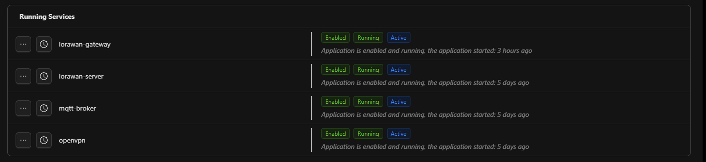
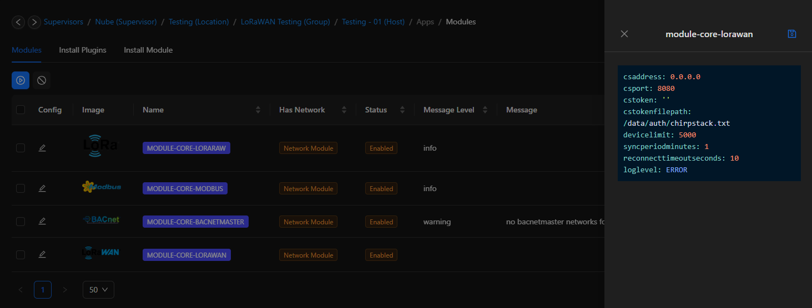

---
sidebar_position: 6
---

# Getting Started

This page will demonstrate how to add wireless LoRaWAN Devices to the Rubix Compute.
The Rubix Compute uses Rubix Connect LW as LoRa® Gateway/Reciever. 

## Adding a LoRa® Network

:::info 
Important things to note before proceeding:
* Install required **[apps](../../../setup/apps.md)** **driver-LoRaWAN*
* Install required **[modules](../../../setup/Modules.md)** **LoRa®** 
* Install hardware **[Rubix Connect LW](/docs/hardware/expansion-modules/rc-lw/user-manual.md)**
:::

1. **Step-1** Ensure the controller device type is set to `rubix-compute-lorawan-vpn`. This configuration is required for the `lorawan-gateway` and `lorawan-server` services to run.
 
2. **Step-2**  In the Rubix controller interface, go to the `Modules`, section and click on `install module`. From the list, select `module-core-lorawan` then click the **download**   to proceed.
3. **Step-3** A pop-up window will appear prompting you to choose the desired driver version. It is recommended to select the latest version available in the list. After selecting, click `install`. TOnce installation is complete, Rubix will prompt for a reboot. Click `ok` to confirm.
4. **Step-4** After installation, go back to the `Modules`  section and click `edit` on `module-core-lorawan` Each controller has a unique `cstoken`, please reach out to support@nube-io.com to get your unique cstoken. 

5. **Step-5** Right-click on `module-core-lorawan`and select `enable` to activate the module. 
6. **Step-6** On the `Driver` level, open `module-core-lorawan` and click **create**  to add device.

| Attribute                       | Description                                                                           |
|---------------------------------|---------------------------------------------------------------------------------------|
| Name                            | Name of the LoRaWAM device                                                            |
| Description                     | Description of the device, eg: `Magnetic Contact Switch                               |
|Enable                           |Enable the network                                                                     |
| Disable Frame-Counter Validation| Frame-counter validation ensures the integrity of the communication by verifying each frame is received in the correct sequence.|
| Device EUI                      | Device Unique Identifier, provided by your device's manufacturer, should not be less than 16 characters |
|Application                      |default-app is the default application for Rubix. Use this unless a custom application is set up, reach out to support@nube-io.com for custom application.|
|Device Profile                   | Drop down menu with list of devices currently supported and tested by Nube-iO, if the device is not listed make sure that it is compatible to Rubix Connect LW and send the Codec script to Nube-iO to add the device on Rubix Compute|
|Application Key                  | Secret cryptographic key used to secure communication between a LoRaWAN device and the network server.|
|History Enable                   | Enabling history allows Rubix Compute to store and track device data over time. This can be useful for diagnostics and analysis of long-term trends.|

7. **Step-7** Click `save`

## Device Profile

The Device Profile includes various settings and configurations that describe the characteristics of the device. Each device within a LoRaWAN network has a profile, and the profile must be compatible with the LoRaWAN network server for successful communication. The profile defines key parameters such as data encoding, transmission frequency, and other protocol settings.

1. Default Device Profiles: Rubix Connect comes with a predefined list of supported device profiles, which cover common device types such as temperature sensors, humidity sensors, and others. These profiles are set up and maintained by Nube-IO engineers.

| **Manufacturer**                         | **Device Model**                          |
|------------------------------------------|-------------------------------------------|
| ELSYS                                    | ABP-AU915                                 |
| ELSYS                                    | OTAA                                      |
| Ellenex                                  | PDT2-L-ABP-AU915                          |
| Ellenex                                  | PDT2-L-OTAA                               |
| ICT International                        | MFR-L-OTAA                                |
| Milesight IoT                            | MS-AM100-OTAA                             |
| Milesight IoT                            | MS-AM300-OTAA                             |
| Milesight IoT                            | MS-EM300-TH-OTAA                          |
| Milesight IoT                            | MS-EM310-UDL-OTAA                         |
| Milesight IoT                            | MS-EM500-CO2-OTAA                         |
| Milesight IoT                            | MS-EM500-SMT-OTAA                         |
| Milesight IoT                            | MS-EM500-UDL-OTAA                         |
| Milesight IoT                            | MS-VS121-OTAA                             |
| Milesight IoT                            |MS-WS101-OTAA                              |
| Milesight IoT                            |MS-WS301-OTAA                              |
| CET Global                               |PMC-350-C-OTAA                             |
| Milesight IoT                            |MS-WS301-OTAA                              |

2. Custom Device Profiles: If your LoRaWAN device is not listed in the default profiles, you can request a custom device profile from Nube-IO support. To ensure that your device can be properly integrated, you must provide the following:

* **Codec**: A JavaScript codec that describes how your device encodes and decodes its data. This codec allows Rubix Connect to interpret your device’s payload correctly.
* **Device Compatibility**: Ensure that your device is compatible with Rubix Connect LoRaWAN. The device should comply with Rubix Connect’s specifications for communication (e.g., supported frequency plans and LoRaWAN version).

