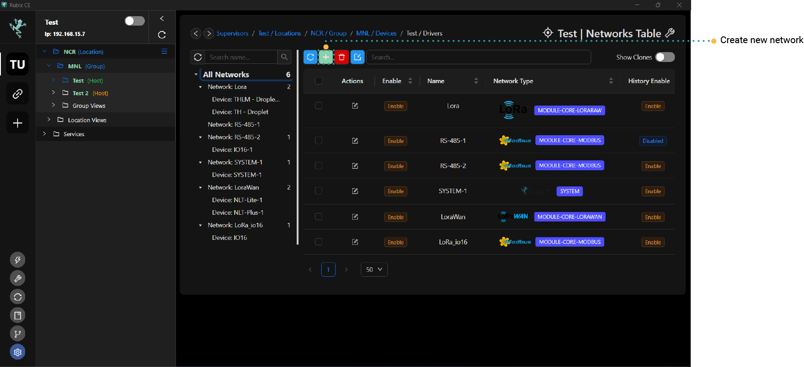

# Overview
See more info for each protocol:

- [BACnet master](bacnet/bacnet-master/bacnet-master.md)
- [BACnet Server](bacnet/bacnet-server/bacnet-server.md)
- [LoRa®](lora/lora-raw/lora.md)
- [LoRaWAN®](lora/lorawan/lorawan.md)
- [Modbus-RTU](modbus/modbus-rtu/modbus.md)
- [Modbus-TCP](modbus/modbus-tcp/modbus.md)
- [System-Network](system/overview.md)

## Drivers (Protocols)

Rubix CE offers enhanced functionality through its versatile driver support, empowering users to integrate a wide range of industrial protocols seamlessly. These drivers include essential protocols such as BACnet Master and Server, LoRa® and LoRaWAN®, Modbus-RTU and Modbus-TCP, as well as System-Network integration. Each driver expands Rubix CE's capabilities, enabling efficient communication and control across diverse industrial environments. Whether you need robust data acquisition, IoT connectivity, or network management, Rubix CE's comprehensive driver suite provides the essential tools for optimizing operational efficiency and scalability within industrial automation and control systems.

To incorporate a Driver for a new network, go to the Driver Tab within the controller page. Click on "+ Create", then pick the driver from the dropdown menu. If the necessary Driver isn't visible in the menu, you'll need to install the apps as outlined in **[apps](../setup/apps.md)**.

## Adding a Network

* **Step-1** Access the controller level by selecting the `host` and then clicking on the specified controller.
* **Step-2** Under `drivers`, click on the **create** 
* **Step-3** Select the network you want to add. This will trigger the download and installation of required network dependencies. Follow the prompts in the wizard to finish the installation.
* **Step-4** Once all settings are configured, click on the **Submit** button.

Proceed to generate the network for the chosen protocol. Afterward, simply **right-click** and select "Open" to view the **devices**.

## Drivers Dependencies Overviews

Typically, every driver requires the installation of an application (refer to **[Installing apps](../setup/apps.md)** for instructions). Once an App is installed, each driver needs a corresponding `Module` (for further details on modules, check **[Modules](../setup/Modules.md)**).

| Driver Name             | App Name      | Module/Plugin Name | Service Name                     |
|-------------------------|---------------|--------------------|----------------------------------|
| BACnet master           | N/A           | BACnet Master      | N/A                              |
| BACnet Server           | Driver-BACnet | na                 | N/A                              |
| LoRa®                    | N/A           | lora               | N/A                              |
| LoRaWAN®                 | N/A           | LoRaWAN®            | LoRaWAN® Gateway, LoRaWAN® Service |
| Modbus-RTU & Modbus-TCP | N/A           | Modbus             | N/A                              |
| System                  | N/A           | System             | N/A                              |

## Exporting And Importing 

:::info
To ensure a comprehensive backup of a Rubix Compute, refer to **[backups](../setup/snapshots.md)** for detailed instructions.
:::

This section is designed for users who wish to save a Network, Device, and Points from **Drivers**.   
For instance, it allows you to create a backup of a device along with its points and then import them into another device, such as a `Rubix Compute`.

### Perform a Backup

To back up a Network, Device, or Points, simply **right-click** on the item you wish to export, then select **Export**. You'll be prompted to enter a meaningful comment, such as "Common Rubix IO16 points", to ensure clarity.

### Restore a Backup

To restore a backup of a Network, Device, or Points, locate and click on the **Import Button**, then choose the backup file you wish to import.

### Point Write Modes

| Mode                   | Use case                                                                                                   | Description                                                                                                                                                   | 
|------------------------|------------------------------------------------------------------------------------------------------------|---------------------------------------------------------------------------------------------------------------------------------------------------------------|
| Read only              | Mostly used for polling values                                                                             | Only Read Point Value Once                                                                                                                                   |
| Write once             | A setpoint on a remote thermostat; The value is set (by writing to the Rubix point) at the beginning of the day, then the thermostat can be adjusted by the occupants throughout the day;  This mode will allow the point to be written, but then will perform read polls to check if the value has been changed by others. speeds                                                                     | Only Read Point Value (poll rate defined by setting)                                                                                                         |
| Write once read once   |  | Write the value on COV, not Read                                                                                                                           |
| Write always           | Used when you want to write every poll                                                                     | Write the value on every poll (poll rate defined by setting)                                                                                                 |
| Write always then read |                                                                                                            | Write the value on COV, then read on each poll (poll rate defined by setting)                                                                                |
| Write and maintain     |                                                                                                            | Value written on COV, then read on each poll (poll rate defined by setting).   If read value doesn't match written value, rewrite the value. |
