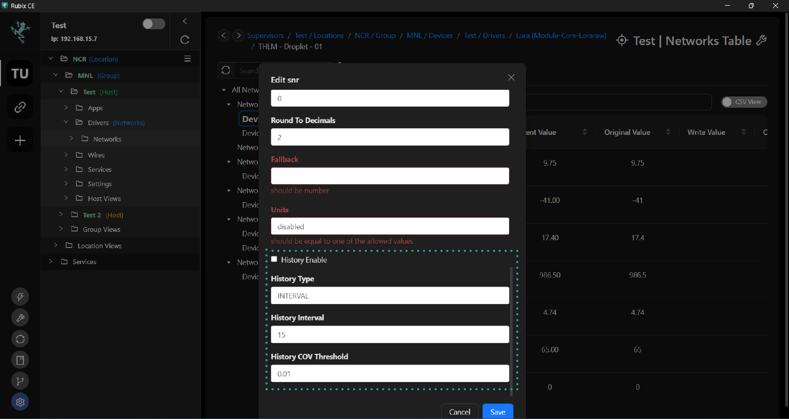

# Histories

To trend data points from devices and sensors, including droplets, Modbus, and LoRaWAN devices, follow these steps:

1. **Add a Network**: Begin by adding a network. This serves as the overarching framework for connecting and managing your devices and sensors.

2. **Add a Device**: Once the network is set up, add the specific device from which you want to collect data. This could be a droplet, Modbus device, LoRaWAN device, or any other compatible device.

3. **Add a Point**: After adding the device, proceed to add the individual data points that you wish to trend or monitor. These points represent the specific measurements or values you want to track, such as temperature, pressure, or humidity.

Once you've completed these steps and have points added, you can begin trending the data by accessing the histories or logging functionality. This allows you to visualize and analyze the historical data trends from your devices and sensors over time.

To enable trending for specific points under the Drivers section, follow these steps:

1. Navigate to the `Drivers` section in `Rubix CE`.

2. Click on the `edit` button next to the point(s) that you want to trend.

3. In the editing interface, check the following options:
- `History Enable`: This option enables historical data logging for the selected point(s), allowing you to track and analyze past data trends.
- `Auto Mapping Enable`: This option enables automatic mapping for the selected point(s).

By checking these options, you ensure that the selected points will be included in the historical data logging process and are ready for trending and analysis within Rubix CE.

configure the History Type and History Interval for trending data

History Type:

**COV (Change of value)**: Select this option if you want to trend data only when the point's value has changed. This helps in capturing data trends efficiently, especially when there are significant changes in the values.
**COV and Interval**: Choose this option if you want to trend data at every set interval and also when the point's value changes. This provides a comprehensive view of data trends, capturing both regular updates and significant changes.
**History Interval**:This setting determines how often the history trends occur.
If you've selected Interval or COV and Interval for the History Type, specify the desired interval for trending data.
For example, if you set the History Interval to 1 hour, data will be trended every hour.

# Viewing Histories
You have two options for viewing history within Rubix CE:

**Directly from a Point**: You can view the history directly from a specific point. This allows you to access the historical data associated with that particular point, typically through a dedicated interface or visualization tool.

**From the services/histories Tab**: Alternatively, you can access history data from the services/histories tab. This tab provides a centralized location for viewing and managing historical data from multiple points or devices within your environment. It offers a comprehensive overview of historical trends and allows for easy navigation and analysis of past data records.

## From a point

