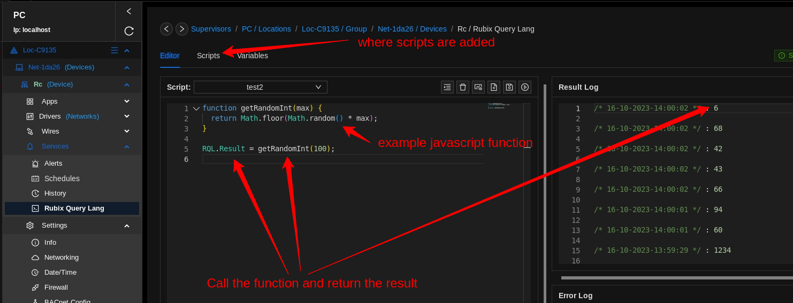

# RQL
RQL means Rubix Query Language. The main use case for using RQL is to write rules and then run the rules and a set time interval. An example use case is to ping a device every 15min to see if it is online.

RQL is a `Synchronous` blocking architecture, so the execution of each operation depends on completing the one before it. Each task requires an answer before moving on to the next iteration.

:::info Important things to note before proceeding:
* Install required **[modules/plugins](../../setup/plugins.md)** **module-core-rql**
:::


## About
Rules can be written in a javaScript similar to syntax and then executed in the RQL runtime.




## Example

```js
function getRandomInt(max) {
  return Math.floor(Math.random() * max);
}

RQL.Result = getRandomInt(100);
```


```js
let getTime = RQL.Time() // will get current time from the RQL server
RQL.Result = getTime; // any value sent to RQL.Result will be returned to view in the editor and also stored as logs
```


## Variables 
The idea of a variable is it can be used across multiple rules/scripts rather than hard coding a variable within your rule code

### Add a variable
1. Open the `Variables` tab
2. Click on the green `+` icon and add the name and value

### Useing a Variable in Your Code

```js
let data = RQL.UpdateVariableValue("test", 11.333); // update by its name or uuid
RQL.Result = data;
```

## Running Rules on Timed Interval

To set a rule/script to run on a time interval do the following
1. Open the `Scripts` tab
2. Right-click on the rule/script that you wish to view the logs and click on `Edit`.
3. Toggle `Enable Schedule`
4. Select the time duration as a number and the time settings as `seconds, minutes, hours or days`


### View Rule Logs

1. Open the `Scripts` tab
2. Right-click on the rule/script that you wish to view the logs and click on `Scheduled Results`. 


### Call the Logs in a Rule/Script
[example to call logs](rqlFunctions.md#getrulelogs)


## Serverless Functions
A rule can be written and called from an external endpoint and a body can be passed in for data to be processed

### Usage
- Add a new script called `test` and paste in the example code below
- Call the end point below as per the curl example. (the endpoint is called by passing in the script name)

### Example RQL code
```js
let x = Input.Body.a;
let y = RQL.RandInt(10, 20);
let calc = x + y;
let out = {
  inputValue: x,
  randomNumber: y,
  calc: calc,
};

RQL.Result = out;
```

### HTTP Body
```json
{
    "body":{
        "a":100
    }
}
```

### Call the Endpoint to Execute the Rule
- method `POST`
- body `JSON`
```
curl -i -X POST -H "Content-Type: application/json" -d '{"body":{"a":100}}' http://0.0.0.0:1660/api/modules/module-core-rql/rules/run/test
```


# JavaScript
RQL uses javascript syntax.

RQL is an implementation of ECMAScript 5.1.

RQL is a Synchronous blocking architecture, so the execution of each operation depends on completing the one before it. Each task requires an answer before moving on to the next iteration.

:::tip
No external npm library's can be used. <br/>
For example, you cant use `momentjs` <br/>
Most Global JS objects and methods are supported **[mozilla developer](https://developer.mozilla.org/en-US/docs/Web/JavaScript/Reference/Global_Objects)**
:::

:::caution
Set Timeout() is not support, you can use `RQL.Sleep(100)`
:::


# Methods

## Strings

**[docs](https://developer.mozilla.org/en-US/docs/Web/JavaScript/Reference/Global_Objects/String)**


### ToString

```js
ToString()
```

## Numbers

### ParseInt

**[docs](https://developer.mozilla.org/en-US/docs/Web/JavaScript/Reference/Global_Objects/parseInt)**

```js
ParseInt()
```

### ParseFloat

**[docs](https://developer.mozilla.org/en-US/docs/Web/JavaScript/Reference/Global_Objects/parseFloat)**


```js
ParseFloat()
```

## Arrays

**[docs](https://developer.mozilla.org/en-US/docs/Web/JavaScript/Reference/Global_Objects/Array)**


### Push
The push() method of Array instances adds the specified elements to the end of an array and returns the new length of the array.

```js
push()
```

```js
Let animals = ["pigs", "goats", "sheep"]
Animals.push("chickens", "cats", "dogs")
RQL.Result = animals
```

### Remove an Item

```js
Function remove ItemOnce(arr, value) {
  var index = arr.indexOf(value);
  if (index > -1) {
    arr.splice(index, 1);
  }
  return arr;
}

Let animals = ["pigs", "goats", "sheep"];

Remove Item Once(animals, "pigs");

RQL.Result = animals;
```

## Regex

```js
Function isValidIP(str) {
  const octet = "(25[0-5]|2[0-4][0-9]|1[0-9][0-9]|[1-9][0-9]?|0)";
  const regex = new RegExp(`^${octet}\\.${octet}\\.${octet}\\.${octet}$`);
  return regex.test(str);
}

RQL.Result = isValidIP("192.168.15.10").toString();
```

## Function
**[docs](https://developer.mozilla.org/en-US/docs/Web/JavaScript/Reference/Statements/function)**


```js
Function calcRectArea(width, height) {
  return width * height;
}
```


## For Loop

**[docs](https://developer.mozilla.org/en-US/docs/Web/JavaScript/Reference/Statements/for)**


```js
const array1 = [1, 2, 10];
let a = 0;

for (const element of array1) {
  a = a + element;
}

RQL.Result = a;
```

## If/Else

**[docs](https://developer.mozilla.org/en-US/docs/Web/JavaScript/Reference/Statements/if...else)**

```js
let a = 10
let result = ""
if (a > 0) {
    result = 'positive';
} else {
    result = 'NOT positive';
}
```

## Switch Case

**[docs](https://developer.mozilla.org/en-US/docs/Web/JavaScript/Reference/Statements/switch)**

```js
const expr = "b";
let a = "";
switch (expr) {
  case "a":
    a = "is a";
    break;
  case "b":
    a = "is b";
    break;
  default:
    a = "nada";
}

RQL.Result = a;
```


