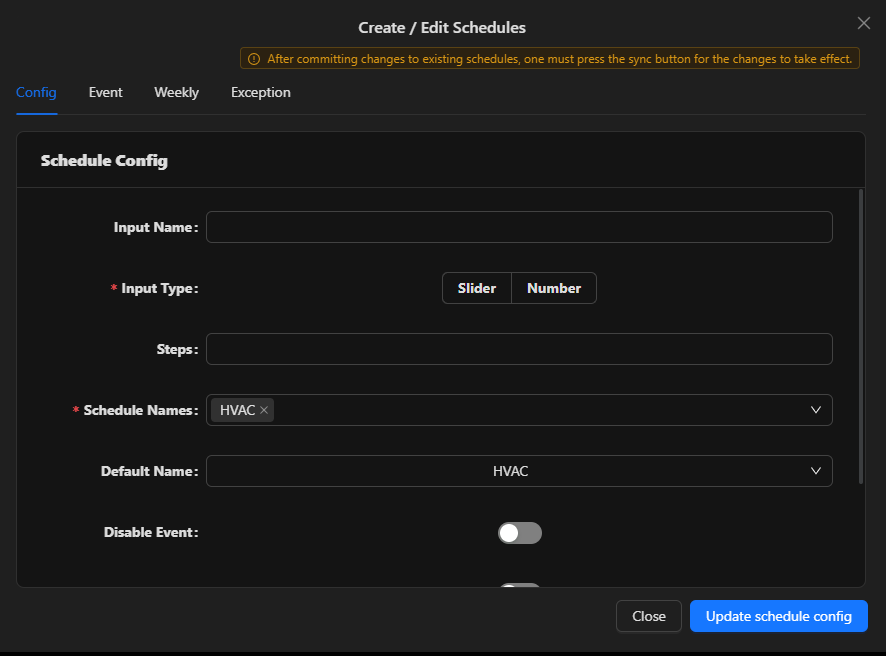
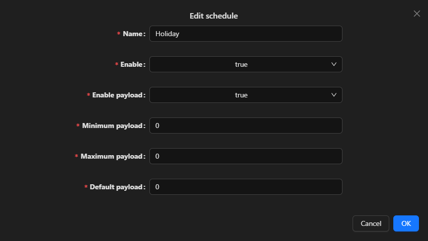

## Schedules
Schedules are primarily utilized for controlling HVAC (Heating, Ventilation, and Air Conditioning) equipment based on predefined time schedules. To set up a schedule, follow these steps:

1. Open the `device` you wish to add a schedule to from the sidebar under its `services`.
2. Click on the Add button 
3. Enter the `name` for the schedule.
4. Enter the `timezone` for the schedule. You can search for the desired timezone using the provided options.

By following these steps, you can easily create and configure schedules to automate a system based on specific time criteria.

## Config

Input Name:The identifier or label for the schedule being edited.
Input Type: Either slider or number
Schedule Name:
Default Name:
Disable Event:
Disable Weekly
Disable Exception:

### Event 
An event schedule allows you to override the regular 7-day schedule and set a specific device to an `ON state` for a defined period of time. For example, you want to activate a device from the 24th of November 2022 at 8 am until the 24th of November 2022 at 1 am.

### Weekly
Weekly schedule is a recurring schedule that operates from Monday to Sunday, covering a span of 7 days. 
 
To establish a weekly schedule for activating the HVAC system each morning at 9 am and deactivating it at 5 pm, specifically on Mondays, Tuesdays, and Wednesdays:

1. Open the device you want to schedule from the sidebar under its services.
2. Click on the Add button  to create a new schedule.
3. Enter a name for the weekly schedule.
4. Set the `Time On` to 9 am and the `Time Off` to 5 pm.
5. Specify the days of the week when the schedule should be active. In this case, select `Monday`, `Tuesday`, and `Wednesday`.
6. Save the weekly schedule.

By configuring the weekly schedule in this manner, you ensure that the HVAC system will automatically turn on at 9 am and turn off at 5 pm, but only on Mondays, Tuesdays, and Wednesdays, following the specified weekly schedule.

### Exception 
Is designed for overriding the regular 7-day schedule to set a device to an `OFF state` for a specified duration. For instance, you might want to deactivate a device from the 25th of December 2022 at 8 am until the 26th of December 2022 at 8 am.

## Edit Schedule

**Name:** The identifier or label for the schedule being edited.

**Enable:** Indicates whether the schedule is currently enabled or disabled.

**Enable Payload:** Specifies the payload or configuration when the schedule is enabled.

**Minimum Payload:** The lowest acceptable payload value associated with the schedule.

**Maximum Payload:** The highest acceptable payload value associated with the schedule.

**Default Payload:** The default payload value set for the schedule when no other conditions are applied.

