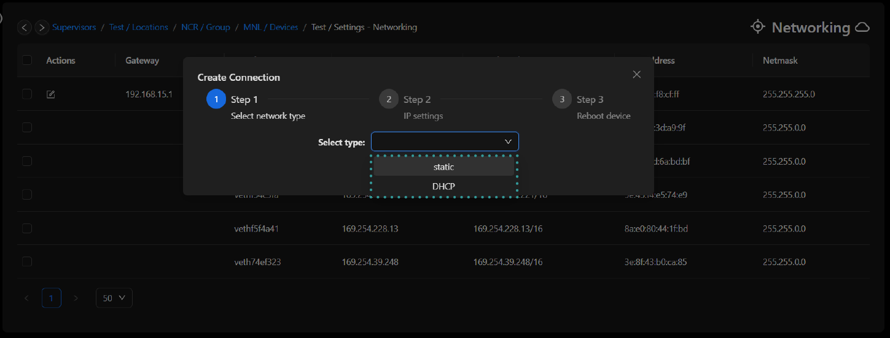

# Networking

:::caution
please note the rubix-compute will be rebooted after updating the IP address
:::

## Default Network Configuration

When a Rubix Compute Controller is reset to factory defaults the two off Ethernet ports will be configured as follows:

| Port Name | Linux Port Name | Type  | IP            | Subnet        | Gateway      |
|-----------|-----------------|-------|---------------|---------------|--------------|
| ETH-1     | eth0            | Fixed | 192.168.15.10 | 255.255.255.0 | 192.168.15.1 |
| ETH-2     | eth1            | DHCP  | na            | na            | na           |

:::info
more info on [DHCP](https://en.wikipedia.org/wiki/Dynamic_Host_Configuration_Protocol)
:::

## Changing the Rubix Compute's IP

1. On the 'device level' of the supervisor. Click into the device's 'settings' tab, then click the 'networking' tab.
   Click the notepad and wait for the pop-up.
2. Follow the wizard to set IP as either static or dynamic
3. The wizard will then prompt the user to reboot the controller Reboot the controller for the new IP to take into
   effect.

