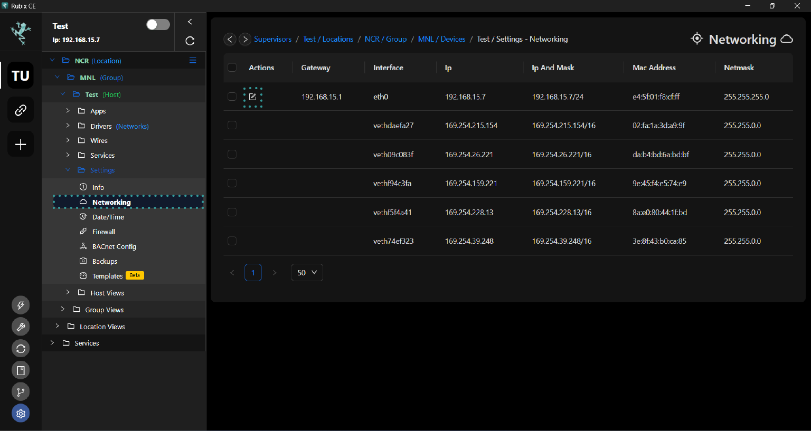

# Networking

:::caution
Please note that the Rubix Compute will be rebooted after updating an IP address
:::

## Default Network Configuration

When a Rubix Compute is reset to its factory defaults, both Ethernet ports will be configured as follows:

| Port Name | Linux Port Name | Type  | IP            | Subnet        | Gateway      |
|-----------|-----------------|-------|---------------|---------------|--------------|
| ETH-1     | eth0            | Fixed | 192.168.15.10 | 255.255.255.0 | 192.168.15.1 |
| ETH-2     | eth1            | DHCP  | na            | na            | na           |

:::info
Additional info on [DHCP](https://en.wikipedia.org/wiki/Dynamic_Host_Configuration_Protocol)
:::

## Changing the Rubix Compute IP address

To access the networking settings for a device on the supervisor level, follow these steps:
* Navigate to the device's settings tab.
* Click on the 'networking' tab within the settings.
* Look for the notepad icon and click on it.

* Wait for the pop-up window to appear, which typically contains options or configurations related to the device's networking settings.
* Set the IP address as either static or dynamic.

* If you choose to set a static IP address during the networking configuration process, you will typically be prompted to enter the specific IP address, subnet mask and gateway.

* After making changes to the networking settings for the Rubix Compute device, the wizard will likely prompt you to reboot the device. This reboot is necessary for the new IP address or any other networking configurations to take effect. Once prompted, proceed to reboot the Rubix Compute device to ensure that the changes are applied successfully.

