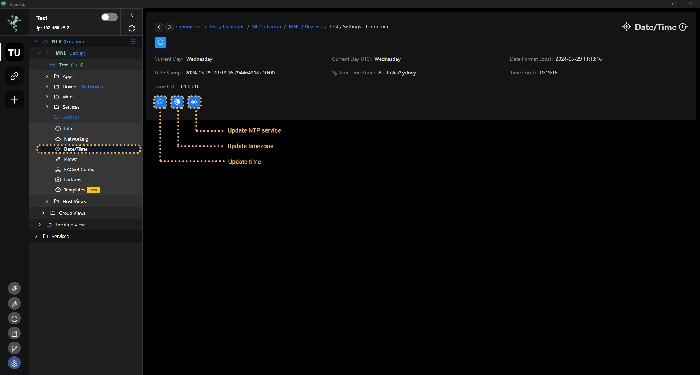
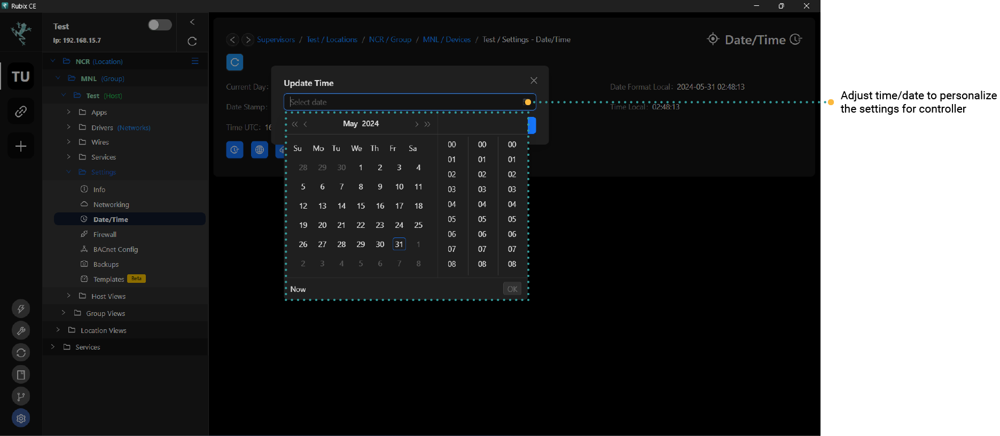
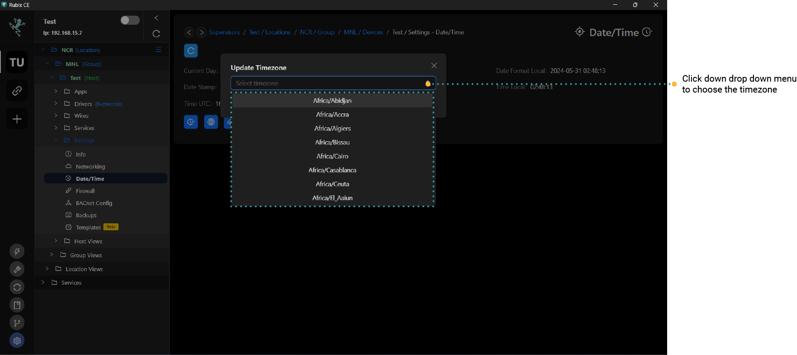
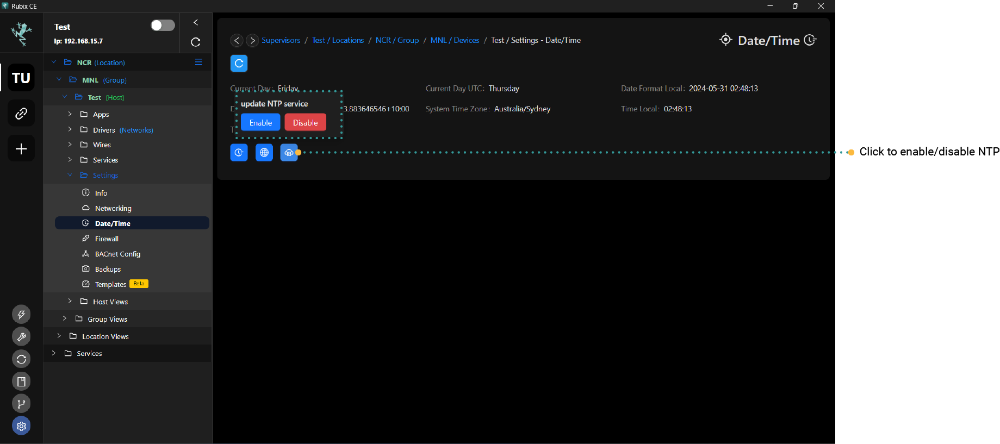

# Time/Date

# Changing the Date / Time Settings

How to update the Rubix Compute date and time

## Updating the Rubix Compute's time and date
Set the time and date as required

If the device is connected to the internet by default it will auto update so you do not need to set the time/data  
Plaease note - You may need to update the `timezone`

## Updating the Time Zone

To set the Rubix Compute time zone, click on the button and set the zone as required  
The default timezone is `Australia/Sydney AEST`

## Enabling / Disabling the NTP Service

To maintain the Rubix Compute time, the operating system calls external servers to fetch the current time for your set time zone.

