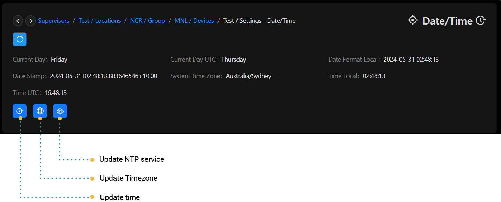

# Time/Date

# Changing the Date / Time Settings

This section will guide you through the process of modifying the date and time on Rubix-Compute.

## Updating the Rubix Compute's time and date
Adjust the time and date as needed.

If the device is connected to the internet, it will automatically update, eliminating the need for manual adjustment.  
Plaease note - You may need to update the `timezone`

## Updating the Time Zone

To configure the Rubix Compute time zone, click on the button and select the desired zone.  
By default, the timezone is set to `Australia/Sydney AEST`.

## Enabling / Disabling the NTP Service

To ensure accurate timekeeping on Rubix Compute, the operating system retrieves the current time for your designated timezone by reaching out to external servers.

